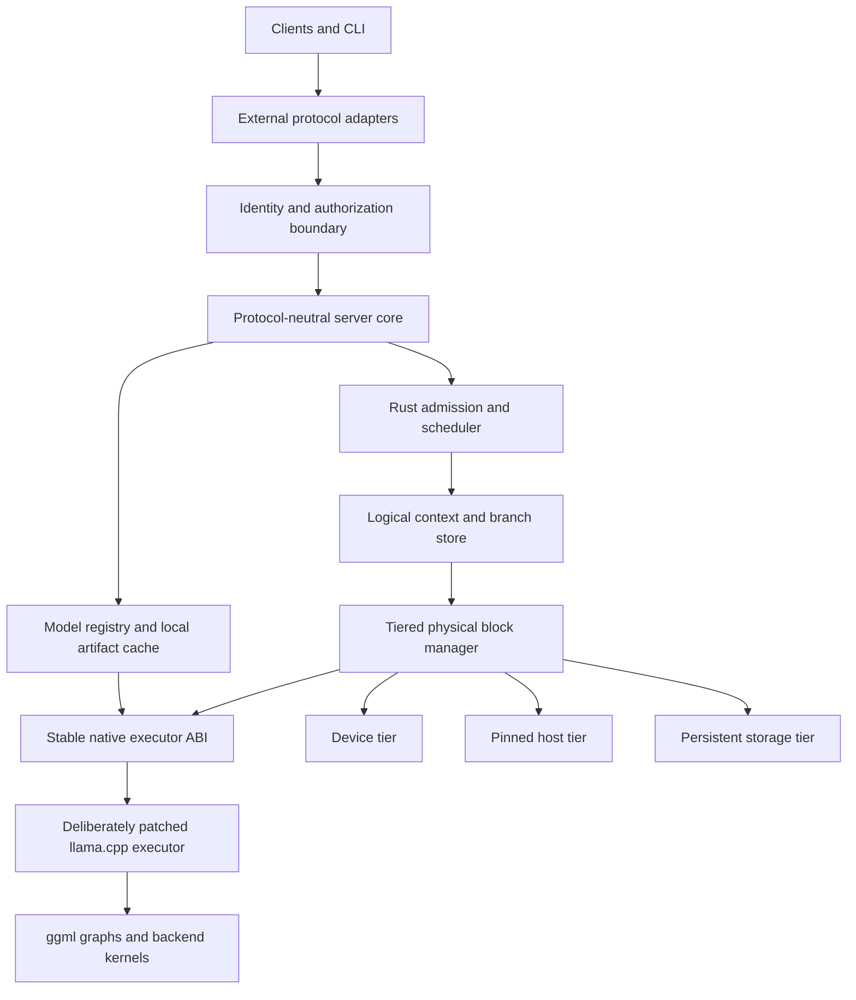

# Cusco: a Rust tiered-context server around the llama.cpp execution engine

## Document purpose and status

This document is the living architecture, implementation roadmap, and acceptance contract for **Cusco**, a persistent, tiered, branch-aware model-state server. It began as a pre-implementation proposal, but now records both demonstrated foundations and prospective work so that historical hypotheses are not confused with current project state.

Cusco is written in Rust and uses a deliberately but conservatively extended llama.cpp as its model execution engine. It is not a Rust rewrite of llama.cpp, a wrapper around llama-server, or an incremental feature plan for an existing server. The intended split is:

> Rust owns logical contexts, scheduling, tiering, and transactional cache state. A deliberately patched llama.cpp owns model-specific graph construction, tensor semantics, and optimized inference kernels, with no more upstream modification than that contract requires.

The first project decision is therefore an architectural boundary, not a cache policy: slots are disposable execution workers, while logical contexts and their evaluated state are durable objects owned outside the executor.

The document uses three status categories:

- **Historical design hypothesis:** the decisive executor question and early recommendations explain why implementation began with checkpoint equivalence rather than a broad server.
- **Implemented current state:** Phases 1 through 8 are complete. The real Gemma proof demonstrated exact checkpoint continuation; the logical and physical managers implement transactional shared state and tiering; the live server implements persistent mapped execution, bounded lifecycle, dynamic multi-model residency, resumable priority-aware workload scheduling, non-blocking attributed diagnostics, authentication, compatibility adapters, and checked OpenAPI; and the real-GPU acceptance artifacts cover mapped activation, live lifecycle, residency, and mixed-workload fairness.
- **Remaining prospective contract:** Phases 9 and 10 remain planned work and are requirements, not claims of implementation.

## Decisive technical hypothesis

The project exists to answer one load-bearing question:

> Can a complete, model-specific executable checkpoint be captured, displaced from an execution slot, moved through the selected memory tiers, rebound transactionally, and continued with the same logits and token IDs as uninterrupted evaluation?

Every broader product commitment in this proposal is conditional on a positive answer. Phase 1 must test this hypothesis on a hybrid/recurrent Gemma model, including concurrent slot replacement and host-tier movement. Model management, protocol compatibility, scheduling breadth, and mapped execution must not turn an executor-boundary failure into a server project that happens to contain a non-working cache.

For Phase 1, model acquisition may be a thin implementation of the eventual registry contract: resolve one pinned `hf://` artifact or register one explicit local GGUF path, verify its identity, and publish a `ModelRecord`. The complete fetch/list/update/remove experience must not delay the checkpoint gate.

## Motivation and prior evidence

A prior branch-cache prototype demonstrated that restoring previously evaluated branches can avoid most prompt evaluation and reduce resumption latency by an order of magnitude. It also exposed a decisive correctness requirement: restoring ordinary KV state without every architecture-required SWA or recurrent component can produce invalid continuation state. A conservative fallback can preserve correctness by reevaluating the prompt, but then the cache benefit disappears.

Those experiments are evidence for this design, not a codebase dependency. This project starts from the requirements they revealed:

- execution slots must not own durable logical contexts;
- prompt state cannot be modeled only as sequence-associated KV ranges;
- each memory implementation has architecture-specific state and dependency rules;
- prompt-cache policy must be separable from slot scheduling;
- logical prompt identity and executable physical state need distinct representations;
- restoration must be a transactional operation rather than an opportunistic pre-decode mutation.

Conventional continuous batching can tolerate slot-owned sequence state and destructive cache mutation. Those assumptions are a poor fit for a persistent branch cache in which:

- logical contexts outlive execution slots;
- many contexts share evaluated prefixes;
- physical blocks move independently among device, host, and storage tiers;
- spare VRAM holds inactive but likely-to-be-revisited branches;
- a slot temporarily binds a context for execution rather than owning it;
- switching branches must either publish a complete, coherent state or leave the prior state intact;
- model architectures may require global KV, SWA, and recurrent state to be restored together.

A new outer server would allow those requirements to become the primary ownership model rather than a secondary mechanism fitted around existing slot semantics.

## Goals

The proposed system should:

1. Represent a logical context independently of any server slot or physical tensor address.
2. Represent evaluated state as dependency-valid composite blocks or checkpoints.
3. Share immutable evaluated prefixes across contexts.
4. Retain multiple inactive contexts in spare VRAM when capacity permits.
5. Demote inactive physical blocks to pinned host memory and eventually persistent storage.
6. Promote only the blocks required for the next execution binding.
7. Switch logical contexts atomically from the scheduler's perspective.
8. Preserve exact model behavior across park, demote, promote, and restore operations.
9. Support ordinary KV, SWA, and recurrent architectures without pretending they have identical dependency rules.
10. Reuse llama.cpp's model loading, graph construction, backend support, and optimized kernels.
11. Expose enough telemetry to explain cache hits, avoided work, transitions, residency, and eviction decisions.
12. Provide a migration path from a copy-based staging implementation to device-side block-mapped execution.
13. Present inference, context management, model management, and operations through one protocol-neutral application interface with versioned external adapters.
14. Make Hugging Face Hub identifiers and reproducibly resolved Hub snapshots the primary model-acquisition path.
15. Keep authentication and usage accounting at stable request boundaries even while the initial local deployment permits anonymous administration.
16. Provide a versioned extension point for later semantic context-compaction strategies and enough lifecycle information to schedule compaction before it delays the next turn.

## Non-goals

The first implementation should not:

- rewrite llama.cpp's model implementations or GPU kernels in Rust;
- reproduce the entire llama-server feature surface before validating the cache boundary;
- treat token-identical substrings as interchangeable evaluated state;
- infer model-specific recurrent layouts in Rust;
- require direct Rust ownership of ggml or C++ objects;
- promise zero-copy branch switching before the execution kernels support physical indirection;
- optimize arbitrary suffix reuse before exact-prefix restoration is correct;
- support every model architecture, multimodal feature, speculative decoder, grammar, adapter configuration, and API variant in its initial milestone.
- implement semantic context compaction or execute third-party strategy code in the initial cache-validation milestones.

## Standalone project boundary

This proposal defines a separate product and source tree. It may reuse and adapt proven executor experiments, tests, and telemetry conventions, but it does not inherit the lifecycle, public API, build layout, or compatibility obligations of an existing branch-cache server.

The project has four independently testable layers:

1. **Coordinator:** Rust-owned logical context identity, branch structure, policy, scheduling, persistence, and transition orchestration.
2. **Native executor:** a pinned llama.cpp fork plus a C-compatible shim implementing model-specific state operations and decode.
3. **Physical tier manager:** Rust-managed reservations and residency state backed by executor-owned representations, transfer operations, and fences.
4. **Independent validation:** black-box and executor-level correctness and performance workloads that do not depend on either server's internal metrics to determine semantic success.

The only mandatory upstream dependency is a pinned llama.cpp revision. The project owns its executor patches, ABI conformance tests, and update procedure. It must be possible to build, run, test, and benchmark the project without checking out the earlier prototype repository.

## Design principles

The implementation should preserve these principles even when individual structures change:

- **Logical identity is not physical location.** Contexts refer to immutable evaluated identities; physical representations may move or disappear.
- **Textual equality is not state equivalence.** Evaluated reuse requires dependency lineage, model configuration, and representation epochs to match.
- **Composite state commits together.** Global KV, SWA, recurrent state, metadata, and completion state form one executable contract.
- **Preparation may be expensive; publication must be atomic.** A worker observes a complete old binding or a complete new binding.
- **Capacity promises outrank cache warmth.** Opportunistic blocks never consume the active-growth guarantee.
- **Asynchronous work extends ownership.** Submitted backend work retains storage through an explicit completion fence.
- **Correctness precedes speed claims.** A restoration is a hit only after it commits and produces behavior equivalent to valid evaluation.
- **Staged execution is a product phase, not throwaway scaffolding.** It establishes the ownership and transaction model before mapped kernels optimize it.
- **The ABI is small-surface, high-semantic-density.** Few entry points may carry rich descriptors and strict lifecycle obligations; “small” must never be mistaken for trivial.

## Terminology

The proposal uses the following terms consistently:

- **Logical context:** a durable token history plus references to the evaluated state that is valid for some prefix of that history.
- **Logical block:** a canonical token interval used for identity, sharing, dependency accounting, and mapping; it contains no device address.
- **Evaluated component:** architecture-specific state for a logical interval or boundary, such as global KV, SWA state, or a recurrent checkpoint.
- **Composite block or checkpoint:** the coherent set of every evaluated component required to continue from one represented boundary.
- **Physical representation:** bytes and layout metadata realizing an evaluated component in device, host, or persistent storage.
- **Execution slot:** a disposable native worker capable of running a batch; it is not the durable owner of a context.
- **Binding:** the complete executor-visible association between a slot, represented position, and validated physical state.
- **Transition:** the prepare/commit/abort lifecycle used to replace one binding with another.
- **Lineage:** the dependency identity proving that evaluated state was derived from the required preceding history and compatible execution configuration.
- **Epoch:** an invalidation identity for model, adapter, representation format, or executor state.
- **Semantic context compaction:** constructing a new, shorter logical token history that preserves selected information from an older history; this creates new lineage and is distinct from compressing physical cache bytes.
- **Context strategy:** a registered policy implementation that proposes when and how to trim, summarize, or otherwise compact a logical context.

“Block” describes canonical logical identity and accounting. It does not require every model component to be physically stored as independently executable fixed-size pages. Recurrent state may be represented as a boundary checkpoint while still participating in the same composite mapping and transaction.

## Core architectural decision

The cache should wrap and control the inference engine rather than remain an optional side structure subordinated to server slots.



The Rust process owns durable context identities and cache policy. llama.cpp remains authoritative for the model-specific meaning of executable state.

## Responsibility split

### Rust server and coordinator

Rust should own:

- HTTP and protocol handling;
- request admission, cancellation, deadlines, and fairness;
- session, agent, conversation, and branch identities;
- token-sequence identities and persistent branch DAGs;
- logical evaluated-prefix mappings;
- prefix lookup and dependency validation;
- device, host, and storage residency policy;
- physical capacity accounting;
- eviction scoring;
- promotion and demotion planning;
- transition reservations;
- slot assignment;
- commit and abort state machines;
- background transfer orchestration;
- metrics and tracing;
- persistence and recovery of logical metadata.
- canonical inference and model-management operations independent of any external protocol;
- model registry, Hugging Face acquisition policy, local artifact-cache metadata, and administrative lifecycle operations;
- authentication and authorization interfaces, even when the initial implementation supplies only an anonymous administrator;
- implementation-independent usage accounting for prompt, generated, cached, and evaluated work;

Rust owns scheduling, decode-quantum boundaries, cancellation, deadlines, stopping policy, and canonical streaming/usage facts. Native execution owns model-compatible sampling primitives and sampler state. A request's sampler state must be suspendable with the request between decode quanta; native code returns selected tokens and the execution facts Rust needs for streaming, usage, and finish reasons. This keeps scheduling preemptible without recreating model-specific sampling behavior in Rust.

### llama.cpp executor

The native executor should continue to own:

- model loading and architecture metadata;
- tokenizer and vocabulary semantics;
- chat-template application and token-piece rendering;
- model tensor definitions;
- graph construction;
- backend buffer allocation;
- CPU, CUDA, and other backend kernels;
- architecture-specific forward passes;
- architecture-specific memory dependencies;
- recurrent checkpoint capture and binding;
- execution of token batches against a supplied valid memory binding;
- model-compatible sampling primitives and suspendable sampler state.

### Native ABI shim

A small-surface, high-semantic-density C-compatible ABI should separate Rust from llama.cpp's internal C++ types. Its surface should remain intentionally compact, but its semantics are necessarily rich: capabilities, canonical geometry, dependency descriptors, arenas, checkpoints, transfers, fences, epochs, and bindings all cross this boundary through stable handles and versioned data-oriented descriptors.

Rust must not manipulate ggml tensors or memory implementations directly. The shim must expose concepts that the current high-level API does not represent sufficiently:

- model memory capabilities and canonical block geometry;
- component dependency and compatibility descriptors;
- physical representation and arena handles;
- logical-mapping validation results;
- physical preparation plans and completion fences;
- prepared executor bindings;
- recurrent checkpoint import and export;
- decode submission and completion;
- invalidation when model, adapter, representation, or execution epochs change.

The ABI should distinguish three operations that may collapse differently in staged and mapped implementations:

1. **Logical mapping validation:** determine whether component identities, lineage, boundaries, and epochs describe a coherent target state. This operation must not allocate or mutate a slot.
2. **Physical representation preparation:** resolve or create the required device representations, schedule transfers or staging copies, and return fences plus ownership-bearing preparation handles.
3. **Executor binding construction:** combine validated logical state and completed physical representations into a candidate binding that the executor can publish atomically.

In staged execution, physical preparation may assemble a conventional contiguous arena and binding construction may be lightweight. In mapped execution, preparation may mostly reserve existing pages while binding construction publishes a block table. The semantic phases remain distinct even when one implementation fuses their internal work.

## External API adapter architecture

External compatibility should be a shim layer over a protocol-neutral application API, not a set of alternate request paths wired directly into scheduling or the executor. To avoid confusion with the native C ABI shim, this proposal calls these modules **protocol adapters**.

The first-class external protocols are an explicitly versioned local-inference profile of the OpenAI-compatible API under `/openai/v1/*` and the Ollama native API under `/ollama/api/*`. Cusco-specific lifecycle extensions occupy `/cusco/v1/*`. All three surfaces must be described by generated, checked OpenAPI documents and must normalize into the same protocol-neutral services. The compatibility clients Cusco targets must accept a configured subdirectory base URL; conformance tests must exercise the prefixed paths through representative clients, with Open WebUI configuration through both its OpenAI-compatible and native Ollama connection types as an explicit acceptance check. If that assumption proves materially incompatible in practice, the prefixes may be revised before the production contract is frozen rather than retaining duplicate aliases. Ollama's current OpenAI compatibility matrix is useful evidence, not a normative dependency or a promise to reproduce every field: <https://docs.ollama.com/api/openai-compatibility>. “Compatible” does not mean copying unrelated hosted-service features such as billing, organization administration, fine-tuning, or cloud-resource APIs.

The Phase 9 OpenAI profile must be fixed before implementation and tested as a behavioral contract. It includes model discovery, text and chat completion, streaming, deterministic and commonly used sampling controls, stop handling, structured output, tool calls where the selected model supports them, embeddings once the executor exposes them, and the stateless Responses shape. Compatibility covers request defaults and validation, model-name resolution, chat-template application, terminal-token suppression, whitespace semantics, finish and stop reasons, usage accounting, error envelopes, cancellation, and streaming framing—not merely endpoint names or JSON shapes. Durable contexts, branches, cache policy, extended usage, model administration, billing, organization administration, and other hosted-service control planes are outside the OpenAI surface and use the appropriate Cusco or Ollama contract.

Phase 9 multimodal input is deliberately limited to text plus images for chat and stateless Responses requests on models whose llama.cpp executor path exposes a compatible vision projector. The OpenAI adapter accepts typed content parts and `image_url` data URIs; the Ollama adapter accepts its native inline image representation. Remote URL fetching, audio, video, image generation, and cross-model media pipelines are later work. Image bytes must be size-bounded, content-addressed for request and cache identity, decoded once, and tied to the model/projector epoch; unsupported media or models fail before admission rather than silently degrading to text.

The internal boundary should normalize each adapter into the same operations and event stream:

```rust
trait InferenceService {
    async fn complete(
        &self,
        request: CanonicalGenerationRequest,
        caller: RequestContext,
    ) -> Result<GenerationEventStream, ServiceError>;
}

trait ModelService {
    async fn fetch(&self, request: FetchModel, caller: RequestContext) -> Result<ModelRecord, ServiceError>;
    async fn list(&self, caller: RequestContext) -> Result<Vec<ModelRecord>, ServiceError>;
    async fn remove(&self, request: RemoveModel, caller: RequestContext) -> Result<(), ServiceError>;
}
```

Context lifecycle extensions should use the same application boundary. `CanonicalGenerationRequest` should reserve optional fields for compaction strategy selection and versioned strategy parameters; when omitted, compaction is explicitly disabled and no predictive path is started.

```rust
struct CanonicalGenerationRequest {
    ...
    compaction: Option<CompactionRequest>,
}

struct CompactionRequest {
    strategy_preferences: Vec<StrategyId>, // ordered list, empty => no compaction
    fallback_when_no_match: CompactionNoMatchFallback, // default: NoCompact
    trigger: CompactionTrigger,            // explicit (request-only, no background guessing)
    strategy_config: JsonValue,            // strategy-specific policy overrides
}

enum CompactionNoMatchFallback {
    // execute request without compaction when no preferred strategy is supported
    NoCompact,
    // reject the request when no preferred strategy is supported
    Reject,
}

enum CompactionTrigger {
    // request-only predictive declaration from an active request
    Predictive,
    // no automatic compaction on ordinary generation completion
    None,
}
```

All external APIs that can influence generation must accept an explicit `compaction` request parameter with the same type requirement. If present, `compaction.strategy_preferences` is an ordered preference list evaluated at admission/selection time.

The list is treated as "first supported strategy wins." Unknown strategy identifiers are rejected as validation errors.

If the list is empty or no preference is supported in this build, `compaction.fallback_when_no_match` controls behavior. The default is `NoCompact`, which runs the request without compaction and still applies normal request-level resource ceilings; if the request then hits a limit, the request fails as usual. If `Reject` is selected, the request is rejected immediately when no preference can be used.

For the current v1 baseline, the build-time strategy registry is closed-world: only identifiers compiled and registered in this release are valid on admission. Later releases may widen this set by changing the compiled strategy registry contract (for example to add custom/native policy kinds); clients should discover supported values from catalog APIs instead of relying on undocumented assumptions.

Protocol adapters may map their own extension fields onto this canonical object (for example, an OpenAI extension field `cusco_compaction` and an Ollama options field `cusco_compaction`). Inference adapters must validate and reject unknown enum values instead of treating the request as a boolean toggle.

`ContextLifecycleService::list_strategies` should include current strategy catalog version and supported ids so clients can negotiate capabilities before sending preference lists.

A dedicated context-lifecycle service should still accept advisory client-presence signals and expose strategy discovery without making any external protocol adapter responsible for compaction policy. For v1, `/cusco/v1/*` compaction policy operations, strategy capability endpoints, and registration paths use the same authorization seam and principal-scope model as generation endpoints (no separate role lattice yet), with operator-driven expansion deferred.

Protocol adapters may map native fields or extension objects onto these canonical operations. A selected strategy is part of request and context policy, not model identity, and authorization policy must govern strategy enumeration, selection, registration, and execution.

Capabilities that neither compatibility protocol models—including durable logical contexts, branch selection and import, cache and compaction policy, activity hints, extended usage, and explicit request cancellation—belong to the versioned `/cusco/v1/*` API. They must remain visible in the generated OpenAPI document and must not be smuggled into unrelated OpenAI or Ollama fields. The final Phase 9 surface contains no `/native/*` routes.


Canonical request types must preserve information needed by the implemented OpenAI profile and by plausible future protocol families without embedding any protocol's JSON schema into `server-core`. The adapter owns field names, defaults, error envelopes, streaming framing, and protocol-specific model-name syntax. The core owns validation, scheduling, context semantics, execution, and usage facts.

Two adapters are committed through Phase 9, while a third remains a post-completion compatibility option:

1. **OpenAI-compatible `/openai/v1`:** first-class in the reference compatibility contract. The minimal server's existing `/v1` surface migrates to this namespace during the Phase 9 clean cutover.
2. **Ollama native `/ollama/api`:** the canonical public local-inference and model-lifecycle adapter. Its Phase 9 contract includes native generate, chat, embeddings when supported, model list/show, pull, copy, and delete behavior, including streaming and error semantics, without creating a second scheduler, registry, or executor path. Pull is convergent rather than create-only: it resolves the requested symbolic revision, compares it with the installed immutable identity, verifies every existing artifact before reuse, repairs incomplete or corrupt content, and transactionally publishes an updated record when the resolved identity changes.
3. **Anthropic Messages API:** a source of requirements for canonical messages, content blocks, tool use, stop reasons, usage, and streaming semantics. Its wire adapter is deferred to the post-completion roadmap; the core should still avoid making a later high-quality adapter needlessly expensive or lossy.

Protocol study still does not justify leaking wire schemas into the core. Its purpose is to distinguish broadly useful application semantics from wire-specific conventions so every adapter remains a thin shim rather than a second execution path.

Efficiency requires more than translating JSON. Adapters should share zero-copy or bounded-copy request bodies where practical, use one backpressure-aware internal event stream, avoid retokenizing merely to populate compatibility fields, and derive all usage views from one execution record. Chat templates and tool schemas may require protocol-specific normalization before tokenization, but tokenization and model execution must happen only once.

### Authentication and authorization seam

The first local build should run without configured credentials. It should nevertheless route every CLI and HTTP operation through an authentication and authorization interface. The default provider returns a well-known anonymous principal with administrator privileges; it is a provider implementation, not a scattering of `if auth_enabled` bypasses.

With the anonymous provider active, network listeners should default to loopback or a local socket. Binding an unauthenticated administrator to a non-local interface must require an explicit unsafe-development option and a prominent startup warning.

`RequestContext` should carry a principal, credential identity when present, request identity, and authorization scope. Inference, context mutation, model fetching, cache deletion, and server administration should invoke explicit policy checks. Replacing the anonymous provider with API keys, local socket identity, or another mechanism must not change handler signatures or core service contracts.

### Usage accounting without billing

Billing is out of scope, but accurate accounting is not. The server should emit a canonical usage record containing at least input tokens, generated tokens, prompt tokens actually evaluated, prompt work satisfied from cache, model identity and revision, logical context identity when applicable, latency, and terminal status. Protocol adapters may expose only the fields their protocol supports, while telemetry and administrative APIs retain the richer record.

Accounting must be generated by `server-core` from committed execution facts rather than reconstructed independently by adapters. This keeps OpenAI, Ollama, CLI, and any future Anthropic views consistent and preserves the distinction between logical input tokens and physical prompt work.

## Model registry and Hugging Face lifecycle

Hugging Face Hub should be the primary model acquisition mechanism. The canonical external identifier is an `hf://` URI, including optional repository type, revision, and file path, for example:

```text
hf://models/organization/model
hf://models/organization/model@revision
hf://models/organization/model@revision/path/to/model.gguf
```

The `model` field accepted by inference APIs and the CLI should resolve:

- an installed model's `hf://` identifier;
- an alias published by Ollama pull or copy; or
- a configured local model name declared in `data/user.yaml`.

Hugging Face is the preferred acquisition path, but it is not the only loading path. Operator-owned GGUF and projector files are mounted read-only under `/models/user` and declared in the read-only `/etc/cusco/user.yaml`; every configured file path is relative to that model root. They are never registered through an HTTP API, copied into the managed Hub cache, or assigned a fictitious `hf://` identity. Arbitrary request-supplied filesystem paths must not bypass configuration, provenance, compatibility checks, or the mounted path boundary.

For a Hub-backed model, resolution must pin the repository to its immutable commit and record the identities of every selected metadata artifact alongside the GGUF. Cusco should consume declarative repository files when present—including model configuration, tokenizer and special-token configuration, tokenizer vocabulary/model data, generation configuration, and chat templates—as candidate profile inputs rather than discarding the first-class metadata surrounding the weight file. It must not import or execute repository Python, `trust_remote_code`, custom kernels, or arbitrary template extensions. Repository metadata is not independently authoritative: converted GGUF repositories may omit it, carry files from a different source revision, or disagree with the tokenizer and template embedded in the selected GGUF. Cusco therefore compares its tokenizer/vocabulary fingerprint, special-token IDs, rendered template fixtures, architecture metadata, and declared limits with the loaded GGUF and executor probe and fails closed on a correctness-relevant mismatch. Effective context capacity remains the minimum of trustworthy repository/model metadata, the operator cap, and the executor's usable runtime capacity; Hub metadata cannot describe current backend allocation limits.

The local-model declaration should require only a public name and path. Cusco must derive everything safely available from the GGUF and executor probe—including architecture, tokenizer and vocabulary identity, embedded chat template, training context, RoPE metadata, quantization, tensor layout, and supported capabilities—and persist the resulting immutable identity in SQLite. Optional declarations may pin `sha256`, cap `max_context_length`, override a chat template, identify a vision projector, or reference a configured draft model. A context cap may reduce an inferred limit but must not expand a model or executor limit. Execution placement such as GPU layers, tier budgets, and concurrency belongs to runtime policy, not model identity.

Model-derived configuration follows an explicit source order. Cusco first reads model-local facts from the GGUF and the loaded executor's family-neutral probe. For an immutably resolved Hugging Face model, verified repository metadata may fill facts the model artifact cannot express, but it must remain tied to the resolved commit and must agree with every overlapping GGUF or executor fact. The family catalog supplies recognition predicates, safe interpretation rules, invariants, and only genuinely family-wide defaults; it must not promote one fixture's model name, context limit, special-token IDs, tokenizer switches, placement, or memory measurements into family truth. Unresolved required facts and source conflicts fail model publication with provenance-rich diagnostics rather than selecting a familiar profile by name.

Cusco may extend model support from above through a versioned Rust-owned execution profile selected first from the GGUF and executor probe, with verified Hub repository metadata filling only facts the model artifact cannot express. Profile selection may use declarative family signatures such as architecture/model type, tokenizer identity, special-token layout, chat-template structure, and executor capability descriptors. This deliberately allows later built-in family support to be expressed as data and validation rules rather than model-name conditionals: an unknown Hub model may match a known family profile only after its required predicates and conformance fixtures pass, while an unmatched model may use a generic profile only when the native executor exposes every required fact. A profile may supply declarative interpretation that the executor can already express: chat templates, role and turn markers, terminal and control-token sets, tokenizer configuration, model-family aliases, capability declarations, output normalization, projector association, and validated metadata corrections. The immutable profile identity includes the resolved Hub metadata artifact identities, selected profile version, validated declarations, GGUF identity, and executor compatibility epoch, so changing any correctness-relevant input invalidates evaluated state and resident compatibility.

Built-in family support should have one repository-owned, schema-versioned declarative source such as `model-profiles/families.yaml`. This catalog is the review and contribution interface for family support that needs no new execution mechanics. Each entry has a stable profile ID and version; bounded, non-executable match predicates over Hub, GGUF, tokenizer, and executor facts; deterministic ambiguity/precedence rules; permitted metadata interpretations and source precedence; template and role-marker declarations; terminal/control-token invariants; output-normalization policy; capacity constraints that can only narrow probed limits; and references to conformance fixtures. The schema forbids arbitrary expressions, code hooks, remote includes, and silent unknown fields. A pull request that adds a family must make its claimed match surface and behavioral evidence reviewable in this catalog rather than scattering model-name checks through Rust.

A deterministic repository tool validates the YAML, rejects overlapping or under-specified matches, checks fixture identities and expected template/token behavior, and compiles the catalog into a static Rust representation included in the server binary. Normal Cargo and container builds must require no network access or model download for this compilation, and CI must verify that generated output is reproducible and current. A companion scaffolding command may resolve a pinned `hf://` model, download its declarative metadata, probe an available GGUF through the native executor, and propose a new catalog entry and fixtures, but generated claims remain untrusted until schema checks, exact fixtures, executor capability checks, and review pass. If a candidate requires new tensor, graph, kernel, or checkpoint mechanics, the tool must report that boundary rather than manufacturing a family profile.

The model registry remains responsible only for immutable resolution, acquisition, hashing, provenance, and artifact publication. It stores repository metadata files as verified opaque artifacts and does not interpret them into execution policy. A separate profile-catalog component lazily decodes only the metadata needed for a selected model, combines it with the GGUF and executor probe, validates the compiled family schema, and produces the immutable execution profile. This keeps network/artifact identity separate from model semantics and avoids parsing large tokenizer metadata during unrelated registry operations.

This extension mechanism must not become a parallel model executor. Tensor layouts, architecture-specific recurrent state, attention and RoPE mechanics, graph construction, expert routing, checkpoint tensor semantics, and kernels remain llama.cpp responsibilities. When a new model requires those mechanics, Cusco should carry a narrow, reviewable llama.cpp patch or wait for upstream support rather than reconstructing execution in Rust.

This creates three explicit support levels. **Declarative family support** covers variants whose tensor and tokenizer mechanics llama.cpp already executes; Cusco may recognize, validate, template, normalize, cap, and release-gate those variants entirely through the compiled catalog. **Native-boundary enablement** covers an already-implemented llama.cpp mechanic that is missing a capability probe, stable descriptor, checkpoint component, or narrow metadata correction; Cusco may carry a small versioned shim or executor patch behind its C ABI. **New execution mechanics** cover unsupported tensor layouts, graph operations, attention/recurrent behavior, quantization, expert routing, or backend kernels; these require an upstream implementation or a deliberately maintained llama.cpp patch and cannot be manufactured by profile data. The pinned executor tag, patch series, capability fixtures, and profile conformance tests let Cusco choose when support enters or leaves its release rather than inheriting upstream claims automatically, but they do not remove the maintenance cost of native architecture support.

The automation target is that ordinary additions stop at the declarative level and most native-boundary gaps disappear through one sufficiently generic ABI rather than recurring family patches. Catalog entries declare required native capabilities and component invariants; they never assert that an executor implements them. The native probe reports those facts using a family-neutral descriptor vocabulary, and the catalog compiler generates matching and validation code around that probe. If the executor already implements all requested mechanics, adding a family changes only YAML and fixtures. If a new model exposes another instance of an existing capability category, the generic probe or generated descriptor table should cover it without handwritten family dispatch. Only a genuinely new primitive or descriptor kind extends the ABI once for all families. The contributor tool should classify failures as catalog-only, metadata/probe exposure, or missing execution mechanics and generate the catalog and fixture portions while refusing to disguise the last category as data.

Missing execution mechanics are therefore not necessarily blocked on upstream release timing. Cusco's pinned llama.cpp patch series is the supported downstream extension path. The profile tool may use the resolved model metadata, GGUF inspection, failed capability checks, fixture traces, and analogous supported architectures to produce an evidence bundle and, where sufficiently constrained, a candidate native patch, ABI descriptor update, and conformance tests. A profile may reference a repository-owned native-extension identifier, but YAML must never embed C++, fetch executable patch code, or mark the capability as present. The implementation remains a separately reviewed patch under `executor/patches`, applied reproducibly to the pinned tag; only the patched executor's capability probe and exact native fixtures can enable the profile. This can remove upstream release latency and automate much of diagnosis and scaffolding, while keeping model-specific kernel and state-transition correctness subject to native review and proof.

Phase 6 does not require automated native-patch synthesis or a generalized extension marketplace. The initial escape hatch is intentionally manual: add a reviewed patch to the existing ordered series, expose its capability through the generic ABI, attach exact fixtures, and reference that capability from the family profile. More automated diagnosis or patch proposals are justified only if repeated real model additions demonstrate that they save maintenance effort.

Compatibility epochs are derived from canonical immutable semantic inputs—the catalog schema and selected profile contents, resolved Hub commit and artifact digests, GGUF identity, validated declarations, and executor compatibility version—not from generated Rust source, `OUT_DIR` bytes, object layout, compiler identity, or other build-environment artifacts. The generated catalog is an implementation representation whose reproducibility is checked independently; equivalent inputs must produce the same compatibility identity across builders.

For example:

```yaml
models:
  my-gemma:
    path: my-gemma.gguf
    sha256: 0123456789abcdef… # optional integrity pin
    max_context_length: 8192  # optional cap
    projector: my-gemma-mmproj.gguf # optional
```

At startup Cusco requires every configured model, projector, and draft-model path to be relative, joins it beneath `/models/user`, canonicalizes the result, and rejects absolute paths, `..` traversal, symlink escape, and non-regular or unreadable files. It then computes and optionally checks digests, probes model metadata, and transactionally reconciles derived `LocalFile` records with SQLite. `user.yaml` is the source of truth for the configured set; deleting a declaration removes the record only when no active reference prevents reconciliation. Phase 6 does not live-reload or watch these files: operators replace files while the service is stopped and restart it, so bytes cannot change beneath an active model mapping.

If no alias is supplied for a Hub model, the normalized `hf://` URI is the model's public name. `ModelRecord` distinguishes `HubSnapshot` and configured `LocalFile` provenance; a local record retains its configured name, canonical path, size, digest, discovery time, and derived metadata, while a Hub record retains repository and revision provenance.

Inference remains lookup-only with respect to model installation: it never initiates, enqueues, or waits for a network fetch and never accepts an undeclared local path. An unavailable reference returns a stable “model not installed” error with the canonical identifier. Through Phase 5, the implemented native registration API remains transitional. Phase 9 removes it and makes Ollama's model-lifecycle routes plus startup reconciliation from `user.yaml` the complete public model-discovery and installation contract.

The Rust model service should use the Hugging Face Hub client rather than scrape web pages or shell out to a CLI. The current `hf-hub` client supports repository metadata, revision-aware snapshot downloads, conditional requests, atomic cache writes, and cache inspection. If a required Hub feature is temporarily absent from the Rust client, it should be implemented behind the model-source trait or delegated to a small isolated helper, not leaked into inference handlers.

Private or gated repositories require a Hugging Face access token. The model service should receive that token through a secret-provider reference or process configuration, pass it only to the Hub client, and never persist the token in `ModelRecord`, logs, provenance, aliases, or API responses.

Each successful installation should publish an immutable `ModelRecord` only after all selected artifacts are complete and verified. The record should retain:

- the requested and normalized `hf://` URI;
- repository type, namespace, name, and requested revision;
- resolved immutable commit hash;
- selected model files and their sizes, Hub ETags or content hashes where available;
- local cache paths;
- model format and executor-discovered metadata;
- optional alias;
- fetch time and last verification time;
- compatibility inputs that contribute to the model and executor epochs.

A repository may contain several quantizations, sharded variants, or unrelated artifacts. Fetch requests should therefore accept explicit include patterns or a concrete file URI. If automatic selection cannot identify one unambiguous supported artifact set, installation should stop with a structured choice list rather than downloading or loading an arbitrary model.

### Standard Gemma validation assets

The standard executor integration suite should use a small, publicly reproducible Gemma 4 model rather than an unrecorded developer-local weight file. The required baseline asset is:

```text
hf://models/unsloth/gemma-4-E2B-it-GGUF@0314792d7f1f7e229411f620751375812bb9faf2/gemma-4-E2B-it-Q3_K_M.gguf
size:   2,536,786,016 bytes
sha256: 086e2f5ba85057f8f19712e3160a644728f74f323c9feeac4cd73fab11b43085
```

This is the canonical core checkpoint-equivalence model until an intentional, reviewed fixture update changes the locked identity. The integration runner may accept a registered local path to these exact bytes for offline and developer use, but it must verify the digest and report the canonical identity in its result artifact. Model-free lifecycle tests remain separate and fast; the externally provisioned model test is a required executor integration gate, not a reason to commit multi-gigabyte weights to the repository.

An optional experimental lane may exercise Gemma 4 multi-token prediction with the QAT mobile model and its paired MTP draft:

```text
target:
  hf://models/unsloth/gemma-4-E2B-it-qat-mobile-GGUF@46af839dc23aceb4b965ab640dae7fc1bea39bba/gemma-4-E2B-it-qat-UD-Q2_K_XL.gguf
  sha256: 0a5bbc20f91f92da96ab4870fa71b356c45b8500a7b8b9c3e0eb48359b72da28
draft:
  hf://models/unsloth/gemma-4-E2B-it-qat-mobile-GGUF@46af839dc23aceb4b965ab640dae7fc1bea39bba/MTP/mtp-gemma-4-E2B-it-Q4_0.gguf
  sha256: 586f2460b909008640981ec34060aa864e03c144fbabfb3173c4335087e4aae0
```

That lane is valuable because speculative execution stresses checkpoint identity, cancellation, and rollback, but it is not the initial proof and must never substitute for the non-speculative baseline gate. It should run only after the pinned executor reports support for both artifacts and after plain Gemma restoration passes. Multimodal projection files are outside this text-only checkpoint gate.

Symbolic branches and tags are convenient acquisition requests, but a loaded model epoch must bind to the resolved commit and exact artifact set. Updating `main` therefore installs a new record and invalidates compatible execution state through an epoch change; it must never mutate the identity beneath a running model.

The canonical Phase 9 model-lifecycle API is Ollama's:

- `GET /ollama/api/tags` lists installed models, immutable revisions, aliases, sizes, and load state;
- `POST /ollama/api/show` reports source provenance and executor metadata;
- `POST /ollama/api/pull` installs or converges a model to the requested source identity;
- `POST /ollama/api/copy` assigns another public name without changing immutable model identity;
- `DELETE /ollama/api/delete` removes a model record and eligible artifact content, or reports why loaded, pinned, or referenced state prevents removal.

`/ollama/api/pull` carries update checking and verification as mandatory lifecycle behavior rather than exposing them as separate public maintenance operations. Every pull resolves symbolic Hub revisions to immutable identities, validates cached sizes and digests before reuse, resumes or repairs incomplete content, and no-ops only when the installed record is both current and valid. A changed identity is prepared as a new immutable record and published atomically; it must not mutate the identity beneath active mappings or in-flight requests.

Local files require no native registration exception: they are discovered exclusively from `user.yaml` and exposed through the same model list and show views as pulled artifacts. Separate native register, list, show, pull/fetch, update-check, verify, alias/copy, and delete routes should be removed once their Ollama equivalents and startup reconciliation are complete.

Downloads, updates, verification, repair, and deletions require per-model coordination, temporary-file cleanup, atomic publication, capacity checks, and cancellation. Cache management must distinguish the Hugging Face artifact cache from the evaluated model-state cache described elsewhere in this proposal. Both Ollama routes and the CLI call the same protocol-neutral `ModelService`; neither owns an independent model store.

## Command-line interface

The CLI should be a first-class client of the same application services, not a test-only wrapper around internal objects. Its command organization should take practical inspiration from Ollama while retaining the project's explicit model, context, and cache semantics:

```text
cusco serve
cusco run <model-reference>
cusco chat <model-reference>
cusco complete <model-reference>
cusco model pull <hf-uri> [--alias NAME]
cusco model list
cusco model show <model>
cusco model copy <source> <destination>
cusco model delete <model>
cusco cache status
cusco context list
cusco context inspect <context-id>
```

Before the HTTP server exists, commands may invoke the application services in-process. Once the daemon exists, the same CLI should default to the Ollama and Cusco extension APIs, with an explicit local/in-process mode for proofs and recovery. Configured local models are edited declaratively in `data/user.yaml`, not registered imperatively by the CLI. Output should support stable machine-readable JSON in addition to human-readable tables. Destructive operations require confirmation unless a non-interactive flag is supplied.

The CLI provides the earliest usable path for loading a Hub model, running inference, exercising capture and restore, inspecting usage, and managing local artifacts. HTTP adapters should be built over those already-tested service contracts rather than becoming the first integration point.

## Logical contexts

A logical context is a durable description of a token history and the portion of that history for which valid evaluated model state exists. It is not an execution slot and does not contain raw device addresses.

Conceptually:

```rust
struct LogicalContext {
    id: LogicalContextId,
    tokens: PersistentTokenSequence,
    evaluated: EvaluatedPrefix,
    represented_end: Position,
    model_epoch: ModelEpoch,
    adapters: AdapterSetId,
}
```

Token storage and evaluated-state storage should remain distinct. A target context may contain tokens for which no evaluated representation exists yet.

For example, after branching in the middle of a context:

```text
source tokens:  [shared prefix][old tail]
source state:   [shared prefix][old tail]

target tokens:  [shared prefix][new tail]
target state:   [shared prefix][missing ]
```

The old tail remains valid for its original branch. It must not be attached to the new branch merely because some later tokens happen to match.

## Persistent sequence representation

Logical token sequences should be lightweight persistent structures, such as a radix tree, persistent rope, or balanced tree with subtree hashes. Constructing a branch should structurally share its unchanged prefix rather than copy an entire vector of tokens or block descriptors.

A logical sequence node might contain:

```rust
struct SequenceNode {
    parent: Option<SequenceNodeId>,
    token_block: TokenBlockId,
    token_count: u32,
    subtree_hash: DependencyHash,
}
```

The exact representation is an implementation choice. Required properties are:

- cheap append;
- cheap branch creation;
- longest-prefix lookup;
- structural sharing;
- stable logical identities;
- collision-safe token confirmation after hash lookup;
- efficient reclamation when no logical context references a branch.

## Semantic context compaction

Long-running conversations will eventually approach the model's usable context limit. Waiting for the next request to arrive and then discovering that its prompt no longer fits puts trimming, summarization, retokenization, and prompt evaluation directly on the user's critical path. Once the server can predict that the next plausible turn will cross a configured headroom threshold, it should be able to prepare a compacted successor immediately after the current reply reaches its terminal event.

This is speculative background work, not a mutation of the context that produced the reply. The coordinator should:

1. preserve the original logical context and its evaluated mapping;
2. ask the selected strategy to propose a shorter logical history;
3. validate and tokenize the proposal under the same model, adapter, and template configuration;
4. construct and evaluate a new logical branch with new dependency lineage;
5. publish that branch as a prepared successor only after its complete state commits;
6. select the original or compacted successor when the next request arrives according to explicit context policy.

If compaction fails, is cancelled, or loses a race with the next request, the original context remains valid. A strategy output is never allowed to masquerade as state derived from the old tokens: semantic compaction changes token history and therefore requires fresh evaluated-state identities. Whether a summary preserves enough meaning is a strategy-level quality property; cache correctness still requires exact execution from whichever new history was actually published.

### Pluggable strategy boundary

The long-term system should support a registry of versioned context strategies selectable by stable identifier in an API request or stored context policy. Strategies might include deterministic trimming, summary generation, retrieval-backed reconstruction, application-specific memory extraction, or combinations of those operations. Registry descriptors should declare accepted inputs, configuration schema, output contract, determinism, resource requirements, implementation kind, and compatibility version.

The extension boundary should be reserved early in `api-types` and `server-core`, but execution belongs to a later milestone. Trusted Rust strategies may implement an in-process trait. Python and other user-authored strategies should normally run behind a versioned out-of-process protocol rather than loading an interpreter or arbitrary code into the scheduling process. The protocol should exchange bounded, structured context and return a proposed replacement history plus provenance; it must not expose native tensor handles, physical block locations, authentication secrets, or mutable cache internals.

All strategy implementations must pass the same validation and publication path. They may propose logical content and policy hints, but only the coordinator can create lineage, reserve resources, evaluate state, and atomically publish a successor. Per-principal allowlists, deadlines, memory and output limits, cancellation, and auditable strategy provenance are required before third-party execution is enabled.

The protocol-neutral contract should reserve types equivalent to:

```rust
struct ContextCompactionPolicy {
    strategy: StrategyId,
    strategy_config: JsonValue,
    trigger: CompactionTrigger,
    next_turn_headroom: TokenCount,
    response_headroom: TokenCount,
}

struct ContextActivityHint {
    context: LogicalContextId,
    connection: ConnectionState,
    last_user_activity: Option<Timestamp>,
    expects_next_turn: Option<bool>,
    expires_at: Timestamp,
}

struct CompactionProposal {
    replacement_messages: Vec<CanonicalMessage>,
    provenance: StrategyProvenance,
    semantic_constraints: Vec<Constraint>,
}
```

The server should not guess that another turn is imminent from traffic heuristics. Request intent must drive compaction work:

- if `trigger = Predictive`, run explicit request-driven prefetch scheduling after the current reply;  
- if omitted, no predictive compaction request is inferred.

A separate declaration endpoint remains useful for long-lived sessions where clients want to predeclare intent before their next request, but this endpoint never replaces an explicit request field when one is available.

The exact wire schema can evolve, but `StrategyId`, opaque validated strategy configuration, trigger policy, and successor selection must be carried by the canonical API rather than hidden in an OpenAI- or Ollama-specific field. Protocol adapters may map their own extension fields onto these types. The native administrative API should expose context policy and activity updates explicitly. In the initial implementation these fields may be accepted, validated, persisted, and reported as unsupported for execution; reserving them early prevents later API and context-record migrations.

Strategy execution should use a request/response protocol with version negotiation, bounded payloads, cancellation, deadlines, and structured error categories. A strategy receives a logical conversation view and declared limits, not an executor binding. It returns a proposal, not permission to mutate a context. A Rust trait and an out-of-process worker protocol should implement the same semantic contract so that built-in Rust, user-authored Rust, Python, and future language implementations differ only in deployment and trust policy.

### Explicit predictive compaction intent

A dedicated declaration path is still supported for long-lived sessions where inference requests are not continuous. It accepts the same strategy enum semantics (`None` or registered strategy ID) and scope/lifetime constraints, but it does not replace explicit inference-request compaction fields when those are present.

### Cache-aware compaction boundaries

The planner should account for known cache geometry when choosing the compacted target length. If the likely next prompt would otherwise force an immediate trim, producing a short terminal cache block that will be invalidated on the next append wastes evaluation and residency. Subject to the strategy's semantic constraints and required headroom, the planner should prefer a target whose evaluated prefix ends on a reusable canonical boundary and leaves room for the expected next user turn and reply.

This is an optimization, not permission to delete meaningful content merely to fill blocks. The trace should report requested headroom, chosen boundary, any unavoidable partial tail, work performed speculatively, work later reused, and work abandoned because the original branch continued instead.

Speculative compaction must have its own admission class. It may consume only capacity left after active bindings, active-growth guarantees, and transition reservations; it must be preemptible before interactive work waits. At most one proposal for the same context, policy version, and source head should execute at once. A new turn, policy update, model epoch change, or context deletion cancels or obsoletes earlier work without invalidating the source branch. Prepared successors may be retained briefly under normal cache policy, but speculation cannot create an unbounded second copy of every conversation.

## Token identity is not evaluated-state identity

A token payload can be identified from its literal tokens, but its position in a logical context must also name its exact ancestry. Every model/profile epoch begins at one canonical zero-token root. Every non-root logical block is an immutable parent-relative token delta with exactly one parent:

```text
token payload identity = hash(tokens)

logical block identity = hash(
    root identity,
    parent logical block identity,
    token payload identity
)

evaluated mapping identity = hash(
    model and profile epochs,
    logical block identity,
    evaluation parameters,
    component dependency summary,
    executor and representation compatibility epochs
)
```

This distinction is essential. For a globally causal transformer:

```text
KV(suffix | history A) != KV(suffix | history B)
```

in general, even when the suffix tokens are identical.

Exact matching prefixes remain the primary reusable unit. Finite-window components may permit additional reuse, but only when their complete dependency identities match.

## Logical block tree and physical materializations

Logical contexts form an immutable, structurally shared, copy-on-write tree rooted at the zero-token initial sequence state. A branch is a head plus the unique parent walk to that root; forking adds a new suffix and never copies or mutates shared ancestors. The root may be a symbolic executor initial-state factory rather than a serialized buffer, and model-global weights are not part of it.

Logical blocks contain parent identity and tokens, not a mandated byte-level difference of native state. “Delta” describes their parent-relative semantic position: ordinary KV may naturally have interval representations, while a recurrent transition may require replay or an opaque cumulative native state. A logical block may exist without any evaluated representation.

Evaluated state is an optional, independently managed acceleration associated with a logical tree position. It may be cumulative, block-mapped, replayable, or architecture-specific; cumulative materializations at arbitrary heads act as restoration shortcuts without becoming different logical node types. Retaining a descendant preserves cheap logical ancestry but does not pin ancestor device, host, or storage representations. Only preparation for execution must establish a valid executable dependency closure, using a compatible cumulative materialization when available or reconstructing forward from an ancestor or the root. Promotion, demotion, transfer, persistence, and eviction otherwise operate on physical representations independently.

## Composite evaluated state

An evaluated mapping should identify one coherent logical prefix across every model-state component required by the architecture.

Conceptually:

```rust
struct EvaluatedMapping {
    logical_head: LogicalBlockId,
    lineage: DependencyHash,
    represented_end: Position,
    capabilities: ComponentMask,
    global_kv: Option<PhysicalRepresentationId>,
    swa: Option<PhysicalRepresentationId>,
    recurrent: Option<PhysicalRepresentationId>,
    dependencies: DependencySummary,
    completion: CompletionFence,
}
```

The mapping contains no raw addresses. Each component names a physical representation that may have device, host, or storage copies and may cover one interval or a cumulative prefix according to the executor capability contract.

Logical-block completeness and evaluated-mapping completeness are distinct. A full logical block is complete once its canonical token interval is immutable. An evaluated mapping is publishable only when every architecture-required component refers to the same logical lineage and ending boundary, its declared dependencies are valid, and its native completion fence has completed. No parent physical representation is required merely to retain or move the mapping; an executable dependency closure is required only when preparing to run from it.

## Canonical block geometry

A logical block should use one canonical token interval. With a 32-token logical block:

```text
logical block 417 = parent block 416 + token positions [13344, 13376)

possible physical accelerations associated with its head:
base KV interval:       [13344, 13376)
SWA representation:    dependency-valid interval or cumulative state
recurrent component:   replay transition or cumulative boundary state
```

Physical component layouts and cumulative materialization cadence may differ, but every evaluated mapping must identify the same logical lineage and ending boundary. The logical tree must not require byte-level native deltas or a standalone recurrent checkpoint at every block. Executor capabilities describe how the required closure is assembled; physical policy may retain periodic cumulative anchors to bound replay cost without changing the tree.

### Publication of completed blocks

Prefill and generation extend one continuous request-private successor branch; cache identity does not distinguish tokens replayed from an existing logical tail, supplied by the new prompt, or selected during decode. Whenever that stream fills a canonical logical block and its dependency-valid evaluated mapping completes, the coordinator may transactionally publish both immediately rather than waiting for generation or terminal response completion. A block assembled across a prior tail and new input is ordinary once full. Publishing reusable evaluated state does not select the successor as the caller-visible durable continuation and never mutates the source branch.

Partial tails are computed as necessary inside the live execution but are not published into the evaluated-state cache, serialized, or retained after request cleanup. If later input fills the interval, the server reevaluates the saved logical tail tokens and publishes the resulting full block; it never inserts model-visible padding tokens or invents a logical boundary merely to make a tail cacheable. After cancellation, deadline expiry, or an observed disconnect, the request coordinator stops admitting new work, abandons incomplete state, and releases its references without issuing cache rollback, demotion, or eviction. Complete published blocks remain detached ordinary cache state under the independent physical-manager lifecycle: exact-prefix lookup may reuse all or part of them for a later request, including a non-bit-identical retry with a matching prefix, while normal reference accounting, placement, demotion, and eviction decide their value and reclaim them. Any future partial-tail optimization is post-completion work and must preserve exact token, length, lineage, model/profile epoch, and representation-compatibility checks without weakening the canonical full-block contract; variable-length tail identities, packing multiple tails into larger physical pages, or allocator padding that is invisible to model execution remain possible implementation choices.

### Request termination and transport delivery

The HTTP response task owns an observable liveness signal carried through queue admission, coordination, and the native abort callback. Cancellation, deadline expiry, or a detected disconnect before completion stops further planning, promotion, mapping preparation, prefill, and decode at the earliest transactionally safe boundary. The server should check liveness before each expensive transition and decode quantum; already-submitted native work may quiesce behind its fence, but it cannot publish incomplete state or mutate the immutable source. This contract acts on server-observed liveness only: successful delivery or client-side processing cannot be proven and is not part of server correctness.

Successful completion linearizes when the coordinator has stopped generation, finalized canonical output, finish reason, and usage, validated the expected source revision, reserved bounded response-buffer capacity for the terminal event, and atomically selected the caller-visible logical successor. A disconnect or cancellation observed before that commit prevents successor selection; one observed after it may prevent delivery but does not roll back the committed logical result. The terminal event is enqueued immediately after the commit from the already-reserved capacity.

The selected logical successor records the exact completed sampled-token sequence even when generation ends between canonical block boundaries. This includes profile-declared terminal or control tokens suppressed from presentation and the complete token whose rendered piece first completes a caller-supplied textual stop sequence; Cusco must not retokenize the visible substring or fabricate a token history the model did not sample. Every retained sampled token consumes the request's token limit and contributes to canonical generated-token usage, while delivered text is accounted separately. A server-owned opaque context therefore continues the exact native path. A stateless client that later replays only visible text may diverge at the final token and receives reuse only through the longest literally matching prefix; this is an expected semantic branch, not permission to attach incompatible state. Retaining logical history is distinct from caching evaluated state: the durable evaluated mapping ends at the last complete published block, so a later continuation reevaluates any uncached logical tail before appending new input. Request termination releases request-owned references and incomplete state, while published blocks remain entirely under ordinary physical-manager policy.

## Model capability descriptors

The executor should describe the state components and dependency rules required by the loaded model. Rust should not infer these rules from model names.

A capability descriptor should answer questions such as:

- Does the model use global KV?
- Does it use sliding-window KV?
- Does it use recurrent state?
- At what boundaries can recurrent checkpoints be captured?
- What preceding range does each component require?
- Can a component be reconstructed from another representation?
- Can physical blocks be rebound directly, or must they be staged?
- What alignment and arena constraints apply?
- Which state becomes invalid after adapter or parameter changes?

This permits the Rust layer to plan transitions while leaving model semantics in the executor.

## Recurrent state

Recurrent state is not an arbitrary token range. A checkpoint summarizes the dependency history required to continue from a particular boundary. It must include both tensor data and the metadata needed to interpret that data.

For a hybrid model, an executable checkpoint may contain:

```text
checkpoint at position N
├── global KV representations
├── SWA dependency window
├── recurrent tensors
├── recurrent cell/tail metadata
├── model and adapter epoch
├── dependency lineage
└── completion fence
```

The executor must provide architecture-specific operations to:

1. capture a complete recurrent checkpoint at a valid boundary;
2. report its physical size and alignment;
3. copy it to host or device storage;
4. validate that it matches a target logical lineage;
5. bind it to an execution slot;
6. reject incomplete or incompatible checkpoints before active state is mutated.

The Rust coordinator owns the checkpoint's identity, references, residency, and transition lifecycle. It must not reverse-engineer the recurrent tensor layout.

## Physical representations and tiers

Logical blocks reference movable physical representations. A representation may exist in more than one tier at once.

```rust
struct PhysicalRepresentation {
    id: PhysicalRepresentationId,
    component: MemoryComponent,
    device: Option<DeviceLocation>,
    host: Option<HostLocation>,
    storage: Option<StorageLocation>,
    bytes: u64,
    active_refs: u32,
    logical_refs: u32,
    reservation_refs: u32,
    transfer_refs: u32,
    last_access: Instant,
}
```

The reference classes must remain distinct:

- `logical_refs` keep a representation useful to retained contexts;
- `active_refs` pin it for an executing binding;
- `reservation_refs` protect it during a prepared transition;
- `transfer_refs` protect its buffers until asynchronous work has completed.

A host-visible CUDA submission is not necessarily complete when the submitting function returns. Physical storage must remain alive until its backend completion fence releases the transfer reference.

## Residency states

Useful policy states include:

```text
device resident and active
device resident and warm
host backed and device resident
host backed and demoting
host resident and promotable
device only
storage backed
discardable
```

These states have different reclaimability. A device-only block is not immediately reclaimable if preserving the logical branch would first require a host copy. A block whose exact host representation already exists can surrender its device pages much more quickly.

## Capacity policy and native operating points

Device memory is not a single least-recently-used pool. The allocator and residency scheduler must distinguish memory required for correct execution, the operator-selected model operating point, request reservations, reusable context state, and optional native acceleration. In particular, the maximum VRAM a model could profitably consume is not its admission requirement.

For each loaded model on a device, capacity is divided conceptually into:

1. **Correctness floor:** mandatory weights, backend state, and other allocations below which native execution cannot run correctly.
2. **Competent model floor:** the selected placement configuration considered operationally acceptable, including the correctness floor and any additional resident layers or experts needed to avoid an operator-defined pathological offload mode.
3. **Admitted execution reserve:** per-slot graph workspace, scratch, architecture-required KV/SWA/recurrent growth through each request's admitted maximum continuation, sampler state, and publication or rollback headroom.
4. **Request-required mapped state:** representations pinned by current bindings or prepared transitions.
5. **Protected context cache:** reusable evaluated blocks that the Cusco residency policy has deliberately retained on the device.
6. **Uncommitted elastic capacity:** the remainder, which native model residency, context promotion, prefetch, or other accelerations may borrow only under an explicit budget and reclamation contract.

The correctness and competent floors are different. A large MoE model may be technically executable with extensive expert offload, competent at a bounded device placement, and capable of consuming the entire device if allowed to retain every expert. Rust policy selects the competent operating point; the native executor implements its tensor, expert-routing, and kernel mechanics. Cusco may evict optional context cache to establish the selected competent floor and the reserves required by admitted execution, but it must not evict valuable context cache merely to improve native model residency beyond that operating point.

The same rule applies to dense layer offload, CUDA graph caches, multimodal projectors, adapters, and future draft models. Rust should consume normalized native capability data rather than branch on model-family names. Conceptually, the executor should expose feasible operating points with fields equivalent to:

```rust
struct NativeOperatingPoint {
    placement: NativePlacementDescriptor,
    required_model_bytes: u64,
    required_slot_bytes: u64,
    request_growth_geometry: RequestGrowthGeometry,
    elastic_limit_bytes: u64,
    reclaimability: NativeReclaimability,
}
```

Native code is authoritative for architecture-specific geometry and must either provide a conservative bound, execute within a fixed preallocated pool, or expose a bounded paging and trimming contract. If routing-dependent or backend allocation cannot be bounded for a configuration, that configuration is not admissible. “Competent” remains operator policy informed by executor-provided placements and measurements; it is not inferred from a model name and should eventually be expressed through a latency or placement objective rather than hidden constants.

Let:

- $C$ be usable device capacity after non-Cusco driver overhead and allocator headroom;
- $M$ be the selected competent model floor;
- $E$ be admitted per-slot and per-request execution reserves;
- $A$ be request-required active mappings;
- $T$ be prepared-transition and delayed-fence reservations;
- $W$ be protected or opportunistic context-cache residency;
- $X$ be elastic native residency above the selected operating point.

The hard admission invariant is:

$$
M + E + A + T \leq C
$$

The remaining allocations must obey:

$$
W + X \leq C - (M + E + A + T)
$$

but $X$ has no automatic priority over $W$. The residency policy explicitly decides how much of the remainder is protected for reusable context state. Native execution may consume only its assigned elastic budget; it must not allocate through the protected-cache boundary merely because free physical pages are momentarily visible.

Before admitting a request, Rust obtains the native execution requirement for the selected operating point and request geometry, adds transition and allocator headroom, plans any necessary cache demotion, completes and validates those transitions, and atomically establishes the reservations. Reclamation should prefer speculative or prefetched state, inexpensive host-backed duplicates, low-value inactive blocks, and then other safely demotable mappings. State required by the admitted request should not be evicted merely to reconstruct it immediately through a slower path.

An unexpected native allocation failure is a transactional fault, not ordinary scheduling control flow. The operation must abort without invalidating the prior binding. Rust may refresh capacity information, reclaim remaining optional state, and retry only when the operation is explicitly retry-safe and a new reservation has been established. Repeated underestimation or an executor that exceeds its declared budget makes that model operating point unhealthy.

Phase 6 may use one statically configured operating point and fixed executor-pool budget. Phase 7 owns dynamic selection, model load and unload, and competition between native elastic residency and context-cache value. Later measurement may tune that competition, but correctness must never depend on learning the required floor by provoking an out-of-memory failure.

This supports the premium deployment mode: when the selected competent model placement and maximum admitted execution use only part of a device, spare VRAM can retain additional branch blocks. Those blocks accelerate revisits without endangering execution, and they are not displaced merely because the model could use more memory as an optional acceleration.

## Active bindings

Execution slots should be disposable workers. A slot holds a temporary binding to a logical context:

```rust
struct ActiveBinding {
    slot: ExecutorSlotId,
    context: LogicalContextId,
    mapping: LogicalMappingId,
    represented_end: Position,
    pins: Vec<PhysicalRepresentationId>,
}
```

The stable API affinity identifier, logical context identity, executor slot, and physical memory binding are separate concepts. A request may preserve logical affinity while executing on a different slot after a transition.

## Prepared transitions

A branch switch should be a prepared mapping transition rather than a sequence of destructive memory mutations.

```rust
struct PreparedTransition {
    source: Option<ActiveBindingId>,
    target: LogicalMappingId,
    common_prefix_blocks: u32,
    activate: Vec<PhysicalRepresentationId>,
    deactivate: Vec<PhysicalRepresentationId>,
    reservations: Vec<ReservationId>,
    transfers: Vec<TransferId>,
    represented_end: Position,
    class: TransitionClass,
}
```

Preparation may perform expensive work. Publication should be small and deterministic.

### Prepare

1. Resolve the target logical mapping.
2. Validate model, adapter, and representation epochs.
3. Validate all component dependencies.
4. Determine already-resident shared blocks.
5. Determine missing device representations.
6. Reserve destination capacity.
7. Protect source rollback representations when required.
8. Schedule required transfers.
9. Wait for or attach completion fences.
10. Ask the executor to validate the complete candidate binding.

### Commit

1. Publish the target mapping to the slot.
2. Publish the new represented boundary.
3. Transfer active pins to the target representations.
4. Release obsolete source pins and transition reservations.
5. Begin or continue decoding.

### Abort

1. Cancel work that can still be cancelled.
2. Retain transfer references until submitted backend work completes.
3. Release reservations.
4. Preserve the old executable binding if one existed.
5. Return a recoverable admission or execution error.

No logical hit should be reported until commit succeeds.

## Transition classes

The coordinator should classify transitions explicitly.

### Reference-only

Every target representation is already device-resident.

```text
reserve target references
validate composite mapping
publish target binding
release old suffix references
```

No tensor copy should occur.

### Non-destructive promotion

The target is host-backed and sufficient spare VRAM exists.

```text
reserve device blocks
promote target representations
wait for completion
validate
publish
release old suffix pins
```

The source remains executable throughout preparation.

### Quiesced, rollback-backed swap

There is insufficient VRAM for source and target suffixes simultaneously, but the source has a complete rollback representation in host memory.

```text
pause slot
pin source rollback representation
release selected source device pages
promote target into reclaimed pages
validate
publish target binding
release rollback reservation
```

This remains transactional in logical state, although abort may require restoring source pages from host.

### Recompute

The cache cannot produce a coherent target binding.

```text
reject cache hit
clear or retain slot according to policy
evaluate target normally
publish newly evaluated blocks as they complete
```

Recompute is a valid fallback, but it must be reported as a miss rather than a restoration hit.

## Device execution strategies

Two execution strategies provide an incremental implementation path.

## Strategy 1: staged execution arena

The first implementation should allow Rust to own logical mappings while llama.cpp continues to consume a conventional execution layout.

```text
logical mapping
    ↓
resolve resident representations
    ↓
promote missing host blocks
    ↓
copy changed or missing blocks into an execution arena
    ↓
bind arena and decode
```

This approach can provide:

- persistent logical branches;
- exact ownership and lifecycle rules;
- host-tier demotion and promotion;
- atomic transition preparation;
- shared-prefix accounting;
- recurrent checkpoint restoration;
- copying only missing state rather than recomputing an entire prompt.

It will not achieve the minimum possible device-resident switch latency because representations may be copied into llama.cpp's expected layout during activation. It is nevertheless the shortest path to validating correctness and the proposed ownership boundary.

## Strategy 2: mapped block-table execution

The advanced executor should allow model graphs and kernels to consume a block table directly.

```text
logical block 0 → physical device page 47
logical block 1 → physical device page 12
logical block 2 → physical device page 90
```

An already-resident branch switch could then approach a mapping publication rather than a tensor copy.

This requires deeper llama.cpp and backend work:

- attention kernels must support physical indirection;
- graph inputs must include stable block mappings;
- KV addressing must not assume the current contiguous or cell-oriented layout;
- participating layers must share canonical logical boundaries;
- graph reuse must tolerate changing block tables;
- CUDA graph capture may require stable table addresses;
- SWA and recurrent components need compatible mapped or checkpoint representations;
- allocator lifetimes and completion fences must be explicit.

Mapped execution is an executor capability, not something an external Rust layer can impose on unmodified kernels.

## Proposed native interface semantics

The precise ABI should be finalized only after the executor proof, but its concepts and phase boundaries should be explicit from the start. The following sketch illustrates responsibilities rather than freezing function signatures:

```c
executor_capabilities executor_get_capabilities(executor_handle);

executor_validation_result executor_validate_mapping(
    executor_handle,
    const executor_logical_mapping *);

executor_prepare_result executor_prepare_representations(
    executor_handle,
    const executor_validation_handle,
    const executor_reserved_locations *);

executor_binding_result executor_construct_binding(
    executor_handle,
    executor_slot_handle,
    const executor_validation_handle,
    const executor_preparation_handle);

executor_status executor_commit_binding(
    executor_handle,
    executor_binding_handle);

void executor_abort_binding(
    executor_handle,
    executor_binding_handle);

executor_checkpoint_result executor_capture_checkpoint(
    executor_handle,
    executor_slot_handle,
    executor_position);

executor_future executor_decode(
    executor_handle,
    executor_slot_handle,
    const executor_token_batch *);
```

The lifecycle is:

```text
logical mapping
    ↓ validate without mutation
validated mapping handle
    ↓ reserve, transfer, stage, and fence
prepared physical representations
    ↓ construct candidate executor binding
prepared binding
    ├─ commit → atomically publish to slot
    └─ abort  → preserve old binding and unwind ownership safely
```

The Rust coordinator owns logical mappings and policy decisions. The native executor is authoritative for architecture-specific validation and construction. Physical preparation is a joint contract: Rust supplies reservations and desired locations; native code performs layout-sensitive copies, imports, and backend synchronization.

Required design rules include:

- opaque native handles with an explicit owning side;
- no exceptions, C++ standard-library objects, or raw ggml pointers crossing the ABI;
- explicit status, error category, and diagnostic-detail types;
- versioned, size-tagged structures that permit compatible extension;
- caller-provided or queryable variable-length buffer sizes;
- explicit asynchronous completion and cancellation handles;
- preparation and binding handles that retain reservations and transfer references until terminal cleanup;
- an abort operation valid from every pre-commit state;
- idempotent cleanup where practical and documented single-consume operations otherwise;
- thread-safety and callback/reentrancy rules for every function;
- an executor epoch that invalidates stale representations after reload;
- conformance tests that run against both staged and mapped implementations;
- no logical cache-hit accounting until binding commit succeeds.

## Scheduling

The scheduler should consider both compute availability and cache-transition cost.

A candidate slot score may include:

- length of dependency-valid resident prefix;
- bytes requiring host-to-device promotion;
- bytes requiring device-to-host rollback preparation;
- whether the source binding must be quiesced;
- active growth reservations;
- request priority and waiting time;
- expected decode duration;
- NUMA or device affinity in multi-GPU deployments.


Semantic compaction adds a second, lower-priority scheduling path. A terminal response may update deterministic eligibility facts, but it must not by itself predict another turn or launch speculative strategy work. An accepted predictive-compaction declaration enqueues the eligibility check. Eligibility combines the context's configured trigger, next-turn fit, exact source-head identity, strategy availability, declaration lifetime, and speculative resource budget. The scheduler should begin eligible work as capacity permits; it may delay or preempt it for interactive traffic or guarded capacity, but it should not override the declaration merely because an internal predictor disagrees. If the next request arrives before publication, it continues from the original context unless that request explicitly accepts waiting for the in-flight successor.

The dedicated declaration endpoint requires authorization for the referenced context, rate limiting, and a live connection or another explicit expiry condition. Disconnect, expiry, source-head change, or policy change cancels pending work or removes speculative priority from completed work. None of these events proves that the conversation has ended or permits deletion of the source context.

The scheduler should not choose a slot solely by least-recent use when another slot can bind the target with substantially less state movement.

Backpressure is an execution-admission condition, not permission to accumulate unbounded output. Each request has a small bounded outbound event buffer. A request whose buffer cannot accept another decode quantum is ineligible for further token generation or speculative prefill until output drains; the executor quantum is relinquished so other admitted work can run. Completed generated blocks remain eligible for transactional publication under the successor rules above. How long an output-blocked request retains a mapped slot, and the exact disconnect timeout and displacement policy, remain Phase 7 and Phase 8 scheduling decisions.

## Eviction and demotion

Physical blocks are the eviction unit, but logical dependency structure determines their value.

An eviction score should account for:

- number of retained logical contexts that depend on the representation;
- whether an unexpired client declaration gives the representation near-term purpose;
- cost to reconstruct or promote it;
- whether an exact host or storage copy exists;
- distance from active branch tips;
- shared-prefix fan-out;
- age and access frequency;
- whether evicting it makes later dependent blocks unusable;
- transfer and reservation pins.

Shared prefix blocks may be unusually valuable because one physical representation accelerates many branches. Large private tails without an active declaration, recent reuse, or dependent branch fan-out are natural candidates for early demotion; the manager need not invent a probability that a client will return.

## Concurrency and failure handling

The cache manager is a concurrent resource allocator and must model state transitions explicitly.

Important rules include:

1. A logical mapping is immutable once published.
2. A prepared transition cannot publish partial component state.
3. Physical storage cannot be reclaimed while active, reserved, or transfer references exist.
4. Cancellation releases logical reservations but not storage still referenced by submitted backend work.
5. A failed promotion does not mutate the source active binding.
6. A model or adapter epoch change invalidates incompatible evaluated mappings.
7. Executor crashes or device loss invalidate physical representations without corrupting durable logical context metadata.
8. A restored boundary is not published until every required memory component agrees on that boundary.
9. Cache accounting uses committed state; tentative work is reported separately.

Rust's type system can help distinguish states such as `PreparedBinding`, `ActiveBinding`, and `CompletedTransfer`, but backend fences must still be treated as real runtime ownership constraints.

## Persistence

Logical metadata and physical payload persistence should be separate.

The logical store should retain:

- token-sequence DAGs;
- evaluated-block identities;
- dependency lineages;
- model and adapter epochs;
- representation checksums;
- tier locations;
- branch metadata and policy hints.

The storage tier may retain:

- serialized physical block components;
- recurrent checkpoints;
- checksums and format versions;
- compression metadata;
- model compatibility identifiers.

Recovery must treat physical payloads as untrusted until their checksums, epochs, sizes, and component descriptors validate. Missing payloads should reduce evaluated coverage rather than corrupt the logical token sequence.

The production container layout must keep mutable data outside image layers and Docker-managed named volumes. Its default host inputs are:

- `./data/models` mounted read-write for artifacts managed by Ollama pull and delete;
- `./data/db` mounted read-write for the initial SQLite catalog containing model-registry identities and digests, logical contexts, branches, mappings, lifecycle records, and other durable server metadata;
- `./data/config.yaml` mounted as `/etc/cusco/config.yaml` read-only for versioned server, HTTP, scheduler, queue, executor, tier-capacity, shutdown, and observability policy;
- `./data/user.yaml` mounted as `/etc/cusco/user.yaml` read-only for operator-declared local models and optional overrides;
- `./data/user-models` mounted as `/models/user` read-only for the custom GGUF, projector, and draft-model files referenced by `user.yaml`.

All paths are under the ignored `./data` tree. Managed model payloads, read-only operator files, runtime configuration, and transactional metadata remain distinct: database backup and migration do not copy weights, Ollama cannot mutate user-owned files, and a later PostgreSQL backend can replace SQLite without changing either model store. `config.yaml` and `user.yaml` are declarative startup inputs, not mutable database state. The server must validate their versioned schemas before opening listeners, reject unknown or inconsistent fields, and require restart for changes until an explicitly transactional reload contract exists. Environment variables must not form a second field-by-field configuration surface; the initial bootstrap may select the config path through an explicit CLI option, while secrets are supplied by configured file or provider references rather than embedded in ordinary runtime policy.

The production `cusco serve` interface should accept the configuration path plus only process-bootstrap controls that cannot live in that file. The implemented and exercised Phase 6/7 positional model and field-by-field model, placement, capacity, queue, timeout, and shutdown flags are the active transitional wiring and must remain supported until that clean cutover; they are not the lasting daemon interface. Installed and declared models enter and leave residency through the model service and scheduler, so the final startup configuration must not select one model or duplicate metadata derivable from its artifacts. Operator policy remains in the versioned `config.yaml`.

Human-facing capacity values in `config.yaml`, `user.yaml`, CLI output, and documented Compose inputs must be unit-bearing quantities with fractional forms, such as `8 GiB`, `1.5 GiB`, or `750 MB`, rather than unlabelled byte integers. Schemas define accepted SI and IEC units, reject non-finite, negative, ambiguous, overflowing, or sub-byte results, and convert once to checked integral bytes at the configuration boundary. Internal accounting, native ABI fields, metrics, and exact machine-readable execution facts remain integer bytes.

## Observability

The server should expose native metrics for:

- logical prefix lookup hits and misses;
- prepared, committed, aborted, and recomputed transitions;
- hits by transition class;
- valid represented tokens or units avoided;
- per-request prompt tokenization, dependency-valid prefix lookup, mapped activation, uncached prefill, and total prompt-processing latency, with cached, uncached, and total prompt-token counts so reports can derive cache fraction and phase-specific throughput without conflating prefill with first-token or end-to-end latency;
- device-to-device, host-to-device, device-to-host, and storage transfer bytes;
- transfer latency and queue time;
- device, host, and storage residency;
- logical and physical reference counts;
- warm-cache capacity versus guarded execution capacity;
- block promotions, demotions, and evictions;
- dependency-validation failures by component;
- recurrent checkpoint captures and restores;
- slot binding latency;
- output-equivalence failures in validation mode;
- cache benefit by explicit predictive-declaration class, observed revisit class, and cache hit rate.

Compaction observability should additionally include:

- eligibility checks, starts, completions, cancellations, obsolete results, failures, and timeouts by strategy;
- source and replacement token counts, requested and achieved headroom, and canonical-boundary alignment;
- queue delay, strategy time, tokenization time, replacement evaluation time, and publish latency;
- speculative CPU, accelerator, and memory use;
- prepared successors selected, reused work, abandoned work, and avoided synchronous compaction latency;
- client-hint age and scheduling effect, without recording message content or high-cardinality principal and context identifiers in metrics.

Traces may carry authorized context and proposal identifiers plus strategy provenance, but logs and metrics must not emit conversation text or third-party configuration secrets. Strategy quality evaluation is distinct from executor correctness and should use workload-specific semantic measures alongside the exact cache-state gates.

A request trace should explain why a candidate was selected or rejected, which blocks moved, which dependencies were validated, and when the mapping was committed.

## Correctness requirements

Performance measurements are valid only after semantic equivalence is established.

For deterministic validation, restoration should be compared at the strongest practical level:

1. next-token logits when available;
2. exact sampled token IDs under fixed sampling configuration;
3. stop reason and generated content;
4. represented boundary and prompt work accounting;
5. component-level checkpoint checksums in diagnostic builds.

The essential invariant is:

> Continuing from a restored composite checkpoint produces the same model result as uninterrupted evaluation from the identical logical prefix under the same model and execution configuration.

A fast restoration with different logits or token IDs is a correctness failure, not a successful cache hit.

## Current implementation and transitional server configuration

Phases 1 through 7 provide the proven executor, logical context store, physical manager, bounded live server, mapped execution, and dynamic residency and lifecycle scheduler described by their exit criteria. The Phase 7 server starts from one positional bootstrap GGUF and wires the field-by-field placement, device/host/storage capacity, context-reserve, queue, timeout, and shutdown controls into `ResidentEngine` and `ServerConfig`. It publishes the bootstrap model as an immutable model record, while the model service may add further immutable model epochs that the residency scheduler loads on demand into independently owned native slots.

That startup surface is deliberately transitional, but it is real operating wiring rather than a future placeholder. It remains the supported Phase 7 path until the Phase 9 configuration cutover atomically replaces it with validated `config.yaml`, metadata-derived profiles, declarative local models, and the canonical model-lifecycle adapters. Workload fairness, broad protocol compatibility, durable production persistence, and packaging hardening remain later phases.

## Target completion profile

The completed roadmap target remains deliberately scoped:

- a dynamically managed set of installed local models, acquired primarily from Hugging Face Hub or declared from operator-owned GGUF files;
- CLI model fetch, inspection, verification, removal, completion, and chat;
- text completion and basic chat through the minimal server's `/v1` completion and chat adapters, which are intentionally narrower than the complete OpenAI compatibility profile delivered under `/openai/v1/*` in Phase 9;
- a native Ollama protocol adapter under `/ollama/api/*` delivered in Phase 9 over the same protocol-neutral services;
- an explicit versioned `/cusco/v1/*` extension API for logical contexts, branches, cache and compaction policy, activity hints, extended usage, and explicit cancellation; model installation is fully covered by Ollama lifecycle routes and read-only `user.yaml` discovery;
- generated, checked OpenAPI descriptions for the `/openai/v1/*`, `/ollama/api/*`, and `/cusco/v1/*` surfaces;
- protocol-neutral request, streaming, error, usage, and multimodal content types informed by OpenAI, Ollama, and Anthropic semantics without promising an Anthropic wire adapter;
- deterministic sampling mode;
- continuous batching;
- explicit logical context IDs;
- exact-prefix branch creation and resume;
- device and pinned-host tiers;
- ordinary KV, SWA, and recurrent checkpoint support for the selected validation model;
- cancellation;
- streaming responses;
- model, inference, cache, and usage metrics and traces;
- authentication and authorization interfaces backed initially by an anonymous administrator.

Broader compatibility follows only after the executor/cache contract and live Phase 6 path are proven. Phase 9 adds the required Ollama adapter, the declared OpenAI profile, image input, storage persistence, and the other compatibility and packaging work listed below. Potential post-completion features include an Anthropic adapter, configured authentication providers and roles, multi-GPU placement, speculative decoding, model adapters, grammars, reranking, additional media types, multi-model routing, and broader hosted-protocol surfaces.

## Project source layout

The repository should make the ownership boundary visible rather than hiding it in one server crate:

```text
/
├── Cargo.toml                 Rust workspace
├── Dockerfile                 multi-stage CPU and CUDA development/build image
├── compose.yaml               production runtime interface with bind-mounted data
├── compose.test.yaml          build, test, proof, benchmark, and local-dev services
├── .dockerignore              explicit build-context and data-directory boundary
├── crates/
│   ├── api-types/             canonical requests, events, errors, usage records
│   ├── auth/                  principal providers and authorization policy seam
│   ├── context-store/         persistent tokens, branches, evaluated mappings
│   ├── cache-coordinator/     transitions, reservations, policy, residency
│   ├── model-registry/        hf:// resolution, records, aliases, artifact lifecycle
│   ├── scheduler/             admission, slot choice, cancellation, deadlines
│   ├── executor-sys/          generated/raw C ABI declarations only
│   ├── executor/              safe Rust handles and lifecycle wrappers
│   ├── server-core/           protocol-neutral application services
│   ├── server-api/            HTTP routing and compatibility/extension adapters
│   ├── api-openai/            first-class OpenAI-compatible /v1 adapter
│   ├── api-ollama/            required Phase 9 Ollama native adapter
│   ├── api-anthropic/         post-completion optional Anthropic adapter
│   ├── telemetry/             metrics, traces, usage, decision explanations
│   ├── context-strategy/      policy, registry, built-ins, and worker protocol
│   └── cli/                   proof, inference, model, cache, and server commands
├── native/
│   ├── include/               public versioned C ABI
│   ├── shim/                  C++ implementation over patched llama.cpp
│   └── conformance/           ABI lifecycle and failure-injection tests
├── executor/
│   ├── llama.lock.toml        pinned upstream source and verified identity
│   └── patches/
│       ├── series.toml        ordered patch and optional PR-source manifest
│       └── *.patch            project-owned minimal source patches
├── vendor/
│   └── llama.cpp/             pristine pinned source or source cache
├── tests/
│   ├── fixtures/              deterministic tokenized workloads and expectations
│   ├── executor/              logits, checkpoint, tier, and failure gates
│   ├── integration/           scheduler and concurrent context scenarios
│   └── compatibility/         protocol and model-management contracts
├── benches/                   isolated transition and end-to-end benchmarks
│   ├── strategy/              protocol, sandbox, cancellation, and quality fixtures
└── tools/                     reproducible executor, model, and report utilities
```

Crate boundaries are dependency rules, not merely organization. `context-store` must not depend on HTTP or native tensor layouts. `executor-sys` contains no policy. `executor` turns raw handles into safe Rust state transitions but does not decide eviction. Protocol adapters depend on `api-types` and `server-core`, never directly on the scheduler, model cache, or FFI. `server-api` hosts adapters but does not define their application semantics. The CLI uses the same core service traits in-process or through the supported versioned HTTP APIs. Native conformance tests must be runnable without starting the HTTP server.

## Container-first build and test interface

Docker images and Docker Compose are the primary supported interfaces for building, testing, benchmarking, and running Cusco. Contributors and automation should not install compiler toolchains, CUDA development packages, patched llama.cpp artifacts, or project dependencies directly on the development host. A host build may exist as an explicitly unsupported expert escape hatch, but documentation, CI, acceptance commands, and generated provenance must use the container path.

The repository provides one multi-stage `Dockerfile` with two complementary Compose files:

- `compose.yaml` is the production-oriented runtime definition. Its `server` service has an explicit restart policy and health check, runs the release binary from the production image target, and bind-mounts the ignored `./data/models`, `./data/state`, and `./data/spill` paths read-write at stable container paths. It does not hide persistent state in anonymous or named Docker volumes.
- `compose.test.yaml` is the development and verification definition. It contains GPU-less coverage, executor and mapped proofs, the Phase 6C acceptance server, and the Phase 7 residency server. Test result and external model mounts remain explicit and may be read-only where mutation is unnecessary.

The same build stages should be used locally and in CI. Compiler, Rust, CUDA, CMake, and Python/tooling versions must be pinned by image digest or another immutable lock, and the resulting provenance must record the base-image identity, executor source identity, patch manifest, build arguments, GPU architecture targets, and runtime image identity. BuildKit caches and mounted dependency caches may accelerate builds, but a clean build must not depend on untracked host state. Model weights, Hugging Face caches, benchmark outputs, compiler caches, and the ignored production `./data` tree must not be copied into image layers.

The default early GPU test configuration in `compose.test.yaml` must pass through **host NVIDIA GPU ID 1, not GPU ID 0**. Compose should select the host device explicitly—for example through an NVIDIA device reservation with `device_ids: ["${CUSCO_GPU_DEVICE_ID:-1}"]`—rather than relying only on enumeration inside the container. The selected device may appear as CUDA device `0` within a container that exposes only that GPU; provenance and test output must still record that host GPU ID 1 was requested and the physical GPU UUID actually used.

This default is intentionally temporary test policy, not a production assumption. `CUSCO_GPU_DEVICE_ID` should permit an explicit override from the beginning. Production `compose.yaml` declares one selected accelerator; multi-GPU device sets and placement policy are post-completion work. Early tests must nevertheless choose GPU 1 out of the box so an unconfigured run does not contend with work expected on host GPU 0.

Canonical commands should remain short and explicit about which Compose contract they use:

```text
docker compose -f compose.test.yaml build
docker compose -f compose.test.yaml run --rm test
docker compose -f compose.test.yaml run --rm mapped-proof
docker compose -f compose.test.yaml run --rm executor-proof
docker compose up -d server
```

Project scripts may wrap these commands for ergonomics, but must not create a second host-native build path with different dependency resolution, build flags, tests, or runtime behavior.

## llama.cpp source, patch, and build management

Upstream integration must be automated, reproducible, and intentionally biased toward carrying as little patch surface as possible. The source manager should treat upstream source, project-owned additions, external PRs, and the final build as distinct inputs.

`executor/llama.lock.toml` should pin:

```toml
[upstream]
repository = "https://github.com/ggml-org/llama.cpp.git"
revision = "<immutable-commit-sha>"
source_tree_sha256 = "<normalized-source-identity>"

[build]
profile = "cuda-release"
cmake_preset = "executor-cuda"

[patches]
manifest = "patches/series.toml"
```

`series.toml` should define a deterministic order and record each patch's origin and digest. Entries may refer to a project-owned patch file or an upstream pull request by repository and PR number, but PR references are an acquisition convenience rather than a reproducible identity. A resolve command must fetch the PR, select and record immutable commit IDs, materialize the patch, compute its digest, and update the lock data. Normal and offline builds consume only locked artifacts; they must not depend on the current contents of a mutable PR or branch.

The build workflow should:

1. acquire or verify the exact upstream commit in a content-addressed source cache;
2. create a disposable build source tree, leaving the pristine source untouched;
3. apply the ordered, digest-checked patch series with no fuzz, skipped hunks, or implicit conflict resolution;
4. add project-owned shim and extension files;
5. configure and build through declared CMake presets or equivalent locked options;
6. emit provenance containing the upstream commit, resolved PR commits, patch digests, toolchain, backend flags, generated ABI version, and final source-tree identity;
7. run native ABI conformance and a minimal executor smoke test.

The project should provide commands equivalent to:

```text
cusco-dev executor fetch
cusco-dev executor resolve-pr <number>
cusco-dev executor patch add <file>
cusco-dev executor build [--offline]
cusco-dev executor verify
cusco-dev executor update --to <tag-or-commit>
```

These are container-internal tooling operations. Developers should invoke them through the appropriate Compose service or a thin Compose wrapper; their presence must not imply that a host-installed Rust/CMake/CUDA toolchain is a supported build interface.

An update command should stage a candidate lockfile, apply the existing series against the new upstream revision, report exact conflicts, rebuild, and run conformance and semantic gates before replacing the accepted lock. It must not silently refresh PR heads or rewrite patches.

Cusco should patch llama.cpp wherever the executor contract genuinely requires it, but not merely for integration convenience. The executor is therefore **deliberately but conservatively patched**: necessary native capability takes priority over an artificially small diff, while avoidable upstream modification remains a defect to prevent or remove.

The decision order is:

1. Use the stable public llama.cpp API when it expresses the required semantics correctly and without avoidable copying.
2. Otherwise, prefer project-owned files and a narrow shim when they can provide the capability without duplicating model semantics or depending precariously on internal layouts.
3. Patch llama.cpp when architecture-specific state, graph construction, kernel addressing, synchronization, or lifecycle semantics cannot safely be exposed at the existing boundary.
4. Keep scheduling, eviction policy, HTTP protocols, model acquisition, and durable logical ownership in Cusco even when moving them into the fork would be expedient.

Every upstream modification must explain why it belongs at the model-execution boundary, remain as localized as correctness permits, carry ABI conformance and semantic coverage, and be checked for removal when upstream capabilities evolve. Independently upstreamable changes should remain separate. The source manager should continuously measure the maintained diff against the pinned upstream tree.

“Minimal patching” must not become “use an inadequate API.” Exact recurrent checkpoints and mapped execution will probably require native changes. Conversely, “deliberately patched” is not permission to turn the executor fork into Cusco's policy layer. The desired result is the **minimum necessary upstream patch surface after correctness**, not a patch-count promise made before the executor requirements are known.

## Bootstrap deliverables

The first implementation increment should leave a buildable, reviewable project rather than a collection of disconnected experiments:

1. a pinned llama.cpp dependency with a locked, automated patch, PR-resolution, build, provenance, verification, and update mechanism;
2. a versioned C header and native shim library;
3. `executor-sys` bindings generated or verified reproducibly;
4. safe Rust wrappers for executor, slot, checkpoint, preparation, binding, transfer, and fence handles;
5. protocol-neutral service, identity, authorization, error, event-stream, and usage-accounting types;
6. a model registry that accepts verified local GGUF registrations and resolves `hf://` URIs to immutable cached revisions, exposing fetch, register, list, inspect, verify, update-check, and removal operations;
7. a CLI proof and operations driver that can acquire or register a model, run inference, and execute deterministic capture, displacement, restoration, and comparison;
8. model capability and composite-state descriptors for the standard Gemma validation asset;
9. failure injection for allocation, transfer, validation, construction, and commit boundaries;
10. machine-readable result artifacts containing model provenance, logits comparison, token comparison, transitions, bytes moved, usage, and timing;
11. a multi-stage, digest-pinned Docker build and Docker Compose interface used as the primary development, CI, test, proof, benchmark, and local-run path, with CPU and CUDA services;
12. an early GPU test service that selects host NVIDIA GPU ID 1 by default, records the requested host ID and observed physical GPU UUID, and permits an explicit device override;
13. continuous containerized checks for Rust, C ABI compatibility, native compilation, patch reproducibility, and model-free lifecycle tests.

The validation model itself may remain an external test asset. Its immutable Hugging Face identity, selected files, checksums, acquisition command, and required runtime parameters must be explicit so the decisive integration experiment is reproducible without committing model weights.

## Implementation plan

### Phase 1: executor proof

Build and run a small C ABI and Rust command-line driver through the checked-in Docker Compose executor-proof service, with no production HTTP server.

1. Resolve and fetch the locked standard Gemma artifact through a thin immutable `hf://` resolver, or register a local file whose digest matches that artifact.
2. Evaluate a deterministic exact prefix.
3. Capture every required component of a composite checkpoint.
4. Continue once and record next-token logits and token IDs.
5. Replace the execution slot with an unrelated context.
6. Restore the captured checkpoint.
7. Continue and require identical logits and tokens.
8. Repeat across four concurrent logical contexts.
9. Repeat after device-to-host-to-device movement.
10. Verify cancellation and failed promotion leave the prior binding valid.

This phase answers the hardest technical question before the project inherits a full server's compatibility surface.

### Phase 2: Rust logical context store

Implement:

- persistent token sequences;
- branch identities;
- evaluated-prefix mappings;
- model and adapter epochs;
- longest dependency-valid prefix lookup;
- immutable mapping publication;
- logical reference accounting;
- monotonic logical-context revisions for ABA-safe prepared publication;
- hash-indexed lookup with allocation-free literal-token confirmation.

Initially, physical execution may still use a staged arena.

### Phase 3: tiered physical manager

Implement:

- guarded active capacity;
- opportunistic warm-device capacity;
- pinned-host representations;
- promotion and demotion;
- transfer and reservation references;
- prepared transition state machines;
- a single-writer logical coordinator that performs transfers outside its critical section and commits only against the prepared logical-context revision;
- typed transfer, reservation, binding, and transition ownership whose lifetimes, rather than metadata `Arc` clones, protect physical residency;
- eviction policy;
- metrics and traces.

### Phase 4: minimal server and scheduler

Implement:

- protocol-neutral inference and model-management services;
- the useful minimal `/v1` completion and chat adapters plus their OpenAPI document;
- native model fetch, local registration, list, inspect, update-check, verify, alias, and removal APIs;
- opaque durable logical-context identifiers that cannot be reused across restart, restore, import, or multiple server processes;
- durable logical-context and revision recovery with atomic restoration of the next externally visible identifier state;
- request streaming through the shared event abstraction;
- context and branch APIs;
- the anonymous-administrator authentication provider and policy checks at every protected operation;
- canonical usage accounting;
- slot scheduling using transition cost;
- cancellation and deadlines;
- deterministic validation mode;
- independent benchmark-harness integration;
- canonical context-compaction policy and activity-hint types, persisted but not executed;
- native endpoints for policy inspection and expiring activity updates;
- strategy capability discovery that reports compaction execution as unavailable;

### Phase 5: mapped execution

After the staged design is correct and measurable:

- introduce physical device block tables;
- teach the executor and kernels to resolve mapped blocks;
- preserve graph reuse across mapping changes;
- reduce device-resident branch switches toward reference-only publication;
- measure the delta between staged and mapped execution.

### Phase 6: live execution integration

Replace the minimal server's per-request executor path with the architecture proven in Phases 2 through 5. This phase is deliberately limited to one loaded model, one active native execution, and bounded static admission so that execution correctness is established before dynamic lifecycle, execution concurrency, and compatibility breadth are added:

Implementation is divided into three dependency-ordered, independently reviewable milestones under this single phase and final acceptance gate:

| Milestone | Reviewable deliverable | Milestone gate |
|---|---|---|
| **6A: persistent mapped core** | one manually authored, schema-validated Gemma execution profile; one process-owned model and executor slot; physical-manager admission, mapped activation, complete-block publication, exact continuation bounds, and fixed operating-point reservations | successive opaque-context requests reuse mapped state without model reload or valid-prefix reevaluation; isolated controls match; preparation and late-capacity failures preserve the prior binding |
| **6B: incremental generation frontier** | one-token decode quanta, request-owned native greedy sampler, bounded protocol-neutral event buffer, native token-piece rendering, incremental UTF-8 and stop matching, presentation normalization, canonical finish reasons, usage, and sampled-token successor selection | slow-consumer, split-UTF-8, whitespace, terminal/control-token, and token-aligned/cross-token/intra-token stop fixtures pass without unbounded buffering or token-history fabrication |
| **6C: bounded lifecycle and integrated proof** | count-and-byte-bounded FIFO admission, pre-queue transport limits, cancellation and disconnect propagation, wall and active deadlines, graceful shutdown, restart behavior, and the recorded end-to-end acceptance artifact | overload rejects before expensive work; every terminal-state injection preserves transactional ownership; shutdown/restart semantics pass; the complete real-Gemma/GPU acceptance matrix and coverage gate pass |

All three milestones and the combined Phase 6 gate are implemented. The
recorded workflow is `tools/phase6c-report.sh`; its generated
`results/phase6c-server.json` artifact is intentionally not committed.

Each milestone must be mergeable with its own changed-path behavioral tests and must leave the server usable under the narrower contract it has reached. A milestone may introduce only the interfaces required by the next one; passing 6A or 6B does not satisfy the Phase 6 exit criterion. The detailed requirements below remain the combined normative contract.

- connect server admission to the physical manager and mapped executor;
- keep one loaded model instance and one executor slot alive across requests;
- after authentication, request-size enforcement, parsing, structural validation, and model-name resolution, assign an immutable monotonic admission ticket and place the request into a count-and-retained-byte-bounded FIFO queue before template application, tokenization, context lookup, cache promotion, mapping preparation, or executor reservation. Phase 6 executes strictly by ticket order; later planners may reorder only under their documented fairness contract while retaining the ticket for age, bypass, and decision accounting. Reject saturation immediately as canonical `queue_overloaded`, mapped to HTTP `429 Too Many Requests` and a defensible `Retry-After` when available; count queue time against deadlines and remove cancelled or disconnected work promptly;
- give queued requests no executor slot, physical mapping, GPU reservation, or permission to mutate durable context state; when the head request reaches the executor, normalize and tokenize it, validate its exact bound, reserve capacity, and transactionally activate its mapped logical context;
- bound pre-queue HTTP work separately with header and body-size limits, body-read and connection timeouts, and a cap on requests concurrently being parsed or authenticated; on graceful shutdown, stop accepting and enqueueing new work, allow queued and executing requests to finish only within a configured grace period, then cancel the remainder coherently. Queue state is ephemeral and is not recovered across process restart;
- preserve separate ownership boundaries for model residency, context placement, and request ordering, even though one coordinating event loop may initially make all three decisions;
- replace buffered whole-request generation with incremental decode quanta and backpressure-aware token streaming; use a small bounded outbound event buffer, make an output-blocked request ineligible for generation and speculative prefill until it drains, and relinquish its execution quantum rather than accumulating output;
- normalize standalone generated output for API consumers rather than exposing tokenizer-oriented continuation fragments: remove incidental leading whitespace, suppress model control pieces such as turn and end-of-sequence markers, and preserve deliberate whitespace only when the selected protocol operation explicitly requests raw continuation semantics;
- recognize profile-declared terminal token IDs before presentation and suppress them from delivered content without deleting them from the exact sampled-token successor; distinguish natural or requested `stop` completion from exhausted `length`, with a stop observed on the final permitted token taking precedence, and derive canonical finish reasons and generated-token usage from every sampled token retained in that successor;
- perform detokenization and normalization once at the Rust generation frontier, before the bounded outbound queue: classify model-defined terminal and control token IDs before rendering; have the native tokenizer render accepted token pieces into a reusable byte buffer; incrementally retain only incomplete UTF-8 and possible cross-piece stop-sequence suffixes; apply the operation's stateful presentation policy; and enqueue only finalized protocol-neutral text deltas. Stop detection and finish-reason selection occur at this frontier, atomically with the final deliverable delta and already-reserved terminal event. Protocol adapters only frame and escape these canonical events and must not detokenize or independently normalize them. Capacity for a bounded delta is reserved before starting the decode step and returned when a control token, incomplete character, or held stop prefix emits no event, so generation cannot outrun backpressure;
- for a caller-supplied textual stop that ends within a rendered token piece, withhold the stop and following bytes from delivery but retain the complete sampled token in a server-owned logical successor. Do not retokenize the visible prefix. Stateless replay of visible output may consequently fork at that final token and may reuse only its exact matching ancestry; record token-aligned, cross-token, and intra-token stop matches plus the resulting recomputed-token count so any later optimization is driven by measured cost;
- treat `max_tokens` as an upper bound rather than a generation target; after applying the selected chat template and tokenizing, hard-reject before scheduling any request for which `existing continuation position + new input tokens + requested maximum output` exceeds the effective context limit, except that a protocol may explicitly define a smaller capped output;
- derive the effective context limit as the minimum of trusted model/profile metadata, an optional operator cap, and the active executor's supported capacity, including architecture-specific usable KV or recurrent sequence-cell limits; an operator cap may reduce but never increase model or executor capacity, and branch-aware validation uses the actual continuation position rather than the total tokens stored across sibling branches;
- select and enforce one statically configured native operating point; reserve its competent model floor plus prompt, output, mapping, executor-state, and prepared-transition capacity before decode, evicting optional GPU cache when necessary to establish those requirements but never merely to enlarge elastic native residency; preserve the prior context binding after unexpected backend exhaustion;
- reject a request before decode when its exact continuation cannot fit the configured executor slot, without silently truncating, decoding beyond usable capacity, or relying on backend allocation failure;
- propagate server-observed cancellation, deadline, and connection liveness through the queue, coordinator, and native abort callback; stop new physical work and decode at the earliest safe boundary, preserve published complete blocks under independent cache policy, and make caller-visible completion linearize at atomic logical-successor selection only after canonical result facts and terminal-event buffer capacity are secured.
- enforce separately configured request wall-time and active-execution-time limits from `config.yaml`. Wall time begins when a valid request receives its bounded-queue ticket and includes queueing, planning, execution, output backpressure, and finalization; active execution time accumulates only while request-owned native evaluation, mapping, reconstruction, or transfer work is running or awaiting its fence. Before starting each operation, the coordinator checks both budgets and passes the remaining deadline plus the shared cancellation flag to the native abort callback. Expiry prevents new work and caller-visible successor selection immediately, but an already-submitted backend operation may run until its next native safe point and must quiesce before its resources are reclaimed. Phase 6 therefore guarantees a hard bound on request admission, publication, and delivery semantics, not a false bound on the duration of an uninterruptible accelerator kernel; forcibly terminating or resetting a hung executor belongs to later worker-isolation hardening.

The result is a real, incrementally streaming Gemma server whose logical and physical state survives across requests. Dynamic model loading, tier policy, concurrent native execution, and workload fairness remain explicit follow-on work rather than being approximated inside this cutover.

#### Phase 6 fixed defaults and acceptance proof

Phase 6 begins from one explicit, deliberately conservative configuration rather than leaving correctness-affecting tuning choices implicit. `config.yaml` exposes these values and validation rejects zero, overflow, or internally inconsistent bounds. The shipped defaults are:

| Setting | Phase 6 default |
|---|---:|
| canonical logical block size | 32 tokens |
| cumulative recurrent anchor cadence | every 8 complete blocks, with reconstruction from the nearest compatible anchor |
| decode quantum | 1 sampled token |
| maximum queued requests | 32 |
| maximum retained queued-request bytes | 16 MiB |
| concurrent pre-queue parse/authentication limit | 16 |
| maximum HTTP header bytes | 32 KiB |
| maximum HTTP request-body bytes | 1 MiB |
| body-read timeout | 10 seconds |
| request wall-time limit | 300 seconds |
| active-execution-time limit | 240 seconds |
| graceful-shutdown drain period | 30 seconds |
| outbound data-event capacity | 8, plus one separately reserved terminal event |
| caller-supplied stop sequences | at most 4, each at most 256 UTF-8 bytes |
| default maximum generated tokens | 16 |

The active model and native operating point are required configuration, not guesses: startup fails if the selected model/profile cannot be resolved, its compiled profile and executor capabilities disagree, or its competent floor and fixed execution reserves cannot be established. The operator context cap defaults to absent and therefore can only be introduced as an additional reduction. Phase 6 supports deterministic native greedy sampling only; unsupported sampling fields are rejected rather than ignored. The native sampler remains request-owned and live across decode quanta and output backpressure, but Phase 6 requires no sampler serialization, cloning, cross-process recovery, or migration. The initial 32-token block and eight-block recurrent-anchor cadence are operational defaults, not compatibility identity; changing them may change cache layout and replay cost but must not change tokens. An output-blocked request retains the sole mapped slot only until it drains, disconnects, or reaches its wall-time limit; displacement and multi-slot fairness begin in later phases.

Phase 6 is complete only when one recorded end-to-end acceptance run, using the pinned real Gemma asset and selected GPU, proves all of the following together:

1. one manually authored, schema-validated Gemma profile compiles reproducibly into the binary without network access, matches its immutable Hub/GGUF identities, and rejects incompatible metadata or missing executor capabilities before model publication. Phase 6 does not require a general catalog scaffolder, automatic family discovery, or profiles for additional families;
2. one process loads exactly one model and creates exactly one executor slot, then successive opaque-context requests reuse committed mapped state without reloading the model or reevaluating the valid prefix;
3. full logical blocks assembled across prior tails, new prompt tokens, and generated tokens publish transactionally, while incomplete tails are neither padded nor published and are reconstructed correctly on a later continuation;
4. queue count and retained-byte saturation return `queue_overloaded` before template application, tokenization, context lookup, physical preparation, or native reservation, and ticket order remains FIFO;
5. exact continuation-capacity rejection occurs after authoritative template application and tokenization but before mapping mutation or decode, and an injected late native allocation failure preserves the prior binding;
6. incremental output remains bounded under a stalled consumer and correctly handles token-aligned, cross-token, and intra-token stops, split UTF-8, suppressed profile control tokens, leading-whitespace policy, `stop` versus `length` precedence, exact sampled-token successors, and canonical usage;
7. cancellation, disconnect, wall-time expiry, and active-time expiry are injected while queued, preparing, prefilling, decoding, and output-blocked; no pre-commit terminal path selects a successor or damages the source context, already published complete blocks remain ordinary cache state, and native resources are reclaimed only after fences quiesce;
8. graceful shutdown rejects new admissions, drains work within the configured period, coherently cancels the remainder, and restart recovers durable contexts and published state without attempting to recover the ephemeral queue, live sampler, slot, or prepared handles;
9. exact continuation tokens and the applicable numeric-logit contract match isolated controls, prompt-work and transfer metrics prove the mapped reuse claimed, all changed-path model-free tests pass, and every measured Rust source file remains above the repository's 80% line-coverage floor.

The acceptance artifact records the config values, resolved model/profile epoch inputs, pinned llama.cpp tag and patch identities, build provenance, selected device UUID, per-case terminal result, exact comparison outcome, cache-work counters, per-request cached/uncached/total prompt-token counts and phase timings, derived cached/uncached/effective prefill rates, transfer bytes, and peak device and host accounting. Passing isolated unit tests or a compile-only check is not a substitute for this run.


### Phase 7: residency and lifecycle scheduling

Implemented by generalizing the live Phase 6 path from one statically admitted model into transactional dynamic resource ownership:

- make the model-residency scheduler account for real device and host memory occupied by model weights, executor pools, mapped contexts, prepared transitions, and non-evictable work;
- choose among executor-reported native operating points under operator policy, keep the selected competent model floor distinct from elastic layer or expert residency, and prevent elastic native allocations from silently consuming capacity protected for context cache;
- require every native elastic pool to have a hard budget or a bounded trim/reclamation contract before allowing it to borrow uncommitted device capacity;
- make the context scheduler decide when inactive durable contexts remain device-mapped, move to host, spill to storage, or are reconstructed from logical token history;
- load model instances and create executor slots only after capacity admission, reusing compatible resident instances whenever possible;
- unload idle models transactionally and reclaim their executor slots, sequence mappings, device block tables, host representations, and reserved transfers without invalidating active references;
- coordinate load, tier movement, and unload with active requests, queued work, cancellation, deadlines, prepared transitions, and delayed native fences;
- handle model removal, alias replacement, transactional reload, and revision changes while requests, contexts, or mappings still reference an old immutable model epoch;
- prove through lifecycle races and fault injection that failed load, movement, eviction, reload, or unload leaves the prior usable state intact.

The implemented contract uses executor-reported operating points selected by
the operator's fixed competent floor, explicit device/host/storage and context
reserve budgets, one independently locked native slot per resident model
epoch, pressure-driven idle LRU eviction, monotonically assigned durable model
epochs, and bounded local spill of inactive native sequence mappings. Load and
reload prepare the replacement before durable publication; retirement drains
active references before reclamation. `/native/status` exposes the configured
budgets, resident epochs, effective operating points, and lifecycle/tier
counters. `tools/phase7-report.sh` records the real-GPU multi-model
load/reuse/reload/remove/restart artifact in `results/phase7-server.json`;
model-free race, rollback, pressure, and exact spill/restore tests remain part
of the per-file coverage gate.

### Phase 8: workload scheduling and operational hardening

Harden request ordering and make resource decisions explainable under sustained mixed workloads:

- make the request scheduler choose which admitted decode quantum runs next without conflating request priority with model residency or context placement;
- prevent one large model, long context, or bulk request from starving smaller, older, or explicitly higher-priority work while preserving bounded interactive latency;
- apply cancellation and deadlines consistently to queued, loading, transferring, and executing work, reclaiming resources only after ownership and native-fence obligations end;
- report model residency, executor-slot occupancy, context placement, queue state and age, capacity reservations, transition costs, eviction and unload reasons, and scheduler decisions;
- validate multi-model and mixed-context pressure, repeated load/unload cycles, cancellation storms, deadline expiry, and sustained operation against capacity, fairness, leak, and latency gates;
- propagate one transport correlation identifier into canonical requests and scheduler/executor work while naming any distinct inference operation identifier explicitly; report response-header, first-event, and terminal durations separately instead of presenting header latency as whole-request duration;
- make routine diagnostics operationally non-interfering and machine-usable: encode JSON and SSE bodies structurally where possible, move record emission off the response-polling path through a bounded asynchronous sink, expose overflow or loss rather than silently dropping records, and never let either privacy-safe or fully unredacted capture backpressure inference; fully unredacted capture must enforce restricted sink access and retention alongside unmistakable credential and content warnings.

The initial Phase 8 scheduler is deliberately a replaceable fairness baseline,
not the final locality- or cost-aware planner. Rust should expose request
ordering as a policy over protocol-neutral runnable operations, with residency,
context placement, and transition estimates supplied as observations rather
than embedded as policy state. The baseline policy is priority-aware deficit
round robin with monotonic age promotion. It charges bounded work quanta,
preserves FIFO order among otherwise equivalent requests, and eventually
promotes every continuously runnable request. Class weights, deficit refill,
prefill width, and promotion intervals are versioned scheduler-policy
parameters recorded by status and proof artifacts, so measurements may tune
them without changing the execution-session or application APIs. Later
locality-aware planning may replace this policy behind the same boundary, but
may not weaken its explicit priority, age, deadline, tenant-isolation, or
starvation invariants.

The baseline has three protocol-neutral request classes: `interactive`,
`standard`, and `batch`; `standard` is the default. Phase 8 does not expose
client-selected elevation through any external adapter. Adapters assign
`standard`, while controlled model-free and acceptance workloads may assign
other classes internally. The canonical request nevertheless records a typed
class and its trusted source so a post-v1 authorization policy could permit
client selection without changing scheduler or executor interfaces. No
transport field should be accepted and silently trusted before that policy
exists. Fairness accounting is defined per authenticated principal, with
request FIFO order inside an otherwise equivalent principal/class queue;
anonymous operation naturally has one principal.

Scheduling requires resumable execution rather than a synchronous whole-request
`generate` call. A request-owned execution session retains sampler,
incremental UTF-8/stop frontier, usage, deadline, and unpublished successor
state. Tokenization is cancellation-aware preparation but is not interleaved.
Uncached prefill runs in bounded token chunks, and each decode quantum samples
and renders exactly one token. Activation and transfer are scheduler-owned
operations immediately preceding the native quantum that needs them. A session
holds a native slot only while activation, prefill, or decode work and its
native completion fence are outstanding; it may be suspended and later
reacquire a compatible slot at the resulting safe boundary. Cancellation
during native work requests the native abort, waits for the ownership fence,
and discards unpublished successor state. Logical context publication remains
one terminal transactional operation and never occurs at an intermediate
quantum.

Scheduler diagnostics use distinct identifiers for distinct lifetimes: a
transport correlation ID names one adapter request, an inference-operation ID
names the protocol-neutral inference, and an execution-session ID names its
resumable scheduled state. Durable context IDs and immutable model epochs
remain separate. Every decision record includes these applicable IDs, the
principal and class, queue age and age promotion, quantum kind and charged
work, model and context placement, executor-slot occupancy, transition cost
and capacity reservations, cancellation/deadline state, and a machine-readable
selection or rejection reason.

Diagnostic emission never backpressures inference in the Phase 8 baseline,
including in fully unredacted mode. Records move through a bounded asynchronous
sink whose configured capacity is published in status and proof output. On
overflow it drops a complete record, increments exact per-kind and total loss
counters, and emits a later loss summary when capacity returns; it never
silently truncates a record. The default stderr sink retains no in-process
history. Fully unredacted mode changes disclosure only, requires the existing
explicit warnings and controlled access, and leaves durable retention to an
operator-selected restricted sink rather than an implicit server buffer.

The Phase 8 acceptance workload and thresholds are versioned proof inputs, not
constants inferred after a mixed-load result is known. The first vertical slice
must check in deterministic model-free fairness and cancellation fixtures plus
the real-GPU workload definition, measure isolated first-event and per-quantum
baselines on the declared model, executor, configuration, and GPU, and freeze
relative latency thresholds before running the sustained mixed workload.
Starvation is gated primarily by a maximum number of scheduler rounds while
wall-clock queue and first-event latency are reported separately. The mixed
artifact records class/principal/request mix, prompt and generation sizes,
arrival pattern, duration, cancellation and deadline injection, and recovery,
diagnostic loss, and all thresholds. Tuning those policy parameters after
observing a working system requires a new versioned fixture and evidence; it
does not require changing the resumable execution contract.

The implemented Phase 8 contract uses a protocol-neutral `ExecutionSession`
boundary and a replaceable priority-aware deficit-round-robin scheduler with
per-principal/class flows, FIFO equivalence ordering, monotonic age promotion,
bounded prefill quanta, and one-token decode quanta. Trusted scheduling
metadata carries distinct transport, inference-operation, and execution-session
identifiers. Native slot occupancy is scoped to each activation, prefill, or
decode quantum, and native abort registration remains live through that
quantum's completion fence. Every scheduler decision records policy attribution


`config/phase8-workload.json` freezes the versioned real-GPU workload, policy,
and acceptance thresholds. `tools/phase8-report.sh` runs the per-file coverage
gate and records model, build, workload, GPU, isolated-baseline, mixed-load,
cancellation, deadline, capacity-recovery, starvation, latency, and diagnostic
evidence in `results/phase8-server.json`; proof snapshots wait for every accepted
diagnostic record to reach the sink. Deterministic model-free fixtures cover
weighted class shares, per-flow FIFO, age promotion, cancellation, suspended
session slot release, diagnostic overflow, scheduler shutdown, and the proof
path.

### Phase 9: compatibility, persistence, and production packaging

Freeze and deliver the external product contract only after the live execution and scheduling architecture is measurable:

The initial Phase 9 release deliberately favors a useful, bounded compatibility contract over exhaustive protocol coverage or restart-preserved execution state. These are provisional v1 decisions and may be refined before implementation, but they define the current planning baseline:

- OpenAI compatibility covers completions, chat completions, the Responses API, streaming, text and bounded image input, tools/tool calls, response formats, temperature, `top_p`, output-token limits, reasoning effort, and explicit compaction control. The canonical internal reasoning-effort enum is `none`, `low`, `medium`, `high`, or `max`; the OpenAI `reasoning_effort` request parameter maps onto it. Cusco adds an explicit extension field `cusco_compaction` for request-scoped compaction opt-in: an ordered preference list where the first supported strategy is selected. Clients may additionally set an explicit `fallback_when_no_match` value of `NoCompact` (default) or `Reject`; empty/unsupported lists default to `NoCompact` today. Under `NoCompact`, Cusco may still compute normal budgeted scheduling and context-admission outcomes.

  When compaction changes the client-supplied conversation state for replay, OpenAI message-based endpoints should include a `cusco_compaction_result` object in response metadata so simpler clients can persist the compacted history and continue deterministically. This response-side payload is not required for the OpenAI Responses API path, which uses protocol-native continuation state.

  Response schema for `cusco_compaction_result` (OpenAI message-based responses):

  - `compact_mode`: `Applied | PolicyBudgetExceeded | NotRequested | NoMatchFallback | AppliedAnchorsOnly`
  - `compact_reason`: `Applied | PolicyBudgetExceeded | NoMatchFallback | NoActionableBudget | NotRequested`
  - `requested_strategy_preferences`: array of strategy IDs sent by the client
  - `selected_strategy_id`: resolved strategy ID, or `null` if none selected
  - `target_budget_tokens`: requested target token/window budget
  - `anchor_policy`: concrete anchor policy identifier
  - `retained_turns`: number of turns kept in the selected predecessor context
  - `retained_window_tokens`: approximate token count of retained conversational tail
  - `removed_turns`: number of turns removed
  - `removed_messages`: number of messages removed
  - `retained_message_ids`: message IDs retained for deterministic replay
  - `resulting_context_epoch`: opaque identity for the new context branch/lineage
  - `strategy_parameters`: resolved strategy parameters
  - `succeeded`: boolean for whether compaction planning and proposal publication succeeded
  - `fallback_used`: boolean
  - `applied`: boolean for whether history was actually shortened for replay

- Ollama compatibility covers the equivalent generation and chat operations, streaming, vision, model lifecycle, and the other Ollama controls supported by the same canonical services. In request options, `cusco_compaction` is the same ordered preference list mechanism, and `fallback_when_no_match` is the same fallback selector (`NoCompact|Reject`). Empty/unsupported lists use the selected fallback; unknown ids remain validation errors. It must be one of the registered strategy IDs (currently `window_tail`) in this release. Cusco-specific context, scheduling, cancellation, usage, and lifecycle capabilities remain available through `/cusco/v1/*`, rather than creating a second execution path.
- Embeddings and direct tokenizer access are deferred. Unsupported protocol fields and capabilities must be rejected explicitly rather than silently discarded.
- Vision input is inline base64/data-URI content only in v1. Remote URLs and local filesystem references are rejected. Accept static JPEG, PNG, WebP, and GIF inputs where the selected model/projector supports them; reject animated images, SVG-as-image input, BMP, TIFF, and other unsupported formats rather than silently choosing a frame or transforming the content. SVG remains ordinary text content unless a future capability explicitly renders it. Validate the declared MIME type against decoded content. Rust decodes base64 in the adapter/admission boundary before enforcing decoded-byte and image-dimension limits, while separately enforcing encoded transport limits; this prevents base64 expansion from masking actual memory usage. Reasonable default limits for image count, encoded and decoded bytes, pixel dimensions, total pixels, and supported MIME types are validated before model admission; administrators may tune those limits in `config.yaml` within implementation-defined hard safety bounds. Admission limits must account for the selected native projector's patch/grid multipliers and model-specific image-token expansion, not only raw pixel dimensions, so apparently safe images cannot overflow downstream tensor or context budgets. Encoded size is a transport and memory-safety guard, not a billing unit: compressed and uncompressed images with the same dimensions may have very different byte sizes, while model-facing image usage is accounted in the model's applicable input-token or equivalent processing units where measurable. Invalid or over-limit images produce explicit request errors rather than being dropped or transparently resized. Tool use does not grant implicit filesystem, URL, shell, or network access. Cusco v1 supports client-declared function tools that produce calls for external execution and client-supplied results; remote code agents are a supported use case because an agent runner can connect to Cusco, execute code-agent actions in its own environment, and return results without granting Cusco host access. Cusco-native tool execution is not part of v1. The model-facing orchestration, streaming, cancellation, deadlines, repeated tool-call/result turns, bounded argument/result sizes, explicit truncation markers, and usage metering are defined for external function tools, while unsupported native capabilities are rejected explicitly. Tool definitions are validated against the supported intersection of the declared OpenAI- and Ollama-compatible function-tool contracts: unsupported schema features, duplicate names, malformed definitions, and stale or mismatched continuation results are rejected explicitly rather than silently coerced.
- Model registration and capability probing determine whether a model/projector supports vision. Requests containing image content are rejected at the HTTP/CLI admission boundary when the selected model lacks that capability; images are never silently discarded, converted to text, or routed to another model in v1. Model metadata exposes the supported modalities for client discovery.
- Vision content uses an ordered canonical sequence of text and image parts. OpenAI-compatible adapters preserve that sequence directly. Ollama lowering concatenates text parts in order, assigns stable request-local image labels, preserves image encounter order in the native image list, and may include those labels in the lowered prompt; this is an adapter normalization, not a guarantee of arbitrary positional semantics. Clients may provide explicit image labels or filenames when association matters, and Cusco must not claim equivalence where the target adapter cannot represent it.
- V1 does not expose image-manipulation operations. Image references such as “the first image” or “the second image” refer to image parts already present in the canonical conversation history or the active stateful session; a stateful interaction may retain those bounded image inputs for follow-up inference, while a stateless continuation must replay the relevant prior message parts. Cusco does not create unbounded implicit image handles, and image retention is subject to the same ownership, lifetime, memory, and accounting rules as the surrounding session state.
- Image references are model-semantic: Cusco preserves the relevant image parts and their canonical order but does not resolve references such as “the first image” or perform image understanding itself. If context truncation, expiry, eviction, or incomplete stateless replay removes a referenced image, Cusco must reject the request explicitly or require replay of the missing history; it must not silently continue with the image omitted.
- Stateful vision retention stores the validated original image bytes after base64 decoding, alongside MIME type, dimensions, pixel count, and a content digest. During ingest, Cusco may stream a digest over the normalized base64 payload before decoding, ignoring permitted line breaks and whitespace; this representation digest is an efficient exact-submission lookup hint and avoids an unnecessary pre-decode allocation. Cusco does not retain the base64 wrapper or re-encode images by default; the retained bytes are reused for follow-up requests until session or resource limits require eviction. Image retention remains session-owned and bounded, not a globally addressable asset store.
- Image admission accounts for combined text tokens, retained image context, projector patch/grid expansion, and model-specific image-token cost against the effective model context limit. V1 rejects requests that exceed that combined budget rather than silently resizing images, truncating text, or evicting earlier context; explicit client-selected detail or administrative image-budget policies may be added later.
- V1 deduplicates only identical normalized submitted image representations for retention and derived-result lookup: a PNG and a TIFF containing visually equivalent pixels remain distinct. Each occurrence remains a distinct canonical conversation part with its own surrounding instructions, and each occurrence counts against effective context and usage unless the executor explicitly guarantees safe projector/embedding reuse. Any collision-prone fast digest is only an index hint and must be verified against the normalized payload before reuse; reuse must not change ordering or semantics.
- Image metadata is parsed at the admission boundary. EXIF orientation is applied for model-facing pixels, while non-visual metadata is not exposed by default. An administrator may enable a bounded, explicitly allowlisted metadata projection in `config.yaml`; enabled fields are passed as clearly labeled auxiliary context, never as opaque prompt text or an unrestricted metadata dump. The projection is disabled by default, subject to privacy/resource limits, and separately reported for usage and diagnostics.
- Enabled metadata projection consumes model context and inference resources, but is free in the v1 billable usage contract: it is included in context admission and operational resource accounting, while model-token billing excludes the projected metadata unless a later deployment-specific pricing policy opts in. Metadata remains bounded so “free” does not bypass safety or capacity limits.
- Retained decoded image bytes are process/session state in v1 and do not survive server restart. After restart, any conversation reference whose image content is unavailable requires the client to replay the image; durable image retention, encryption-at-rest, deletion, and access-control policy are deferred to a later explicit deployment capability.
- The image-retention budget is fixed when the process starts and is not reconfigured dynamically in v1. Once an image representation is admitted to the process cache, Cusco retains it for the cache's lifetime; exact normalized submitted representations may be reused across sessions because the cache stores immutable content, while session references and authorization remain separate and the cache exposes no cross-session lookup API. Cusco does not evict admitted image bytes to make room for later uploads. A replay or resend after restart is a new admission and is rejected with a stable capacity error when the fixed budget cannot accommodate it. Existing cached representations may still be reused.
- Transparency is preserved in the admitted image representation and cache identity. Each projector declares whether it supports alpha; when it does not, the model-specific preprocessing contract must define a deterministic conversion, including its background policy, or admission rejects the image. Derived-result cache fingerprints include that conversion policy.
- V1 vision input is accepted only in user-message content parts. Images in system, assistant, or tool-result messages are rejected explicitly until a cross-adapter role-mapping contract exists; they must not be silently dropped or relocated into prompt context.
- Model metadata advertises vision support and the applicable image constraints for the selected model/projector, including supported MIME types and known count, encoded/decoded byte, dimension, long-edge, total-pixel, and image-budget limits. Metadata distinguishes model/projector hard ceilings from deployment-configured limits; admission remains authoritative and returns structured limit errors when a request exceeds a constraint.
- Vision admission failures use stable machine-readable error codes with structured details where applicable, including the violated field, observed value, limit, unit, selected model/projector, and whether the failure is due to malformed input, unsupported capability, resource safety, context budget, or unavailable retained history. HTTP, CLI, OpenAI, and Ollama adapters preserve the canonical error category while applying their wire-specific envelopes.
- Tool-domain failures are model-visible structured tool results so the model can recover, while malformed results, unknown tools, schema violations, and safety-limit violations are explicit protocol or policy errors. HTTP handling is transport-aware: before headers are sent, return a structured HTTP error; once streaming has begun, emit a protocol-native error event or chunk and close the stream. Client disconnects, deadlines, cancellation, and shutdown remain transport/request lifecycle events rather than being represented as ordinary tool results. Tool calls use stable opaque correlation IDs; Cusco may use UUIDs internally, but adapters preserve the wire representation required by each compatible protocol rather than imposing UUIDs. Duplicate, unknown, stale, or ambiguous tool results are rejected.
- Tool streaming uses one canonical incremental internal representation while each adapter emits the compatible OpenAI or Ollama wire format. V1 may stream tool-call argument deltas, but a call is executable only after its arguments are complete and validated. External tool results are submitted atomically in v1; incremental result streaming is deferred unless a compatible protocol contract is defined later.
- Tool choice follows the conservative common OpenAI/Ollama contract: `auto`, `none`, and `required`/`any` are supported where the target adapter and model can honor them, and forcing a named function is supported where an equivalent protocol/model capability exists. Cusco maps requests to the closest equivalent behavior where possible, but rejects unsupported or impossible choices explicitly rather than silently falling back to `auto`.
- Tool-bearing requests are limited to message-oriented endpoints with an unambiguous continuation model: OpenAI chat and Responses-style APIs and Ollama chat support tools and tool results. Plain text completions and Ollama generate reject tools and tool-result messages in v1 rather than inventing a prompt-only representation. Every accepted tool result must belong to an active tool-call continuation.
- Tool definitions are request-scoped and are not persisted as global model state or across restart. Each continuation supplies the tool set it intends to use; Cusco validates compatibility with unresolved calls, rejects silent removal or redefinition of tools with active calls, and permits a changed set only after those calls resolve.
- Tool continuations use client-replayed history as the canonical v1 contract: follow-up requests include the assistant tool-call message and matching tool result, and Cusco validates call IDs, tool definitions, and ordering from that request rather than requiring an in-memory pending-call record to survive between requests. Adapter-specific response or conversation IDs may be supported where required, but server-held conversation state is not the common contract.
- Restart and upgrade are intentionally stateless for context and execution state. Contexts, branches, evaluated prefixes, native mappings, caches, in-flight requests, and other context-related state may be discarded. Model identity, installed model metadata, and validated server configuration are the durable v1 baseline; native execution state does not require a cross-upgrade persistence format.
- Pull and inference remain separate operations at different service layers. Inference has priority over pull where resources conflict. The v1 Ollama `pull` endpoint streams progress until completion, including terminal success or error, rather than introducing a separate job-status API. Pull may be backed by asynchronous server work, must handle client cancellation and disconnects, and must shut down politely without compromising active inference or immutable model publication.
- Configuration should remain deliberately small and validated rather than becoming a second product. SQLite migrations should use an established Rust migration framework when one fits the selected stack; v1 should not invent a bespoke migration system.
- Synchronous model fetch, hashing, filesystem, residency, spill/restore, and native lifecycle work should initially use bounded `spawn_blocking`. A dedicated model-lifecycle executor remains a later optimization if measured contention or coordination complexity justifies it.
- Phase 9 is a clean API cutover rather than a compatibility migration: remove the unprefixed `/v1/*` and `/native/*` routes entirely, expose the versioned `/openai/v1/*`, `/ollama/api/*`, and `/cusco/v1/*` surfaces, and update all callers, tests, OpenAPI documents, examples, and operator documentation in the same change. No aliases, deprecation window, or backward-compatibility shim is required for this fresh single-user project.

Sampler support follows a staged policy. In v1, sampler configuration is request-local and sampler state is not persisted across restart. Streaming and in-process scheduler suspension must work within the request lifetime, but v1 does not promise continuation of a sampler across process restart, upgrade, or model reload. Supported controls receive behavioral tests; unsupported controls fail explicitly. Seeds provide best-effort determinism only under a fixed model, tokenizer, executor, sampler implementation, and runtime configuration. A narrow deterministic or greedy mode may carry stronger exact-output guarantees than ordinary sampled generation.

Possible post-v1 stages are intentionally recorded here:

1. Preserve and clone sampler state for suspended or explicitly branched requests within one process.
2. Add versioned sampler-state serialization for compatible restarts or durable jobs, guarded by model, tokenizer, executor, ABI, sampler, and configuration provenance.
3. Use replay from a retained prompt, seed, configuration, and token history when native sampler serialization is unavailable and the cost is acceptable.
4. Offer a narrowly scoped strong-determinism profile with strict provenance and runtime compatibility checks rather than imposing that guarantee on every sampling mode.

5. Add explicitly registered Cusco-native tools only in a later phase, behind an allowlisted capability registry, explicit configuration, disabled-by-default access, bounded workers, cancellation/deadline handling, resource limits, and audit/metering; host, filesystem, shell, network, and credential access must not be implied by native-tool registration.
6. Add hosted-deployment usage accounting and billing integration only after v1: expose reliable model-token, image-processing, tool, latency, and resource measurements with clear units, while keeping local-server safety limits independent from any pricing or quota policy.

- deliver the required Ollama native protocol adapter under `/ollama/api/*` over the same canonical services as the OpenAI adapter, including convergent pull with integrated update resolution, verification, and repair;
- reconcile read-only `user.yaml` local-model declarations at startup, then remove every native model register, list, show, fetch, update-check, verify, alias, and delete route;
- replace the Phase 6/7 single-asset profile path and caller-supplied family selector with metadata-driven profile resolution: derive model facts from GGUF and the executor probe first, use verified immutable Hugging Face metadata only for missing compatible facts, and require family entries to describe families rather than fixture-specific model constants;
- complete the daemon-configuration cutover to versioned `config.yaml`: reduce `cusco serve` to a config path and indispensable bootstrap controls, remove field-by-field environment and startup flags for models and runtime policy, and express operator-facing capacities as validated fractional unit-bearing quantities while retaining integer-byte accounting internally;
- establish an explicit async-runtime blocking boundary before expanding the HTTP surface: keep protocol handlers, admission waits, streaming, deadlines, and cancellation on Tokio, but dispatch synchronous model fetches, hashing, filesystem persistence, residency load/reload/unload, spill/restore, and other native lifecycle work through bounded `spawn_blocking` or dedicated workers; audit every async handler so a synchronous model operation cannot occupy a runtime worker, and preserve cancellation, shutdown, ownership fences, and error propagation across that boundary;
- deliver the complete OpenAI-compatible behavior under `/openai/v1/*` declared in the adapter architecture section, with conformance fixtures for configurable subdirectory base URLs, request defaults, streaming, errors, output semantics, usage, tools, structured output, and stateless Responses; embeddings remain deferred from v1;
- treat every compatibility request as a strict semantic contract: preserve message roles, reject unknown or unsupported fields and capabilities before admission, and never silently discard tools, tool choice, stream options, structured-output controls, content parts, or other accepted input;
- define and test protocol defaults explicitly, including omitted output-token limits; apply the selected model's chat template and normalized tool schema exactly once before tokenization; and emit protocol-native streaming chunks, terminal usage behavior such as `include_usage`, finish reasons, and errors rather than exposing Cusco's internal event schema;
- migrate context, branch, import, cache and compaction-policy operations, activity, extended-usage, and request-cancellation operations to `/cusco/v1/*`; these services are v1 runtime APIs, not a promise that their state survives restart;
- remove the minimal server's unprefixed `/v1/*` and `/native/*` routes rather than retaining aliases;
- support text-and-image input within the declared model, projector, content-part, size, and transport boundaries;
- provide SQLite-backed model and lifecycle persistence under `./data/db`, separately bind-mounted managed model storage under `./data/models`, read-only runtime policy under `./data/config.yaml`, and read-only local-model configuration and files under `./data/user.yaml` and `./data/user-models`; context and native execution state are disposable across restart;
- prove restart and crash recovery for model installation, lifecycle metadata, configuration, and in-flight-operation cleanup without silently accepting incomplete or mismatched state; context-related and native execution state need not survive restart;
- ship production runtime images and `compose.yaml`, complemented by `compose.test.yaml` for all build, test, proof, benchmark, and development services.

The Phase 9 release profile supports the proven Gemma family and any other architecture required by its explicit compatibility fixtures; architecture breadth is not itself a release goal. Configured authentication providers, least-privilege roles, multi-GPU scheduling, the Anthropic wire adapter, speculative decoding, model adapters, and broader media or hosted-service surfaces remain post-completion work.

### Phase 10: semantic context compaction

Implement only after the live executor, residency, context-placement, request schedulers, persistence, and public lifecycle contracts pass their semantic and capacity gates:

- close the observed Phase 9 compatibility and observability defects before semantic-compaction work begins: suppress model-declared textual terminal/control sequences such as Gemma `<end_of_turn>` before any constituent bytes are published to buffered or streaming clients, including when the sequence spans multiple tokens; propagate the transport request/correlation ID unchanged through canonical inference requests, scheduler decisions, execution diagnostics, and response metadata while retaining distinct inference-operation and execution-session IDs; and emit OpenAI Responses streaming lifecycle events with the protocol-native response, output-item, content-part, and index fields required to reconstruct the same complete response represented by the terminal event.
- a versioned strategy registry and a single deterministic built-in trimming strategy:
  - `window_tail`: preserve required anchors (system/dev and policy scope), then trim by selecting a contiguous retained window under the target token/window budget with block-aware safety.
- in-process deterministic built-in strategy implementations in the `context-strategy` service;
- compacted-successor creation through the ordinary tokenize, evaluate, validate, and atomic publication path;
- a dedicated authorized declaration API with bounded lifetime, disconnect handling, expiry, and rate limits;
- cache-block-aware target planning without weakening semantic constraints;
- cancellation, obsolescence, resource accounting, provenance, and operator controls;
- execute compaction planning and strategy execution without blocking the async runtime: declarations, expiry, cancellation, and event delivery remain async and bounded, while context-inspection, strategy proposals, validation, and native publication use bounded blocking workers with explicit completion limits; worker queue limits, disconnects, shutdown behavior, and backpressure must not delay admitted interactive inference;

#### Built-in compaction method (out-of-box)

The out-of-box compaction surface is intentionally conservative and deterministic:

- `window_tail`
  - Keeps required anchors (system/developer policy and active tool declarations).
  - Trims conversational content by selecting a contiguous retained window under the target token/window budget (favoring continuity around the latest active exchange and preserving required anchors), rather than always dropping strict chronological prefix order.
  - Trims at logical turn/message boundaries only: v1 never retains a partial message, so role and envelope integrity are preserved.
  - Aligns truncation to compaction block geometry where possible to avoid immediately invalidating reusable block boundaries.
  - Treats `target` as a target, not a hard cap: if policy anchors alone exceed the target and cannot be reduced, compaction returns an `AnchorsOnly` result (no additional conversational window), continues execution, and emits runtime metadata with reason `PolicyBudgetExceeded` so clients can distinguish this from admission/resource failures.
  - Records explicit runtime metadata: budget, anchor policy, compact mode, and compact-reason.
#### Phase 10 baseline exit checklist (window_tail only)

Baseline completion for v1 requires all checks below to pass:

| Domain | Test | Acceptance |
|---|---|---|
| Registry bootstrap | `strategy_registry_registers_deterministic_ids` | Built-ins are discoverable, versioned, and cannot collide with external strategy IDs. |
| Strategy behavior | `window_tail_preserves_required_anchors` | System/dev policy anchors are preserved under all configured budget trims; windowing never drops required role scope. |
| Determinism | `strategy_output_is_idempotent_for_same_context` | Re-running a strategy on the same committed source context and config yields an identical candidate successor lineage. |
| Publication safety | `compaction_success_successor_commit` | Successful strategies publish successor context through the normal tokenize/evaluate/validate/commit path, including usage and scheduling correlation metadata. |
| Publication safety | `compaction_failure_rolls_back_source_context` | Failed strategy execution, validation failure, cancellation, or race conditions cannot mutate the source context or active binding. |
| Concurrency | `compaction_cancel_disconnect_race` | Cancel/disconnect/race preempts speculative compaction and demotes stale successors without leaking reservations or orphaning derived state. |
| Semantic quality | `semantic_regression_pronoun_continuity` | Pronoun reference and role continuity remain valid after compaction in deterministic follow-up prompts. |
| Semantic quality | `semantic_regression_instruction_retention` | System/user policy/instruction constraints are preserved and dominant over trimmed history. |
| Semantic quality | `semantic_regression_tool_call_consistency` | Tool-call state is coherent and does not create malformed or context-inconsistent calls in the next-turn request path. |
| Semantic quality | `semantic_regression_followup_fidelity` | Follow-up prompts against compacted successors maintain expected structured behavior against a control fixture set. |
| Integration | `openai_responses_stream_correlates_ids` | End-to-end stream metadata preserves distinct transport request/correlation IDs and inferred inference-operation / execution-session IDs. |
| Documentation | `swagger_combined_spec_and_ui` | A single combined OpenAPI JSON is the source of truth for `/openai/v1/*`, `/ollama/api/*`, and `/cusco/v1/*`; the Swagger UI route is opt-in and **disabled by default** through `config.yaml` (e.g., `openapi.ui.enabled: false`) and must require explicit operator enablement in all other environments. |
- Opt-in external workers (Python/Rust) remain disabled until all Phase 10 baseline checks above pass and platform isolation work is implemented under Open Question 7.


#### Phase 10 test matrix (window_tail baseline)

For each baseline check above, define a nameable fixture-backed test so implementation can be scheduled and gated independently:

| Test name | Suggested command | Primary fixture set |
|---|---|---|
| `strategy_registry_registers_deterministic_ids` | `cargo test -p cusco-server strategy_registry_registers_deterministic_ids -- --nocapture` | `phase10/fixtures/strategy/registry/` |
| `window_tail_preserves_required_anchors` | `cargo test -p cusco-server window_tail_preserves_required_anchors -- --nocapture` | `phase10/fixtures/strategy/window_tail/anchors.yaml` |
| `strategy_output_is_idempotent_for_same_context` | `cargo test -p cusco-server strategy_output_is_idempotent_for_same_context -- --nocapture` | `phase10/fixtures/strategy/idempotence/*.yaml` |
| `compaction_success_successor_commit` | `cargo test -p cusco-server compaction_success_successor_commit -- --nocapture` | `phase10/fixtures/integration/compaction_success_matrix.yaml` |
| `compaction_failure_rolls_back_source_context` | `cargo test -p cusco-server compaction_failure_rolls_back_source_context -- --nocapture` | `phase10/fixtures/integration/compaction_rollback_cases.yaml` |
| `compaction_cancel_disconnect_race` | `cargo test -p cusco-server compaction_cancel_disconnect_race -- --nocapture` | `phase10/fixtures/races/cancel_disconnect_race.yaml` |
| `compaction_result_payload_for_openai_replay` | `cargo test -p cusco-server compaction_result_payload_for_openai_replay -- --nocapture` | `phase10/fixtures/integration/openai_compaction_result.yaml` |
| `semantic_regression_pronoun_continuity` | `cargo test -p cusco-server semantic_regression_pronoun_continuity -- --nocapture` | `phase10/fixtures/semantic/pronoun_continuity.jsonl` |
| `semantic_regression_instruction_retention` | `cargo test -p cusco-server semantic_regression_instruction_retention -- --nocapture` | `phase10/fixtures/semantic/instruction_retention.yaml` |
| `semantic_regression_tool_call_consistency` | `cargo test -p cusco-server semantic_regression_tool_call_consistency -- --nocapture` | `phase10/fixtures/semantic/tool_call_consistency.yaml` |
| `semantic_regression_followup_fidelity` | `cargo test -p cusco-server semantic_regression_followup_fidelity -- --nocapture` | `phase10/fixtures/semantic/followup_fidelity.jsonl` |
| `openai_responses_stream_correlates_ids` | `cargo test -p cusco-server openai_responses_stream_correlates_ids -- --nocapture` | `phase10/fixtures/integration/stream_correlation.yaml` |
| `swagger_combined_spec_and_ui_smoke` | `cargo test -p cusco-server swagger_combined_spec_and_ui_smoke -- --nocapture` | `phase10/fixtures/openapi/swagger_smoke.yaml` |
| `swagger_ui_default_off` | `cargo test -p cusco-server swagger_ui_default_off -- --nocapture` | `phase10/fixtures/openapi/swagger_smoke.yaml` |
Execution rule: no `phase10` baseline artifact is complete until all listed command filters execute green for the target branch.

---

## Post-completion roadmap


After Phases 1 through 10 satisfy their exit gates, prioritize additional work from measured deployment demand:

- configured authentication providers, secret handling, least-privilege roles, policy administration, and hardened deployment controls;
- multi-GPU tensor placement, device-set admission, scheduling, failure recovery, and physical block descriptors;
- an Anthropic Messages adapter with full content-block, tool-use, stop-reason, usage, error, and streaming conformance;
- speculative decoding, draft-model lifecycle, model adapters, and transactional adapter reloads;
- additional model architectures selected from demonstrated demand rather than compatibility speculation;
- remote image retrieval with explicit SSRF controls, audio and video inputs, realtime media, and other multimodal surfaces;
- additional deterministic compaction strategy families: `role_preserving_window`, `block_aligned_keep_tail_overlap`, and deterministic role-aware variants with stronger retention heuristics;
- external worker execution strategies (Python/Rust workers via the sandbox protocol) with explicit operator allowlists;
- richer compaction quality suites for multi-domain semantic stability before enabling any non-default strategy families.

These additions must continue to use the protocol-neutral services, transactional state transitions, and canonical usage/event records established by the completed phases.

## Phase deliverables and exit criteria

Each phase must end in a usable artifact and a decision, not merely merged infrastructure.

| Phase | Required deliverable | Exit criterion |
|---|---|---|
| 1. Executor proof | CLI driver, reproducibly patched native ABI, Hub-resolved model, complete Gemma checkpoint operation | displaced and tier-moved continuations match uninterrupted logits and tokens; failed preparations preserve the old binding |
| 2. Logical context store | persistent branch and evaluated-prefix library | structural sharing, lineage invalidation, and longest valid-prefix lookup pass deterministic and property-based checks |
| 3. Tiered physical manager | reservation, residency, transfer, and eviction subsystem | active-growth guarantees survive full warm capacity; cancellation and delayed fences produce no leaks or premature reuse |
| 4. Minimal server | runnable completion and chat adapters, native model-management API, context APIs, CLI, and scheduler | four concurrent branch revisits match isolated controls; committed hits avoid measured prompt work; minimal protocol, accounting, anonymous-auth, and immutable model-install contracts pass |
| 5. Mapped execution | block-table-capable executor path | semantic gates remain green and measured resident-switch cost improves enough to justify backend complexity |
| 6. Live execution integration | mapped server execution, one persistent Gemma instance and executor slot, early bounded FIFO admission, and normalized incremental generation | successive requests reuse live mapped state; queue saturation rejects before expensive planning; impossible generation bounds fail before decode; terminal tokens, control pieces, whitespace, finish reasons, and usage are correct; cancellation and capacity failures preserve prior bindings |
| 7. Residency and lifecycle scheduling | capacity-aware model residency, context tiering, transactional load/reload/unload, and immutable model-epoch ownership | measured device and host admission remains within capacity; load, movement, revision, removal, eviction, reload, and unload races preserve active references and prior usable bindings without leaks |
| 8. Workload and operational hardening | distinct request-ordering policy, starvation protection, lifecycle-aware cancellation and deadlines, scheduler observability, and sustained-load validation | mixed workloads satisfy bounded fairness, capacity, cancellation, deadline, latency, and reclamation gates; every residency and scheduling decision is attributable; correlated transport and inference timings remain unambiguous without diagnostic backpressure silently changing execution |
| 9. Compatibility, persistence, and packaging | supported OpenAI, Ollama, and Cusco profiles, local and managed model lifecycle, bounded image input, durable recovery, async-runtime blocking boundary, and production/test container contracts | declared protocol and model-lifecycle conformance fixtures pass, including strict unsupported-input errors, request defaults, templates, tools, and native streaming framing; blocking fetch, hashing, persistence, residency, spill/restore, and native lifecycle work cannot occupy Tokio workers outside bounded worker capacity; cancellation, shutdown, ownership fences, restarts, crashes, migrations, backup/restore, and corrupt state preserve transactional guarantees; production deployment exercises the live scheduled path |
| 10. Semantic compaction | Phase 9 compatibility and correlation closure, strategy registry, built-in deterministic strategy, explicit client declaration API, and bounded async/blocking coordination | real-model buffered and streaming fixtures prove that textual terminal/control sequences never escape; transport, inference-operation, and execution-session IDs remain distinct and correctly correlated end to end; OpenAI Responses streams are protocol-conformant and reconstruct the terminal response exactly; original contexts survive every failure and race; accepted declarations start eligible work without predictive guessing; abandoned successors demote normally; committed successors execute correctly without blocking interactive inference |

Phase 1 has an explicit go/no-go boundary. If complete recurrent capture and restoration cannot be expressed without exposing unstable model internals, the project pauses for an executor-boundary redesign before server work begins. Phase 5 is optional unless staged measurements show that physical assembly is a material bottleneck.

Phase 4 reserves and persists the extension contract but does not execute it. The first release should support allowlisted local executables for admin-only runtime tasks; third-party compaction workers remain post-v1 only, with explicit operator enablement and hardened isolation.

## Definition of a cache hit

A lookup candidate is not yet a hit. A request counts as a committed cache hit only when:

1. the logical mapping is dependency-valid;
2. all required physical components are prepared and complete;
3. the executor constructs and validates a coherent candidate binding;
4. commit publishes that binding atomically;
5. decode begins from the represented boundary without prompt recomputation attributable to missing restored state.

Semantic validation remains an independent release gate: if the same deterministic request diverges from its valid control, the transition is a correctness failure even if all five operational conditions appeared to succeed. Metrics should separately report candidates, validation rejections, preparation failures, aborts, recomputes, committed hits, and post-commit semantic failures discovered by validation workloads.

## Validation plan

Each phase should preserve a small set of end-to-end gates.

### Exact checkpoint gate

```text
evaluate prefix
capture checkpoint
generate continuation A
replace slot
restore checkpoint
generate continuation B
assert logits(A) == logits(B) within the defined numeric contract
assert tokens(A) == tokens(B)
```

### Concurrent branch gate

```text
warm four independent contexts concurrently
replace all four execution bindings
restore all four contexts concurrently
assert all continuations match isolated controls
assert every committed hit avoided prompt work
assert no slot observes partially restored state
```

### Tier movement gate

Run the same equivalence check for:

- device-resident reference-only activation;
- host-to-device promotion;
- quiesced rollback-backed swap;
- storage-to-host-to-device restoration, when a storage tier has been implemented;
- forced allocation failure and abort.

### Capacity and native-budget gate

Fill warm VRAM to its policy limit, then grow an active context to its guarded reservation. The active request must not fail because opportunistic warm blocks consumed reserved capacity.

For a model with multiple feasible placements, including an MoE fixture or deterministic stand-in, select a competent operating point below its maximum profitable residency. Verify both directions of the policy:

- optional cache is demoted when required to establish the selected model floor and an admitted request's execution reserve;
- valuable context cache remains resident when native code requests only elastic placement above the selected operating point;
- native allocations cannot cross their elastic budget or the protected-cache boundary;
- trimming or unloading elastic native residency returns the declared capacity;
- an injected underestimate or late allocation failure aborts transactionally, preserves the prior binding, and does not enter an unbounded evict-and-retry loop.

### Lifetime gate

Inject delayed asynchronous copies, cancellation, and rapid eviction. Buffers must remain valid until backend completion events release their transfer references.

### Performance gate

Only after semantic gates pass, measure:

- active binding latency;
- resumed request latency;
- prompt units avoided;
- bytes transferred;
- throughput under concurrency;
- benefit by explicit predictive-declaration class, observed revisit class, and cache hit rate;
- effect of spare device capacity;
- staged versus mapped execution cost.

## Upstream and prototype strategy

This project consumes a pinned llama.cpp fork as an executor dependency, but it is not organized as a feature branch of llama-server. Executor patches should move llama.cpp toward a lower-level, testable execution boundary and avoid embedding Rust-owned branch policy back into native slot code.

Prior branch-cache implementations remain useful as experimental evidence and comparison targets. They are not linked into the new server, imported as a policy library, or treated as normative behavior. Any reused native primitive must enter through the new ABI, satisfy its ownership rules, and pass its conformance tests.

The accepted upstream revision and every applied change must be described by the executor lock and patch manifest, not by an implicitly dirty submodule. Build provenance should make two binaries with different patch or PR inputs distinguishable even when they report the same product version.

Project-owned additions should be compiled beside upstream sources whenever possible. Necessary edits to existing llama.cpp files should remain narrow, independently testable, and removable when equivalent upstream capability lands. Optional upstream PRs must be resolved to immutable commits and vendored patches before they enter a reproducible build.

The benchmark and correctness harness should also remain independent of both implementations. During development it should be capable of comparing:

- upstream llama-server as a conventional baseline;
- any prior branch-cache prototype as historical comparison;
- the Rust coordinator with staged execution;
- the Rust coordinator with mapped execution when available.

Historical benchmark artifacts may motivate target workloads, but they do not constitute acceptance evidence for Cusco. Every correctness and performance claim must be reproduced from Cusco's source tree, pinned executor revision, declared model asset, and captured build configuration.

## Risks

### Reimplementing too much server behavior

llama-server includes batching, sampling, adapters, speculative decoding, multimodal behavior, embeddings, reranking, context shifting, grammar support, and numerous compatibility details. Attempting immediate feature parity would obscure the cache experiment.

Mitigation: begin with a narrow executor proof and a deliberately constrained server surface.

### An unstable internal executor boundary

llama.cpp evolves quickly, and a shim tied to internal C++ layouts could be expensive to maintain.

Mitigation: use a small versioned C ABI, opaque handles, capability queries, and conformance tests. Keep architecture-specific implementation behind the shim.

The patch manager, locked upstream source, diff-size reporting, and update gates described above are part of this mitigation. A green compile after an upstream update is insufficient; ABI conformance and checkpoint equivalence must also pass.

### Copy-based staging underperforms

A correct staged implementation may spend meaningful time assembling execution layouts.

Mitigation: treat staging as the correctness baseline and quantify its cost. Move to mapped execution only after measurements identify the remaining copy overhead.

### Recurrent checkpoints are large or awkward

Some architectures may require checkpoints whose size or cadence weakens cache economics.

Mitigation: expose checkpoint size and boundary capabilities, measure them per architecture, and allow policy to choose recomputation when transfer cost exceeds expected avoided work.

### Numeric reproducibility under concurrency

Backend batching and floating-point execution order can complicate byte-for-byte logit comparison.

Mitigation: define isolated deterministic controls first, compare logits under a documented tolerance where necessary, and distinguish cache-induced divergence from ordinary batching variation.

### Unsafe asynchronous lifetimes across FFI

Rust ownership alone cannot guarantee that CUDA or another backend has finished using a buffer.

Mitigation: represent backend completion as explicit native fence handles and retain transfer references until fence completion.

### Logical metadata outlives compatible physical state

Model reloads, adapters, quantization changes, or executor upgrades can invalidate stored representations.

Mitigation: include model, adapter, representation-format, and executor epochs in evaluated identities and validate them before preparation.

### Untrusted model acquisition and cache pressure

An administrative model-fetch API introduces network, disk-capacity, provenance, and artifact-validation risks even before multi-user authentication is enabled.

Mitigation: accept only supported URI schemes and repository types, resolve symbolic revisions to immutable commits, download into bounded temporary space, publish atomically, record provenance, verify artifacts, and prohibit deletion of loaded or referenced revisions. The initial anonymous administrator is suitable only for an explicitly local deployment.

### Speculative compaction consumes interactive capacity

Background summary generation and replacement evaluation could compete with the next user turn or duplicate large contexts that are never selected.

Mitigation: use a preemptible admission class below interactive traffic, strict per-context deduplication, global and per-principal budgets, short successor retention, and accounting for abandoned work. Preserve guarded active-growth capacity and cancel stale work before reclaiming resources from admitted requests.

### Strategy plugins expand the trust boundary

In-process plugins or unrestricted Python execution could read secrets, exhaust resources, block cancellation, or compromise the server.

Mitigation: keep third-party strategies out of process; pass bounded structured data over a versioned protocol; use allowlists, least privilege, filesystem and network restrictions, deadlines, memory and output caps, provenance, and audit records. Treat strategy output as untrusted input that must pass canonical validation and fresh evaluation.

## Open questions

The executor-proof, logical-store, mapped-execution, and Phase 6 design questions have been closed by the implemented gates and the fixed Phase 6 contract above. Phase 9 v1 decisions are recorded in the implementation plan above; the following remain explicitly deferred, measured, or later-phase questions:

1. **Sampler breadth and post-v1 state (deferred):** v1 uses request-local sampler state and does not persist it across restart. Later work may add in-process cloning, versioned serialization, replay, or a narrow strong-determinism profile, alongside any additional native sampler algorithms justified by the compatibility matrix.
2. **Measured cache tuning (Phase 7+):** after collecting Phase 6 replay, storage, transfer, and publication data, should the 32-token logical block size or eight-block recurrent-anchor cadence change for particular compatibility classes?
3. **Reconstruction policy (Phase 7):** which evaluated-state components are cheap enough to reconstruct that retaining their physical representations is not worthwhile?
4. **Multi-GPU representation (post-Phase 9):** how should tensor placement be represented in a physical block descriptor?
5. **Cross-upgrade persistence (resolved for v1):** v1 discards context-related and native execution state on restart or upgrade. A durable native checkpoint format may be reconsidered only for a later version with an explicit compatibility contract.
6. **Semantic compaction (Phase 10):** resolved for baseline as **`window_tail` only**.
   - Window-tail is conservative and deterministic: contiguous retention under budget with anchor preservation.
   - Non-baseline strategies (`role_preserving_window`, `block_aligned_keep_tail_overlap`, model-assisted variants) remain future work in the roadmap.
   - Third-party/custom workers are deferred to post-v1.
7. **Worker hardening (post-v1):** which isolation mechanisms are required on each supported deployment platform, especially for user-authored Python and Rust strategies?
8. **Output-blocked displacement (Phases 7 and 8):** once multiple slots or runnable requests exist, how long may a blocked request retain mapped state and what disconnect and displacement policy preserves fairness without unsafe reclamation?
9. **Partial-tail retention (post-Phase 6 measurement):** is durable retention of incomplete generated tails worth its storage and recovery complexity after complete-block publication has been measured?
10. **Competent operating points (Phase 7):** should operators select an explicit placement preset, a measured latency objective, or both, and under what transactional policy may the residency scheduler change it?

## Recommendation

For v1 and the immediate Phase 10 exit path, compaction is limited to `window_tail` only.
The baseline remains deterministic, contiguous, anchor-aware retention with no model-owned or user-defined strategy surface by default.
Future compaction options (`role_preserving_window`, `block_aligned_keep_tail_overlap`, external workers) stay in the post-v1/post-completion roadmap with explicit hardening and evidence gates.

The next decisive gate is Phase 7: generalize the proven single-model,
single-slot ownership contract into transactional residency and lifecycle
scheduling without weakening earlier bounded admission or exact-state guarantees.

Phase 7 can now generalize resource ownership and residency from the completed
live coordinator, generation frontier, and native execution boundary before
dynamic lifecycle and concurrency multiply the state space.

The long-term target remains a Rust context operating system around a narrower llama.cpp execution engine: logical branches and resource policy outside, architecture-specific tensors and optimized inference inside.