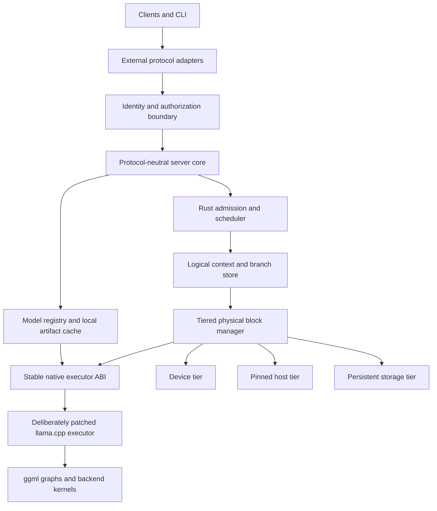

# Cusco architecture, current product, and future direction

## Document purpose and current state

This document describes **Cusco as implemented after the architecture remediation**, followed by work that is expected, work that remains conditional, and directions the project does not intend to pursue. It is a product and engineering contract, not an implementation diary.

The main body is organized around four questions:

- **What exists now:** the supported product profile and the load-bearing contracts of the running system.
- **What comes next:** planned expansion, ordered by measured demand rather than historical implementation sequence.
- **What may come later:** conditional designs that require evidence that the current architecture is insufficient.
- **What will not be built:** unlikely directions and permanent non-goals.

Cusco is written in Rust and uses a deliberately but conservatively extended llama.cpp as its model execution engine. It is not a Rust rewrite of llama.cpp, a wrapper around llama-server, or an incremental feature plan for another server. Its physical-ownership split is:

> llama.cpp and the versioned native shim own model-specific physical allocations, layouts, KV and recurrent state, graph-sensitive buffers, and hot-path address resolution. Rust owns logical contexts and identities, typed opaque native handles, scheduling and tiering policy, authoritative reservations, lifetimes, and transactional publication.

Slots are disposable execution workers. Logical contexts and their evaluated state are durable across requests and slot changes, but the current single-host profile intentionally discards them on daemon restart.

## Foundational technical result

The project began by asking one load-bearing question:

> Can a complete, model-specific executable checkpoint be captured, displaced from an execution slot, moved through the selected memory tiers, rebound transactionally, and continued with the same logits and token IDs as uninterrupted evaluation?

The Gemma proof established exact checkpoint continuation. The production architecture extends that result with native-owned opaque physical representations, real tier movement, copy-free ordinary publication, authoritative allocator accounting, and atomic logical-plus-physical commits.

The proof used immutable `hf://` resolution and verified local GGUF registration so model-management breadth could not obscure the executor boundary.

All real-model acceptance gates use the single cached artifact
`hf://unsloth/gemma-4-E2B-it-GGUF/gemma-4-E2B-it-Q3_K_M.gguf`. Tests pass this
identity directly to the proof or model-lifecycle interface. The registry
resolves and validates the cached local artifact and exposes its path only at
the executor boundary; tests do not inspect cache layout, copy, hard-link,
symlink, or independently redownload it. The model supports vision and tool
use, so those capability gates use this same fixture.

## Motivation and prior evidence

A prior branch-cache prototype demonstrated that restoring previously evaluated branches can avoid most prompt evaluation and reduce resumption latency by an order of magnitude. It also exposed a decisive correctness requirement: restoring ordinary KV state without every architecture-required SWA or recurrent component can produce invalid continuation state. A conservative fallback can preserve correctness by reevaluating the prompt, but then the cache benefit disappears.

Those experiments are evidence for this design, not a codebase dependency. This project starts from the requirements they revealed:

- execution slots must not own durable logical contexts;
- prompt state cannot be modeled only as sequence-associated KV ranges;
- each memory implementation has architecture-specific state and dependency rules;
- prompt-cache policy must be separable from slot scheduling;
- logical prompt identity and executable physical state need distinct representations;
- restoration must be a transactional operation rather than an opportunistic pre-decode mutation.

Conventional continuous batching can tolerate slot-owned sequence state and destructive cache mutation. Those assumptions are a poor fit for a persistent branch cache in which:

- logical contexts outlive execution slots;
- many contexts share evaluated prefixes;
- physical blocks move independently among device, host, and storage tiers;
- spare VRAM holds inactive but likely-to-be-revisited branches;
- a slot temporarily binds a context for execution rather than owning it;
- switching branches must either publish a complete, coherent state or leave the prior state intact;
- model architectures may require global KV, SWA, and recurrent state to be restored together.

A new outer server would allow those requirements to become the primary ownership model rather than a secondary mechanism fitted around existing slot semantics.

## Goals

The system:

1. Represent a logical context independently of any server slot or physical tensor address.
2. Represent evaluated state as dependency-valid composite blocks or checkpoints.
3. Share immutable evaluated prefixes across contexts.
4. Retain multiple inactive contexts in spare VRAM when capacity permits.
5. Demote inactive physical blocks to pinned host memory and eventually persistent storage.
6. Promote only the blocks required for the next execution binding.
7. Switch logical contexts atomically from the scheduler's perspective.
8. Preserve exact model behavior across park, demote, promote, and restore operations.
9. Support ordinary KV, SWA, and recurrent architectures without pretending they have identical dependency rules.
10. Reuse llama.cpp's model loading, graph construction, backend support, and optimized kernels.
11. Expose enough telemetry to explain cache hits, avoided work, transitions, residency, and eviction decisions.
12. Provide a migration path from a copy-based staging implementation to device-side block-mapped execution.
13. Present inference, context management, model management, and operations through one protocol-neutral application interface with versioned external adapters.
14. Make Hugging Face Hub identifiers and reproducibly resolved Hub snapshots the primary model-acquisition path.
15. Keep authentication and usage accounting at stable request boundaries even when a local deployment explicitly enables anonymous administration.
16. Provide a versioned extension point for semantic context-compaction strategies and enough lifecycle information to schedule compaction before it delays the next turn.

## Permanent boundaries and near-term exclusions

Cusco will not:

- rewrite llama.cpp's model implementations or GPU kernels in Rust;
- infer model-specific recurrent layouts or manipulate ggml/C++ objects directly from Rust;
- treat token-identical substrings as interchangeable evaluated state;
- make executor slots the durable owners of logical contexts;
- expose unstable llama.cpp sequence IDs, allocator internals, or tensor addresses as public Rust contracts;
- weaken exact continuation into approximate checkpoint validation;
- put scheduling, admission, lifecycle, or product policy inside the llama.cpp fork;
- execute arbitrary third-party strategy code in the main server process.

The current architecture does not require zero-copy switching, arbitrary suffix reuse, exhaustive protocol compatibility, every model architecture, every media type, speculative decoding, adapters, or grammars. Those are planned or conditional expansions only where the future-direction sections say so.

## Standalone project boundary

This design defines a separate product and source tree. It may reuse and adapt proven executor experiments, tests, and telemetry conventions, but it does not inherit the lifecycle, public API, build layout, or compatibility obligations of an existing branch-cache server.

The project has four independently testable layers:

1. **Coordinator:** Rust-owned logical context identity, branch structure, policy, scheduling, persistence, and transition orchestration.
2. **Native executor:** a pinned llama.cpp fork plus a C-compatible shim implementing model-specific state operations and decode.
3. **Physical tier manager:** Rust-managed reservations and residency state backed by executor-owned representations, transfer operations, and fences.
4. **Independent validation:** black-box and executor-level correctness and performance workloads that do not depend on either server's internal metrics to determine semantic success.

The only mandatory upstream dependency is a pinned llama.cpp revision. The project owns its executor patches, ABI conformance tests, and update procedure. It must be possible to build, run, test, and benchmark the project without checking out the earlier prototype repository.

## Design principles

The implementation should preserve these principles even when individual structures change:

- **Logical identity is not physical location.** Contexts refer to immutable evaluated identities; physical representations may move or disappear.
- **Textual equality is not state equivalence.** Evaluated reuse requires dependency lineage, model configuration, and representation epochs to match.
- **Composite state commits together.** Global KV, SWA, recurrent state, metadata, and completion state form one executable contract.
- **Preparation may be expensive; publication must be atomic.** A worker observes a complete old binding or a complete new binding.
- **Capacity promises outrank cache warmth.** Opportunistic blocks never consume the active-growth guarantee.
- **Asynchronous work extends ownership.** Submitted backend work retains storage through an explicit completion fence.
- **Correctness precedes speed claims.** A restoration is a hit only after it commits and produces behavior equivalent to valid evaluation.
- **Staged execution is a supported operating mode, not throwaway scaffolding.** It preserves the same ownership and transaction model as mapped execution.
- **The ABI is small-surface, high-semantic-density.** Few entry points may carry rich descriptors and strict lifecycle obligations; “small” must never be mistaken for trivial.

## Terminology

This document uses the following terms consistently:

- **Logical context:** a durable token history plus references to the evaluated state that is valid for some prefix of that history.
- **Logical block:** a canonical token interval used for identity, sharing, dependency accounting, and mapping; it contains no device address.
- **Evaluated component:** architecture-specific state for a logical interval or boundary, such as global KV, SWA state, or a recurrent checkpoint.
- **Composite block or checkpoint:** the coherent set of every evaluated component required to continue from one represented boundary.
- **Physical representation:** bytes and layout metadata realizing an evaluated component in device, host, or persistent storage.
- **Execution slot:** a disposable native worker capable of running a batch; it is not the durable owner of a context.
- **Binding:** the complete executor-visible association between a slot, represented position, and validated physical state.
- **Transition:** the prepare/commit/abort lifecycle used to replace one binding with another.
- **Lineage:** the dependency identity proving that evaluated state was derived from the required preceding history and compatible execution configuration.
- **Epoch:** an invalidation identity for model, adapter, representation format, or executor state.
- **Semantic context compaction:** constructing a new, shorter logical token history that preserves selected information from an older history; this creates new lineage and is distinct from compressing physical cache bytes.
- **Context strategy:** a registered policy implementation that proposes when and how to trim, summarize, or otherwise compact a logical context.

“Block” describes canonical logical identity and accounting. It does not require every model component to be physically stored as independently executable fixed-size pages. Recurrent state may be represented as a boundary checkpoint while still participating in the same composite mapping and transaction.

## Core architectural decision

The cache should wrap and control the inference engine rather than remain an optional side structure subordinated to server slots.



The Rust process owns durable context identities and cache policy. llama.cpp remains authoritative for the model-specific meaning of executable state.

## Responsibility split

### Rust server and coordinator

Rust should own:

- HTTP and protocol handling;
- request admission, cancellation, deadlines, and fairness;
- session, agent, conversation, and branch identities;
- token-sequence identities and persistent branch DAGs;
- logical evaluated-prefix mappings;
- prefix lookup and dependency validation;
- device, host, and storage residency policy;
- physical capacity accounting;
- eviction scoring;
- promotion and demotion planning;
- transition reservations;
- slot assignment;
- commit and abort state machines;
- background transfer orchestration;
- metrics and tracing;
- persistence and recovery of logical metadata.
- canonical inference and model-management operations independent of any external protocol;
- model registry, Hugging Face acquisition policy, local artifact-cache metadata, and administrative lifecycle operations;
- authentication and authorization interfaces, with anonymous administration available only when explicitly configured;
- protocol-independent usage accounting for prompt, generated, cached, restored, and newly evaluated work;

Rust owns scheduling, decode-quantum boundaries, cancellation, deadlines, stopping policy, and canonical streaming/usage facts. Native execution owns model-compatible sampling primitives and sampler state. A request's sampler state must be suspendable with the request between decode quanta; native code returns selected tokens and the execution facts Rust needs for streaming, usage, and finish reasons. This keeps scheduling preemptible without recreating model-specific sampling behavior in Rust.

### llama.cpp executor

The native executor should continue to own:

- model loading and architecture metadata;
- tokenizer and vocabulary semantics;
- chat-template application and token-piece rendering;
- model tensor definitions;
- graph construction;
- backend buffer allocation;
- CPU, CUDA, and other backend kernels;
- architecture-specific forward passes;
- architecture-specific memory dependencies;
- recurrent checkpoint capture and binding;
- execution of token batches against a supplied valid memory binding;
- model-compatible sampling primitives and suspendable sampler state.

### Native ABI shim

A small-surface, high-semantic-density C-compatible ABI should separate Rust from llama.cpp's internal C++ types. Its surface should remain intentionally compact, but its semantics are necessarily rich: capabilities, canonical geometry, dependency descriptors, arenas, checkpoints, transfers, fences, epochs, and bindings all cross this boundary through stable handles and versioned data-oriented descriptors.

Rust must not manipulate ggml tensors or memory implementations directly. The shim must expose concepts that the current high-level API does not represent sufficiently:

- model memory capabilities and canonical block geometry;
- component dependency and compatibility descriptors;
- physical representation and arena handles;
- logical-mapping validation results;
- physical preparation plans and completion fences;
- prepared executor bindings;
- recurrent checkpoint import and export;
- decode submission and completion;
- invalidation when model, adapter, representation, or execution epochs change.

The selected ownership model is **Approach A: native-owned opaque physical state**. ABI 9 begins that cutover: it no longer exposes llama sequence IDs as Rust mapping identities, and instead returns opaque, reference-counted representation handles tied to the executor lifetime, plus uniquely owned prepared handles with abort-on-drop semantics. The complete contract also requires model-described component coverage, authoritative size and placement, explicit completion fences, and prepare/validate/commit/abort operations across physical preparation and publication; those remaining descriptors and reservations must be added before capacity accounting can be authoritative. The boundary must not expose raw allocator internals or assume that one Rust logical chunk equals one physical allocation.

The ABI leaves room for **B1**, a conditional evolution in which native code allocates model-specific blocks while Rust owns their stable identities, references, sharing, tier placement, and mapping composition. No public Rust contract assumes that one opaque representation handle is permanently backed by one llama sequence. B1 is justified only by measured branch-copy, coarse-eviction, or prefix-sharing costs, and must execute directly or activate reference-only from composed blocks rather than copy them into a conventional sequence first.

**B2**, fully Rust-owned host/device allocation and physical layout, remains possible but is not a planned direction. It would require Rust to reproduce or track llama.cpp's alignment, cache formats, backend allocation, graph stability, scratch, SWA, recurrent-state, and architecture-specific requirements. It may be reconsidered only after A and B1 prove inadequate and through a separate design commitment; raw-buffer escape hatches must not allow the ABI to drift into B2 incrementally.

The ABI should distinguish three operations that may collapse differently in staged and mapped implementations:

1. **Logical mapping validation:** determine whether component identities, lineage, boundaries, and epochs describe a coherent target state. This operation must not allocate or mutate a slot.
2. **Physical representation preparation:** resolve or create the required device representations, schedule transfers or staging copies, and return fences plus ownership-bearing preparation handles.
3. **Executor binding construction:** combine validated logical state and completed physical representations into a candidate binding that the executor can publish atomically.
In Approach A, preparation resolves or creates opaque native state while binding construction publishes an opaque candidate. A future B1 implementation may resolve existing native-allocated blocks and publish a block table behind the same Rust-owned transaction. Native code may fuse internal copies where useful, but the logical operation remains prepare, validate, commit, or abort.

## External API adapter architecture

External compatibility is a shim layer over a protocol-neutral application API, not a set of alternate request paths wired directly into scheduling or the executor. To avoid confusion with the native C ABI shim, this document calls these modules **protocol adapters**.

The first-class external surfaces are an explicitly versioned local-inference profile of the OpenAI-compatible API under `/openai/v1/*` and the Cusco control plane under `/cusco/v1/*`. The control plane includes a bounded Ollama-compatible model-management profile under `/cusco/v1/api/*`; it intentionally does not provide Ollama chat or generation, and no standalone `/ollama/*` routes exist. Both surfaces must be described by the generated, checked OpenAPI document and must normalize into protocol-neutral services. Compatibility clients must accept a configured subdirectory base URL. Open WebUI is configured with `/openai/v1` as its normally enabled OpenAI inference connection and `/cusco/v1` as a normally disabled Ollama management connection; operators enable the latter only for model administration, then disable it and refresh the model list.

The supported OpenAI profile is a tested behavioral contract. It includes model discovery, text and chat completion, streaming, deterministic and commonly used sampling controls, stop handling, structured output, tool calls where the selected model supports them, and the Responses shape. Embeddings remain unavailable until the executor exposes them. Compatibility covers request defaults and validation, model-name resolution, chat-template application, terminal-token suppression, whitespace semantics, finish and stop reasons, usage accounting, error envelopes, cancellation, and streaming-native rather than JSON-shaped chunks. Durable contexts, branches, cache policy, extended usage, model administration, billing, organization administration, and other hosted-service control planes remain Cusco concerns rather than OpenAI compatibility claims.

Multimodal input is deliberately limited to text plus images for chat and Responses requests on models whose llama.cpp executor path exposes a compatible vision projector. The OpenAI adapter accepts typed content parts and `image_url` data URIs. Remote URL fetching, audio, video, image generation, and cross-model media pipelines are later work. Image bytes must be size-bounded, content-addressed for request and cache identity, decoded once, and tied to the model/projector epoch; unsupported media or models fail before admission rather than silently degrading to text.

The internal boundary should normalize each adapter into the same operations and event stream:

```rust
trait InferenceService {
    async fn complete(
        &self,
        request: CanonicalGenerationRequest,
        caller: RequestContext,
    ) -> Result<GenerationEventStream, ServiceError>;
}

trait ModelService {
    async fn fetch(&self, request: FetchModel, caller: RequestContext) -> Result<ModelRecord, ServiceError>;
    async fn list(&self, caller: RequestContext) -> Result<Vec<ModelRecord>, ServiceError>;
    async fn remove(&self, request: RemoveModel, caller: RequestContext) -> Result<(), ServiceError>;
}
```

Context lifecycle extensions should use the same application boundary. `CanonicalGenerationRequest` should reserve optional fields for compaction strategy selection and versioned strategy parameters; when omitted, compaction is explicitly disabled and no predictive path is started.

```rust
struct CanonicalGenerationRequest {
    ...
    compaction: Option<CompactionRequest>,
}

struct CompactionRequest {
    strategy_preferences: Vec<StrategyId>, // ordered list, empty => no compaction
    fallback_when_no_match: CompactionNoMatchFallback, // default: NoCompact
    trigger: CompactionTrigger,            // explicit (request-only, no background guessing)
    strategy_config: JsonValue,            // strategy-specific policy overrides
}

enum CompactionNoMatchFallback {
    // execute request without compaction when no preferred strategy is supported
    NoCompact,
    // reject the request when no preferred strategy is supported
    Reject,
}

enum CompactionTrigger {
    // request-only predictive declaration from an active request
    Predictive,
    // no automatic compaction on ordinary generation completion
    None,
}
```

All external APIs that can influence generation must accept an explicit `compaction` request parameter with the same type requirement. If present, `compaction.strategy_preferences` is an ordered preference list evaluated at admission/selection time.

The list is treated as "first supported strategy wins." Unknown strategy identifiers are rejected as validation errors.

If the list is empty or no preference is supported in this build, `compaction.fallback_when_no_match` controls behavior. The default is `NoCompact`, which runs the request without compaction and still applies normal request-level resource ceilings; if the request then hits a limit, the request fails as usual. If `Reject` is selected, the request is rejected immediately when no preference can be used.

The build-time strategy registry is closed-world: only identifiers compiled and registered in the release are valid on admission. A later release may widen this set by changing the compiled strategy-registry contract; clients discover supported values from catalog APIs instead of relying on undocumented assumptions.

Protocol adapters may map their own extension fields onto this canonical object (for example, an OpenAI extension field `cusco_compaction` and an Ollama options field `cusco_compaction`). Inference adapters must validate and reject unknown enum values instead of treating the request as a boolean toggle.

`ContextLifecycleService::list_strategies` should include current strategy catalog version and supported ids so clients can negotiate capabilities before sending preference lists.

A dedicated context-lifecycle service accepts advisory client-presence signals and exposes strategy discovery without making any external protocol adapter responsible for compaction policy. `/cusco/v1/*` compaction policy operations, strategy capability endpoints, and registration paths use the same authorization seam and principal-scope model as generation endpoints. A richer operator role lattice is planned expansion.

Protocol adapters may map native fields or extension objects onto these canonical operations. A selected strategy is part of request and context policy, not model identity, and authorization policy must govern strategy enumeration, selection, registration, and execution.

Capabilities that neither compatibility protocol models—including durable logical contexts, branch selection and import, cache and compaction policy, activity hints, extended usage, and explicit request cancellation—belong to the versioned `/cusco/v1/*` API. They remain visible in the generated OpenAPI document and are not smuggled into unrelated OpenAI or Ollama fields. The supported surface contains no `/native/*` routes.


Canonical request types preserve the information required by the OpenAI profile without embedding that protocol's JSON schema into `server-core`. The adapter owns field names, defaults, error envelopes, streaming framing, and protocol-specific model-name syntax. The core owns validation, scheduling, context semantics, execution, and usage facts. This boundary is valuable independently of whether another inference protocol is ever added.

The supported external profiles are:

1. **OpenAI-compatible `/openai/v1`:** the sole public inference contract.
2. **Ollama-compatible management under `/cusco/v1/api`:** `version`, `tags`, `show`, `pull`, `copy`, `delete`, and `ps` preserve the request, response, progress-stream, and error shapes expected by Ollama management clients while delegating to Cusco lifecycle services. There is no Ollama `generate` or `chat` endpoint. Pull is convergent rather than create-only: it resolves the requested symbolic revision, compares it with the installed immutable identity, verifies every existing artifact before reuse, repairs incomplete or corrupt content, and transactionally publishes an updated record when the resolved identity changes.

Protocol study still does not justify leaking wire schemas into the core. Its purpose is to distinguish broadly useful application semantics from wire-specific conventions so every adapter remains a thin shim rather than a second execution path.

Efficiency requires more than translating JSON. Adapters should share zero-copy or bounded-copy request bodies where practical, use one backpressure-aware internal event stream, avoid retokenizing merely to populate compatibility fields, and derive all usage views from one execution record. Chat templates and tool schemas may require protocol-specific normalization before tokenization, but tokenization and model execution must happen only once.

### Authentication and authorization seam

The local deployment profile can run without configured credentials while still routing every CLI and HTTP operation through authentication and authorization interfaces. Its anonymous provider returns a well-known administrator principal; it is a provider implementation, not a scattering of `if auth_enabled` bypasses.

With that provider active, network listeners default to loopback or a local socket. Binding an unauthenticated administrator to a non-local interface requires an explicit unsafe-development option and emits a prominent startup warning.

`RequestContext` carries a principal, credential identity when present, request identity, and authorization scope. Inference, context mutation, model fetching, cache deletion, and server administration invoke explicit policy checks. Replacing the anonymous provider with API keys, local socket identity, or another mechanism does not change handler signatures or core service contracts.

### Usage accounting without billing

Billing is out of scope, but accurate accounting is not. The server should emit a canonical usage record containing at least input tokens, generated tokens, prompt tokens actually evaluated, prompt work satisfied from cache, model identity and revision, logical context identity when applicable, latency, and terminal status. Protocol adapters may expose only the fields their protocol supports, while telemetry and administrative APIs retain the richer record.

Accounting must be generated by `server-core` from committed execution facts rather than reconstructed independently by adapters. This keeps OpenAI, Ollama management, CLI, telemetry, and administrative views consistent and preserves the distinction between logical input tokens and physical prompt work.

## Model registry and Hugging Face lifecycle

Hugging Face Hub should be the primary model acquisition mechanism. The canonical external identifier is an `hf://` URI, including optional repository type, revision, and file path, for example:

```text
hf://models/organization/model
hf://models/organization/model@revision
hf://models/organization/model@revision/path/to/model.gguf
```

The `model` field accepted by inference APIs and the CLI should resolve:

- an installed model's `hf://` identifier;
- an alias published by Ollama pull or copy; or
- a configured local model name declared in `data/user.yaml`.

Hugging Face is the preferred acquisition path, but it is not the only loading path. Operator-owned GGUF and projector files are mounted read-only under `/models/user` and declared in the read-only `/etc/cusco/user.yaml`; every configured file path is relative to that model root. They are never registered through an HTTP API, copied into the managed Hub cache, or assigned a fictitious `hf://` identity. Arbitrary request-supplied filesystem paths must not bypass configuration, provenance, compatibility checks, or the mounted path boundary.

For a Hub-backed model, resolution must pin the repository to its immutable commit and record the identities of every selected metadata artifact alongside the GGUF. Cusco should consume declarative repository files when present—including model configuration, tokenizer and special-token configuration, tokenizer vocabulary/model data, generation configuration, and chat templates—as candidate profile inputs rather than discarding the first-class metadata surrounding the weight file. It must not import or execute repository Python, `trust_remote_code`, custom kernels, or arbitrary template extensions. Repository metadata is not independently authoritative: converted GGUF repositories may omit it, carry files from a different source revision, or disagree with the tokenizer and template embedded in the selected GGUF. Cusco therefore compares its tokenizer/vocabulary fingerprint, special-token IDs, rendered template fixtures, architecture metadata, and declared limits with the loaded GGUF and executor probe and fails closed on a correctness-relevant mismatch. Effective context capacity remains the minimum of trustworthy repository/model metadata, the operator cap, and the executor's usable runtime capacity; Hub metadata cannot describe current backend allocation limits.

The local-model declaration should require only a public name and path. Cusco must derive everything safely available from the GGUF and executor probe—including architecture, tokenizer and vocabulary identity, embedded chat template, training context, RoPE metadata, quantization, tensor layout, and supported capabilities—and persist the resulting immutable identity in SQLite. Optional declarations may pin `sha256`, cap `max_context_length`, override a chat template, identify a vision projector, or reference a configured draft model. A context cap may reduce an inferred limit but must not expand a model or executor limit. Execution placement such as GPU layers, tier budgets, and concurrency belongs to runtime policy, not model identity.

Model-derived configuration follows an explicit source order. Cusco first reads model-local facts from the GGUF and the loaded executor's family-neutral probe. For an immutably resolved Hugging Face model, verified repository metadata may fill facts the model artifact cannot express, but it must remain tied to the resolved commit and must agree with every overlapping GGUF or executor fact. The family catalog supplies recognition predicates, safe interpretation rules, invariants, and only genuinely family-wide defaults; it must not promote one fixture's model name, context limit, special-token IDs, tokenizer switches, placement, or memory measurements into family truth. Unresolved required facts and source conflicts fail model publication with provenance-rich diagnostics rather than selecting a familiar profile by name.

Cusco may extend model support from above through a versioned Rust-owned execution profile selected first from the GGUF and executor probe, with verified Hub repository metadata filling only facts the model artifact cannot express. Profile selection may use declarative family signatures such as architecture/model type, tokenizer identity, special-token layout, chat-template structure, and executor capability descriptors. This deliberately allows later built-in family support to be expressed as data and validation rules rather than model-name conditionals: an unknown Hub model may match a known family profile only after its required predicates and conformance fixtures pass, while an unmatched model may use a generic profile only when the native executor exposes every required fact. A profile may supply declarative interpretation that the executor can already express: chat templates, role and turn markers, terminal and control-token sets, tokenizer configuration, model-family aliases, capability declarations, output normalization, projector association, and validated metadata corrections. The immutable profile identity includes the resolved Hub metadata artifact identities, selected profile version, validated declarations, GGUF identity, and executor compatibility epoch, so changing any correctness-relevant input invalidates evaluated state and resident compatibility.

Built-in family support should have one repository-owned, schema-versioned declarative source such as `model-profiles/families.yaml`. This catalog is the review and contribution interface for family support that needs no new execution mechanics. Each entry has a stable profile ID and version; bounded, non-executable match predicates over Hub, GGUF, tokenizer, and executor facts; deterministic ambiguity/precedence rules; permitted metadata interpretations and source precedence; template and role-marker declarations; terminal/control-token invariants; output-normalization policy; capacity constraints that can only narrow probed limits; and references to conformance fixtures. The schema forbids arbitrary expressions, code hooks, remote includes, and silent unknown fields. A pull request that adds a family must make its claimed match surface and behavioral evidence reviewable in this catalog rather than scattering model-name checks through Rust.

A deterministic repository tool validates the YAML, rejects overlapping or under-specified matches, checks fixture identities and expected template/token behavior, and compiles the catalog into a static Rust representation included in the server binary. Normal Cargo and container builds must require no network access or model download for this compilation, and CI must verify that generated output is reproducible and current. A companion scaffolding command may resolve a pinned `hf://` model, download its declarative metadata, probe an available GGUF through the native executor, and propose a new catalog entry and fixtures, but generated claims remain untrusted until schema checks, exact fixtures, executor capability checks, and review pass. If a candidate requires new tensor, graph, kernel, or checkpoint mechanics, the tool must report that boundary rather than manufacturing a family profile.

The model registry remains responsible only for immutable resolution, acquisition, hashing, provenance, and artifact publication. It stores repository metadata files as verified opaque artifacts and does not interpret them into execution policy. A separate profile-catalog component lazily decodes only the metadata needed for a selected model, combines it with the GGUF and executor probe, validates the compiled family schema, and produces the immutable execution profile. This keeps network/artifact identity separate from model semantics and avoids parsing large tokenizer metadata during unrelated registry operations.

This extension mechanism must not become a parallel model executor. Tensor layouts, architecture-specific recurrent state, attention and RoPE mechanics, graph construction, expert routing, checkpoint tensor semantics, and kernels remain llama.cpp responsibilities. When a new model requires those mechanics, Cusco should carry a narrow, reviewable llama.cpp patch or wait for upstream support rather than reconstructing execution in Rust.

This creates three explicit support levels. **Declarative family support** covers variants whose tensor and tokenizer mechanics llama.cpp already executes; Cusco may recognize, validate, template, normalize, cap, and release-gate those variants entirely through the compiled catalog. **Native-boundary enablement** covers an already-implemented llama.cpp mechanic that is missing a capability probe, stable descriptor, checkpoint component, or narrow metadata correction; Cusco may carry a small versioned shim or executor patch behind its C ABI. **New execution mechanics** cover unsupported tensor layouts, graph operations, attention/recurrent behavior, quantization, expert routing, or backend kernels; these require an upstream implementation or a deliberately maintained llama.cpp patch and cannot be manufactured by profile data. The pinned executor tag, patch series, capability fixtures, and profile conformance tests let Cusco choose when support enters or leaves its release rather than inheriting upstream claims automatically, but they do not remove the maintenance cost of native architecture support.

The automation target is that ordinary additions stop at the declarative level and most native-boundary gaps disappear through one sufficiently generic ABI rather than recurring family patches. Catalog entries declare required native capabilities and component invariants; they never assert that an executor implements them. The native probe reports those facts using a family-neutral descriptor vocabulary, and the catalog compiler generates matching and validation code around that probe. If the executor already implements all requested mechanics, adding a family changes only YAML and fixtures. If a new model exposes another instance of an existing capability category, the generic probe or generated descriptor table should cover it without handwritten family dispatch. Only a genuinely new primitive or descriptor kind extends the ABI once for all families. The contributor tool should classify failures as catalog-only, metadata/probe exposure, or missing execution mechanics and generate the catalog and fixture portions while refusing to disguise the last category as data.

Missing execution mechanics are therefore not necessarily blocked on upstream release timing. Cusco's pinned llama.cpp patch series is the supported downstream extension path. The profile tool may use the resolved model metadata, GGUF inspection, failed capability checks, fixture traces, and analogous supported architectures to produce an evidence bundle and, where sufficiently constrained, a candidate native patch, ABI descriptor update, and conformance tests. A profile may reference a repository-owned native-extension identifier, but YAML must never embed C++, fetch executable patch code, or mark the capability as present. The implementation remains a separately reviewed patch under `executor/patches`, applied reproducibly to the pinned tag; only the patched executor's capability probe and exact native fixtures can enable the profile. This can remove upstream release latency and automate much of diagnosis and scaffolding, while keeping model-specific kernel and state-transition correctness subject to native review and proof.

Automated native-patch synthesis and a generalized extension marketplace are not part of the supported system. The escape hatch is intentionally manual: add a reviewed patch to the ordered series, expose its capability through the generic ABI, attach exact fixtures, and reference that capability from the family profile. More automated diagnosis or patch proposals are justified only if repeated real-model additions demonstrate that they save maintenance effort.

Compatibility epochs are derived from canonical immutable semantic inputs—the catalog schema and selected profile contents, resolved Hub commit and artifact digests, GGUF identity, validated declarations, and executor compatibility version—not from generated Rust source, `OUT_DIR` bytes, object layout, compiler identity, or other build-environment artifacts. The generated catalog is an implementation representation whose reproducibility is checked independently; equivalent inputs must produce the same compatibility identity across builders.

For example:

```yaml
models:
  my-gemma:
    path: my-gemma.gguf
    sha256: 0123456789abcdef… # optional integrity pin
    max_context_length: 8192  # optional cap
    projector: my-gemma-mmproj.gguf # optional
```

At startup Cusco requires every configured model, projector, and draft-model path to be relative, joins it beneath `/models/user`, canonicalizes the result, and rejects absolute paths, `..` traversal, symlink escape, and non-regular or unreadable files. It computes and optionally checks digests, probes model metadata, and transactionally reconciles derived `LocalFile` records with SQLite. `user.yaml` is the sole source of truth for this configured subset: names, aliases, provenance, paths, and optional overrides are read-only through HTTP and CLI management. Operators change configured entries by editing `user.yaml` and restarting. API-managed Hub records remain independently mutable and are not removed merely because they are absent from `user.yaml`. The service does not live-reload configured files, so model bytes cannot change beneath an active mapping.

If no alias is supplied for a Hub model, the normalized `hf://` URI is the model's public name. `ModelRecord` distinguishes `HubSnapshot` and configured `LocalFile` provenance; a local record retains its configured name, canonical path, size, digest, discovery time, and derived metadata, while a Hub record retains repository and revision provenance.

Inference is lookup-only with respect to model installation: it never initiates, enqueues, or waits for a network fetch and never accepts an undeclared local path. An unavailable reference returns a stable “model not installed” error with the canonical identifier. The Cusco model-lifecycle service—exposed canonically under `/cusco/v1/*`, with its bounded Ollama-compatible management projection under `/cusco/v1/api/*`—and startup reconciliation from `user.yaml` form the complete public model-discovery and installation contract.

The Rust model service should use the Hugging Face Hub client rather than scrape web pages or shell out to a CLI. The current `hf-hub` client supports repository metadata, revision-aware snapshot downloads, conditional requests, atomic cache writes, and cache inspection. If a required Hub feature is temporarily absent from the Rust client, it should be implemented behind the model-source trait or delegated to a small isolated helper, not leaked into inference handlers.

Private or gated repositories require a Hugging Face access token. The model service should receive that token through a secret-provider reference or process configuration, pass it only to the Hub client, and never persist the token in `ModelRecord`, logs, provenance, aliases, or API responses.

Each successful installation should publish an immutable `ModelRecord` only after all selected artifacts are complete and verified. The record should retain:

- the requested and normalized `hf://` URI;
- repository type, namespace, name, and requested revision;
- resolved immutable commit hash;
- selected model files and their sizes, Hub ETags or content hashes where available;
- local cache paths;
- model format and executor-discovered metadata;
- optional alias;
- fetch time and last verification time;
- compatibility inputs that contribute to the model and executor epochs.

A repository may contain several quantizations, sharded variants, or unrelated artifacts. Fetch requests should therefore accept explicit include patterns or a concrete file URI. If automatic selection cannot identify one unambiguous supported artifact set, installation should stop with a structured choice list rather than downloading or loading an arbitrary model.

### Standard Gemma validation assets

The standard executor integration suite should use a small, publicly reproducible Gemma 4 model rather than an unrecorded developer-local weight file. The required baseline asset is:

```text
hf://models/unsloth/gemma-4-E2B-it-GGUF@0314792d7f1f7e229411f620751375812bb9faf2/gemma-4-E2B-it-Q3_K_M.gguf
size:   2,536,786,016 bytes
sha256: 086e2f5ba85057f8f19712e3160a644728f74f323c9feeac4cd73fab11b43085
```

This is the canonical core checkpoint-equivalence model until an intentional, reviewed fixture update changes the locked identity. The integration runner may accept a registered local path to these exact bytes for offline and developer use, but it must verify the digest and report the canonical identity in its result artifact. Model-free lifecycle tests remain separate and fast; the externally provisioned model test is a required executor integration gate, not a reason to commit multi-gigabyte weights to the repository.

An optional experimental lane may exercise Gemma 4 multi-token prediction with the QAT mobile model and its paired MTP draft:

```text
target:
  hf://models/unsloth/gemma-4-E2B-it-qat-mobile-GGUF@46af839dc23aceb4b965ab640dae7fc1bea39bba/gemma-4-E2B-it-qat-UD-Q2_K_XL.gguf
  sha256: 0a5bbc20f91f92da96ab4870fa71b356c45b8500a7b8b9c3e0eb48359b72da28
draft:
  hf://models/unsloth/gemma-4-E2B-it-qat-mobile-GGUF@46af839dc23aceb4b965ab640dae7fc1bea39bba/MTP/mtp-gemma-4-E2B-it-Q4_0.gguf
  sha256: 586f2460b909008640981ec34060aa864e03c144fbabfb3173c4335087e4aae0
```

The optional speculative lane is valuable because it stresses checkpoint identity, cancellation, and rollback, but it never substitutes for the non-speculative baseline gate. It runs only when the pinned executor reports support for both artifacts and plain Gemma restoration passes. Multimodal projection files remain outside this text-only checkpoint gate.

Symbolic branches and tags are convenient acquisition requests, but a loaded model epoch must bind to the resolved commit and exact artifact set. Updating `main` therefore installs a new record and invalidates compatible execution state through an epoch change; it must never mutate the identity beneath a running model.

The canonical model-lifecycle service belongs to the Cusco control plane. Configured `LocalFile` records reconciled from `user.yaml` are visible but immutable through this service. A bounded Ollama-compatible management profile exposes:

- `GET /cusco/v1/api/tags` to list installed models, immutable revisions, aliases, sizes, load state, and configured provenance;
- `POST /cusco/v1/api/show` to report source provenance and executor metadata;
- `POST /cusco/v1/api/pull` to install or converge an API-managed model to the requested source identity, rejecting configured names and aliases;
- `POST /cusco/v1/api/copy` to assign another public name to an API-managed record without changing immutable model identity, rejecting configured sources and destinations;
- `DELETE /cusco/v1/api/delete` to remove an API-managed model record and eligible artifact content, or report why loaded, pinned, referenced, or configuration ownership prevents removal;
- `GET /cusco/v1/api/ps` to project current residency in the form expected by Ollama management clients.

`/cusco/v1/api/pull` carries update checking and verification as mandatory lifecycle behavior rather than exposing them as separate public maintenance operations. Every pull resolves symbolic Hub revisions to immutable identities, validates cached sizes and digests before reuse, resumes or repairs incomplete content, and no-ops only when the installed record is both current and valid. A changed identity is prepared as a new immutable record and published atomically; it must not mutate the identity beneath an active execution. Pull never converts, shadows, or replaces a `user.yaml`-owned entry.

Local files require no native registration exception: they are discovered exclusively from `user.yaml` and exposed read-only through the same model list and show views as pulled artifacts. Their names, aliases, declarations, and removal remain configuration-owned. The public lifecycle surface consists of the compatibility-profile operations and startup reconciliation; no separate native register, list, show, fetch, update-check, verify, alias, or delete routes remain.

Downloads, updates, verification, repair, and deletions require per-model coordination, temporary-file cleanup, atomic publication, capacity checks, and cancellation. Cache management must distinguish the Hugging Face artifact cache from the evaluated model-state cache described elsewhere in this document. The compatibility handlers and CLI call the same protocol-neutral `ModelService`; neither owns an independent model store.

## Command-line interface

The CLI should be a first-class client of the same application services, not a test-only wrapper around internal objects. Its command organization should take practical inspiration from Ollama while retaining the project's explicit model, context, and cache semantics:

```text
cusco serve
cusco run <model-reference>
cusco chat <model-reference>
cusco complete <model-reference>
cusco model pull <hf-uri> [--alias NAME]
cusco model list
cusco model show <model>
cusco model copy <source> <destination>
cusco model delete <model>
cusco cache status
cusco context list
cusco context inspect <context-id>
```

The CLI defaults to the Ollama-compatible management and Cusco extension APIs, with an explicit local/in-process mode for proofs and recovery. Configured local models are edited declaratively in `data/user.yaml`, not registered imperatively by the CLI. Output supports stable machine-readable JSON and human-readable tables. Destructive operations require confirmation unless a non-interactive flag is supplied.

The CLI provides a direct path for loading a Hub model, running inference, exercising capture and restore, inspecting usage, and managing local artifacts. HTTP adapters and CLI commands share the same application-service contracts.

## Logical contexts

A logical context is a durable description of a token history and the portion of that history for which valid evaluated model state exists. It is not an execution slot, does not contain raw device addresses, and does not prescribe native allocation geometry.

Conceptually:

```rust
struct LogicalContext {
    id: LogicalContextId,
    tokens: PersistentTokenSequence,
    evaluated: EvaluatedPrefix,
    represented_end: Position,
    model_epoch: ModelEpoch,
    adapters: AdapterSetId,
}
```

Token storage and evaluated-state storage should remain distinct. A target context may contain tokens for which no evaluated representation exists yet.

For example, after branching in the middle of a context:

```text
source tokens:  [shared prefix][old tail]
source state:   [shared prefix][old tail]

target tokens:  [shared prefix][new tail]
target state:   [shared prefix][missing ]
```

The old tail remains valid for its original branch. It must not be attached to the new branch merely because some later tokens happen to match.

## Persistent sequence representation

Logical token sequences use immutable chunks in a lightweight persistent structure such as a radix tree, persistent rope, or balanced tree with subtree hashes. Constructing a branch structurally shares unchanged chunks rather than copying an entire token vector or full-prefix descriptor array. Chunk identity and executor-described component coverage meet at evaluated boundaries, but a logical chunk need not correspond one-to-one with a native allocation and must not assume identical geometry for global KV, SWA, and recurrent state.

A logical sequence node might contain:

```rust
struct SequenceNode {
    parent: Option<SequenceNodeId>,
    token_block: TokenBlockId,
    token_count: u32,
    subtree_hash: DependencyHash,
}
```

The exact representation is an implementation choice. Required properties are:

- cheap append;
- cheap branch creation;
- longest-prefix lookup;
- structural sharing;
- stable logical identities;
- collision-safe token confirmation after hash lookup;
- efficient reclamation when no logical context references a branch.

## Semantic context compaction

Long-running conversations will eventually approach the model's usable context limit. Waiting for the next request to arrive and then discovering that its prompt no longer fits puts trimming, summarization, retokenization, and prompt evaluation directly on the user's critical path. Once the server can predict that the next plausible turn will cross a configured headroom threshold, it should be able to prepare a compacted successor immediately after the current reply reaches its terminal event.

This is speculative background work, not a mutation of the context that produced the reply. The coordinator should:

1. preserve the original logical context and its evaluated mapping;
2. ask the selected strategy to propose a shorter logical history;
3. validate and tokenize the proposal under the same model, adapter, and template configuration;
4. construct and evaluate a new logical branch with new dependency lineage;
5. publish that branch as a prepared successor only after its complete state commits;
6. select the original or compacted successor when the next request arrives according to explicit context policy.

If compaction fails, is cancelled, or loses a race with the next request, the original context remains valid. A strategy output is never allowed to masquerade as state derived from the old tokens: semantic compaction changes token history and therefore requires fresh evaluated-state identities. Whether a summary preserves enough meaning is a strategy-level quality property; cache correctness still requires exact execution from whichever new history was actually published.

### Pluggable strategy boundary

The strategy system exposes a registry of versioned context strategies selectable by stable identifier in an API request or stored context policy. The current trusted Rust registry provides deterministic built-ins. Registry descriptors declare accepted inputs, configuration schema, output contract, determinism, resource requirements, implementation kind, and compatibility version.

The protocol-neutral types reserve the out-of-process extension boundary without loading interpreters or arbitrary code into the scheduler. Third-party Rust, Python, and other user-authored strategies are planned expansion and will use a versioned protocol exchanging bounded structured context and a proposed replacement history plus provenance. It does not expose native tensor handles, physical block locations, authentication secrets, or mutable cache internals.

All strategy implementations must pass the same validation and publication path. They may propose logical content and policy hints, but only the coordinator can create lineage, reserve resources, evaluate state, and atomically publish a successor. Per-principal allowlists, deadlines, memory and output limits, cancellation, and auditable strategy provenance are required before third-party execution is enabled.

The protocol-neutral contract should reserve types equivalent to:

```rust
struct ContextCompactionPolicy {
    strategy: StrategyId,
    strategy_config: JsonValue,
    trigger: CompactionTrigger,
    next_turn_headroom: TokenCount,
    response_headroom: TokenCount,
}

struct ContextActivityHint {
    context: LogicalContextId,
    connection: ConnectionState,
    last_user_activity: Option<Timestamp>,
    expects_next_turn: Option<bool>,
    expires_at: Timestamp,
}

struct CompactionProposal {
    replacement_messages: Vec<CanonicalMessage>,
    provenance: StrategyProvenance,
    semantic_constraints: Vec<Constraint>,
}
```

The server should not guess that another turn is imminent from traffic heuristics. Request intent must drive compaction work:

- if `trigger = Predictive`, schedule request-tied prefetch execution only after the current reply and before the turn advances, using an explicit declaration/context hint from that request.
- if omitted, no predictive compaction request is inferred.

Compaction is **request-first only**: there is no autonomous tick-based speculation. Declaration endpoints are control inputs for next-available request planning, not triggers for immediate background work.

The exact wire schema can evolve, but `StrategyId`, opaque validated strategy configuration, trigger policy, and successor selection belong in the canonical API rather than an OpenAI- or Ollama-specific field. Protocol adapters may map extension fields onto these types. The Cusco control API exposes context policy and activity updates explicitly, and unsupported strategies fail clearly rather than being silently ignored.

Strategy execution uses a request/response protocol with version negotiation, bounded payloads, cancellation, deadlines, and structured error categories. A strategy receives a logical conversation view and declared limits, not an executor binding. It returns a proposal, not permission to mutate a context. Built-in trusted Rust strategies implement the semantic contract in process; user-authored Rust, Python, and future language implementations run behind the same out-of-process worker contract and differ only in deployment and trust policy.

### Explicit predictive compaction intent

A dedicated declaration path is still supported for long-lived sessions where inference requests are not continuous. It accepts the same strategy enum semantics (`None` or registered strategy ID) and scope/lifetime constraints, but it does not replace an explicit request field when one is available.

In v1, declaration is a user preference only: if the request flow reaches an eligibility point where compaction would run, the declared intent is applied; otherwise it is not proactively executed. Eligibility is checked after admission and operates on the pre-request source context (before this turn's new tokens are appended).
### Cache-aware compaction boundaries

The planner should account for known cache geometry when choosing the compacted target length. If the likely next prompt would otherwise force an immediate trim, producing a short terminal cache block that will be invalidated on the next append wastes evaluation and residency. Subject to the strategy's semantic constraints and required headroom, the planner should prefer a target whose evaluated prefix ends on a reusable canonical boundary and leaves room for the expected next user turn and reply.

This is an optimization, not permission to delete meaningful content merely to fill blocks. The trace should report requested headroom, chosen boundary, any unavoidable partial tail, work performed speculatively, work later reused, and work abandoned because the original branch continued instead.

Speculative compaction remains request-tied. Autonomous background worker queues, dedicated admission classes, and longer-lived proposal-retention policies are future work.

At most one request-tied proposal for the same context, policy version, and source head executes at once. A new turn, policy update, model epoch change, or context deletion cancels or obsoletes earlier work without invalidating the source branch. Prepared successors may be retained briefly under normal cache policy, but speculation cannot create an unbounded second copy of every conversation.

## Token identity is not evaluated-state identity

A token payload can be identified from its literal tokens, but its position in a logical context must also name its exact ancestry. Every model/profile epoch begins at one canonical zero-token root. Every non-root logical block is an immutable parent-relative token delta with exactly one parent:

```text
token payload identity = hash(tokens)

logical block identity = hash(
    root identity,
    parent logical block identity,
    token payload identity
)

evaluated mapping identity = hash(
    model and profile epochs,
    logical block identity,
    evaluation parameters,
    component dependency summary,
    executor and representation compatibility epochs
)
```

This distinction is essential. For a globally causal transformer:

```text
KV(suffix | history A) != KV(suffix | history B)
```

in general, even when the suffix tokens are identical.

Exact matching prefixes remain the primary reusable unit. Finite-window components may permit additional reuse, but only when their complete dependency identities match.

## Logical block tree and physical materializations

Logical contexts form an immutable, structurally shared, copy-on-write tree rooted at the zero-token initial sequence state. A branch is a head plus the unique parent walk to that root; forking adds a new suffix and never copies or mutates shared ancestors. The root may be a symbolic executor initial-state factory rather than a serialized buffer, and model-global weights are not part of it.

Logical blocks contain parent identity and tokens, not a mandated byte-level difference of native state. “Delta” describes their parent-relative semantic position: ordinary KV may naturally have interval representations, while a recurrent transition may require replay or an opaque cumulative native state. A logical block may exist without any evaluated representation.

Evaluated state is an optional, independently managed acceleration associated with a logical tree position. It may be cumulative, block-mapped, replayable, or architecture-specific; cumulative materializations at arbitrary heads act as restoration shortcuts without becoming different logical node types. Retaining a descendant preserves cheap logical ancestry but does not pin ancestor device, host, or storage representations. Only preparation for execution must establish a valid executable dependency closure, using a compatible cumulative materialization when available or reconstructing forward from an ancestor or the root. Promotion, demotion, transfer, persistence, and eviction otherwise operate on physical representations independently.

## Composite evaluated state

An evaluated mapping should identify one coherent logical prefix across every model-state component required by the architecture.

Conceptually:

```rust
struct EvaluatedMapping {
    logical_head: LogicalBlockId,
    lineage: DependencyHash,
    represented_end: Position,
    capabilities: ComponentMask,
    global_kv: Option<PhysicalRepresentationId>,
    swa: Option<PhysicalRepresentationId>,
    recurrent: Option<PhysicalRepresentationId>,
    dependencies: DependencySummary,
    completion: CompletionFence,
}
```

The mapping contains no raw addresses. Each component names a physical representation that may have device, host, or storage copies and may cover one interval or a cumulative prefix according to the executor capability contract.

Logical-block completeness and evaluated-mapping completeness are distinct. A full logical block is complete once its canonical token interval is immutable. An evaluated mapping is publishable only when every architecture-required component refers to the same logical lineage and ending boundary, its declared dependencies are valid, and its native completion fence has completed. No parent physical representation is required merely to retain or move the mapping; an executable dependency closure is required only when preparing to run from it.

## Canonical block geometry

A logical block should use one canonical token interval. With a 32-token logical block:

```text
logical block 417 = parent block 416 + token positions [13344, 13376)

possible physical accelerations associated with its head:
base KV interval:       [13344, 13376)
SWA representation:    dependency-valid interval or cumulative state
recurrent component:   replay transition or cumulative boundary state
```

Physical component layouts and cumulative materialization cadence may differ, but every evaluated mapping must identify the same logical lineage and ending boundary. The logical tree must not require byte-level native deltas or a standalone recurrent checkpoint at every block. Executor capabilities describe how the required closure is assembled; physical policy may retain periodic cumulative anchors to bound replay cost without changing the tree.

### Publication of completed blocks

Prefill and generation extend one continuous request-private successor branch; cache identity does not distinguish tokens replayed from an existing logical tail, supplied by the new prompt, or selected during decode. Whenever that stream fills a canonical logical block and its dependency-valid evaluated mapping completes, the coordinator may transactionally publish both immediately rather than waiting for generation or terminal response completion. A block assembled across a prior tail and new input is ordinary once full. Publishing reusable evaluated state does not select the successor as the caller-visible durable continuation and never mutates the source branch.

Partial tails are computed as necessary inside the live execution but are not published into the evaluated-state cache, serialized, or retained after request cleanup. If later input fills the interval, the server reevaluates the saved logical tail tokens and publishes the resulting full block; it never inserts model-visible padding tokens or invents a logical boundary merely to make a tail cacheable. After cancellation, deadline expiry, or an observed disconnect, the request coordinator stops admitting new work, abandons incomplete state, and releases its references without issuing cache rollback, demotion, or eviction. Complete published blocks remain detached ordinary cache state under the independent physical-manager lifecycle: exact-prefix lookup may reuse all or part of them for a later request, including a non-bit-identical retry with a matching prefix, while normal reference accounting, placement, demotion, and eviction decide their value and reclaim them. Any future partial-tail optimization is post-completion work and must preserve exact token, length, lineage, model/profile epoch, and representation-compatibility checks without weakening the canonical full-block contract; variable-length tail identities, packing multiple tails into larger physical pages, or allocator padding that is invisible to model execution remain possible implementation choices.

### Request termination and transport delivery

The HTTP response task owns an observable liveness signal carried through queue admission, coordination, and the native abort callback. Cancellation, deadline expiry, or a detected disconnect before completion stops further planning, promotion, mapping preparation, prefill, and decode at the earliest transactionally safe boundary. The server should check liveness before each expensive transition and decode quantum; already-submitted native work may quiesce behind its fence, but it cannot publish incomplete state or mutate the immutable source. This contract acts on server-observed liveness only: successful delivery or client-side processing cannot be proven and is not part of server correctness.

Successful completion linearizes when the coordinator has stopped generation, finalized canonical output, finish reason, and usage, validated the expected source revision, reserved bounded response-buffer capacity for the terminal event, and atomically selected the caller-visible logical successor. A disconnect or cancellation observed before that commit prevents successor selection; one observed after it may prevent delivery but does not roll back the committed logical result. The terminal event is enqueued immediately after the commit from the already-reserved capacity.

The selected logical successor records the exact completed sampled-token sequence even when generation ends between canonical block boundaries. This includes profile-declared terminal or control tokens suppressed from presentation and the complete token whose rendered piece first completes a caller-supplied textual stop sequence; Cusco must not retokenize the visible substring or fabricate a token history the model did not sample. Every retained sampled token consumes the request's token limit and contributes to canonical generated-token usage, while delivered text is accounted separately. A server-owned opaque context therefore continues the exact native path. A stateless client that later replays only visible text may diverge at the final token and receives reuse only through the longest literally matching prefix; this is an expected semantic branch, not permission to attach incompatible state. Retaining logical history is distinct from caching evaluated state: the durable evaluated mapping ends at the last complete published block, so a later continuation reevaluates any uncached logical tail before appending new input. Request termination releases request-owned references and incomplete state, while published blocks remain entirely under ordinary physical-manager policy.

## Model capability descriptors

The executor should describe the state components and dependency rules required by the loaded model. Rust should not infer these rules from model names.

A capability descriptor should answer questions such as:

- Does the model use global KV?
- Does it use sliding-window KV?
- Does it use recurrent state?
- At what boundaries can recurrent checkpoints be captured?
- What preceding range does each component require?
- Can a component be reconstructed from another representation?
- Can physical blocks be rebound directly, or must they be staged?
- What alignment and arena constraints apply?
- Which state becomes invalid after adapter or parameter changes?

This permits the Rust layer to plan transitions while leaving model semantics in the executor.

## Recurrent state

Recurrent state is not an arbitrary token range. A checkpoint summarizes the dependency history required to continue from a particular boundary. It must include both tensor data and the metadata needed to interpret that data.

For a hybrid model, an executable checkpoint may contain:

```text
checkpoint at position N
├── global KV representations
├── SWA dependency window
├── recurrent tensors
├── recurrent cell/tail metadata
├── model and adapter epoch
├── dependency lineage
└── completion fence
```

The executor must provide architecture-specific operations to:

1. capture a complete recurrent checkpoint at a valid boundary;
2. report its physical size and alignment;
3. copy it to host or device storage;
4. validate that it matches a target logical lineage;
5. bind it to an execution slot;
6. reject incomplete or incompatible checkpoints before active state is mutated.

The Rust coordinator owns the checkpoint's identity, references, residency, and transition lifecycle. It must not reverse-engineer the recurrent tensor layout.

## Physical representations and tiers

Logical evaluated boundaries refer to opaque, movable native physical representations. Under Approach A, native code owns their bytes, layouts, and backend completion obligations; Rust owns their typed identities, references, placement policy, reservations, and transition lifecycle. A representation may exist in more than one tier at once.

```rust
struct PhysicalRepresentation {
    id: PhysicalRepresentationId,
    component: MemoryComponent,
    device: Option<DeviceLocation>,
    host: Option<HostLocation>,
    storage: Option<StorageLocation>,
    bytes: u64,
    active_refs: u32,
    logical_refs: u32,
    reservation_refs: u32,
    transfer_refs: u32,
    last_access: Instant,
}
```

The reference classes must remain distinct:

- `logical_refs` keep a representation useful to retained contexts;
- `active_refs` pin it for an executing binding;
- `reservation_refs` protect it during a prepared transition;
- `transfer_refs` protect its buffers until asynchronous work has completed.

A host-visible CUDA submission is not necessarily complete when the submitting function returns. Physical storage must remain alive until its backend completion fence releases the transfer reference.

## Residency states

Useful policy states include:

```text
device resident and active
device resident and warm
host backed and device resident
host backed and demoting
host resident and promotable
device only
storage backed
discardable
```

These states have different reclaimability. A device-only block is not immediately reclaimable if preserving the logical branch would first require a host copy. A block whose exact host representation already exists can surrender its device pages much more quickly.

## Capacity policy and native operating points

Device memory is not a single least-recently-used pool. The allocator and residency scheduler must distinguish memory required for correct execution, the operator-selected model operating point, request reservations, reusable context state, and optional native acceleration. In particular, the maximum VRAM a model could profitably consume is not its admission requirement.

For each loaded model on a device, capacity is divided conceptually into:

1. **Correctness floor:** mandatory weights, backend state, and other allocations below which native execution cannot run correctly.
2. **Competent model floor:** the selected placement configuration considered operationally acceptable, including the correctness floor and any additional resident layers or experts needed to avoid an operator-defined pathological offload mode.
3. **Admitted execution reserve:** per-slot graph workspace, scratch, architecture-required KV/SWA/recurrent growth through each request's admitted maximum continuation, sampler state, and publication or rollback headroom.
4. **Request-required mapped state:** representations pinned by current bindings or prepared transitions.
5. **Protected context cache:** reusable evaluated blocks that the Cusco residency policy has deliberately retained on the device.
6. **Uncommitted elastic capacity:** the remainder, which native model residency, context promotion, prefetch, or other accelerations may borrow only under an explicit budget and reclamation contract.

The correctness and competent floors are different. A large MoE model may be technically executable with extensive expert offload, competent at a bounded device placement, and capable of consuming the entire device if allowed to retain every expert. Rust policy selects the competent operating point; the native executor implements its tensor, expert-routing, and kernel mechanics. Cusco may evict optional context cache to establish the selected competent floor and the reserves required by admitted execution, but it must not evict valuable context cache merely to improve native model residency beyond that operating point.

The same rule applies to dense layer offload, CUDA graph caches, multimodal projectors, adapters, and future draft models. Rust should consume normalized native capability data rather than branch on model-family names. Conceptually, the executor should expose feasible operating points with fields equivalent to:

```rust
struct NativeOperatingPoint {
    placement: NativePlacementDescriptor,
    required_model_bytes: u64,
    required_slot_bytes: u64,
    request_growth_geometry: RequestGrowthGeometry,
    elastic_limit_bytes: u64,
    reclaimability: NativeReclaimability,
}
```

Native code is authoritative for architecture-specific geometry and must either provide a conservative bound, execute within a fixed preallocated pool, or expose a bounded paging and trimming contract. If routing-dependent or backend allocation cannot be bounded for a configuration, that configuration is not admissible. “Competent” remains operator policy informed by executor-provided placements and measurements; selection is expressed through explicit latency and placement objectives rather than hidden constants.

Let:

- $C$ be usable device capacity after non-Cusco driver overhead and allocator headroom;
- $M$ be the selected competent model floor;
- $E$ be admitted per-slot and per-request execution reserves;
- $A$ be request-required active mappings;
- $T$ be prepared-transition and delayed-fence reservations;
- $W$ be protected or opportunistic context-cache residency;
- $X$ be elastic native residency above the selected operating point.

The hard admission invariant is:

$$
M + E + A + T \leq C
$$

The remaining allocations must obey:

$$
W + X \leq C - (M + E + A + T)
$$

but $X$ has no automatic priority over $W$. The residency policy explicitly decides how much of the remainder is protected for reusable context state. Native execution may consume only its assigned elastic budget; it must not allocate through the protected-cache boundary merely because free physical pages are momentarily visible.

Before admitting a request, Rust obtains the native execution requirement for the selected operating point and request geometry, adds transition and allocator headroom, plans any necessary cache demotion, completes and validates those transitions, and atomically establishes the reservations. Reclamation should prefer speculative or prefetched state, inexpensive host-backed duplicates, low-value inactive blocks, and then other safely demotable mappings. State required by the admitted request should not be evicted merely to reconstruct it immediately through a slower path.

An unexpected native allocation failure is a transactional fault, not ordinary scheduling control flow. The operation must abort without invalidating the prior binding. Rust may refresh capacity information, reclaim remaining optional state, and retry only when the operation is explicitly retry-safe and a new reservation has been established. Repeated underestimation or an executor that exceeds its declared budget makes that model operating point unhealthy.

The residency controller selects among native-reported operating points, performs dynamic model load and unload, and balances native elastic residency against context-cache value. Measurement may tune that competition, but correctness never depends on learning the required floor by provoking an out-of-memory failure.

This supports the premium deployment mode: when the selected competent model placement and maximum admitted execution use only part of a device, spare VRAM can retain additional branch blocks. Those blocks accelerate revisits without endangering execution, and they are not displaced merely because the model could use more memory as an optional acceleration.

## Active bindings

Execution slots should be disposable workers. A slot holds a temporary binding to a logical context:

```rust
struct ActiveBinding {
    slot: ExecutorSlotId,
    context: LogicalContextId,
    mapping: LogicalMappingId,
    represented_end: Position,
    pins: Vec<PhysicalRepresentationId>,
}
```

The stable API affinity identifier, logical context identity, executor slot, and physical memory binding are separate concepts. A request may preserve logical affinity while executing on a different slot after a transition.

## Prepared transitions

A branch switch should be a prepared mapping transition rather than a sequence of destructive memory mutations.

```rust
struct PreparedTransition {
    source: Option<ActiveBindingId>,
    target: LogicalMappingId,
    common_prefix_blocks: u32,
    activate: Vec<PhysicalRepresentationId>,
    deactivate: Vec<PhysicalRepresentationId>,
    reservations: Vec<ReservationId>,
    transfers: Vec<TransferId>,
    represented_end: Position,
    class: TransitionClass,
}
```

Preparation may perform expensive work. Publication must be small and deterministic. Candidate native state remains private and abortable until publication.

### Prepare

1. Resolve the target logical mapping.
2. Validate model, adapter, and representation epochs.
3. Validate all component dependencies and executor-described coverage.
4. Resolve reusable opaque native representations.
5. Determine missing device state or required native preparation.
6. Establish hard destination and transient reservations.
7. Protect source rollback representations.
8. Schedule required transfers or native preparation.
9. Wait for or attach completion fences.
10. Ask the executor to validate a complete private candidate binding.

### Commit

One Rust-owned publication record is the linearization point. It atomically makes the complete successor logical context, represented boundary, and executable opaque native binding visible. Only after that publication may obsolete source references and transition reservations be released, and then only after all prior readers and native completion fences permit reclamation. Readers therefore observe either the complete old logical context and executable binding or the complete successor and executable binding, never a logical successor with absent or unusable physical state.

### Abort

1. Cancel work that can still be cancelled.
2. Keep private candidate and transfer references alive until submitted backend work completes.
3. Release reservations when their fences permit it.
4. Preserve the old logical context and executable binding.
5. Return a recoverable admission or execution error.

No logical hit or caller-visible successor should be reported until the atomic publication succeeds.

## Transition classes

The coordinator should classify transitions explicitly.

### Reference-only linear publication

Ordinary continuation mutates one active native sequence or equivalent opaque state and publishes a new logical boundary without forking or copying the complete native sequence. Crossing a logical chunk or publication boundary alone must not cause a full-prefix KV copy or CUDA graph recapture.

A genuine branch from an earlier response may initially require a native physical fork. Its copy bytes, latency, and graph effects are measured separately from ordinary publication. If genuine-branch cost is material, B1 copy-on-write native blocks become the preferred evolution. When every target representation is already reusable and independently activatable, binding activation remains reference-only and performs no tensor copy.

### Non-destructive promotion

The target is host-backed and sufficient spare VRAM exists.

```text
reserve device blocks
promote target representations
wait for completion
validate
publish
release old suffix pins
```

The source remains executable throughout preparation.

### Quiesced, rollback-backed swap

There is insufficient VRAM for source and target suffixes simultaneously, but the source has a complete rollback representation in host memory.

```text
pause slot
pin source rollback representation
release selected source device pages
promote target into reclaimed pages
validate
publish target binding
release rollback reservation
```

This remains transactional in logical state, although abort may require restoring source pages from host.

### Recompute

The cache cannot produce a coherent target binding.

```text
reject cache hit
clear or retain slot according to policy
evaluate target normally
publish newly evaluated blocks as they complete
```

Recompute is a valid fallback, but it must be reported as a miss rather than a restoration hit.

## Device execution strategies

Two execution strategies provide an incremental implementation path.

## Strategy 1: staged execution arena

The staged baseline allows Rust to own logical mappings while llama.cpp continues to consume a conventional execution layout.

```text
logical mapping
    ↓
resolve resident representations
    ↓
promote missing host blocks
    ↓
copy changed or missing blocks into an execution arena
    ↓
bind arena and decode
```

This approach can provide:

- persistent logical branches;
- exact ownership and lifecycle rules;
- host-tier demotion and promotion;
- atomic transition preparation;
- shared-prefix accounting;
- recurrent checkpoint restoration;
- copying only missing state rather than recomputing an entire prompt.

The selected Approach A path will not necessarily achieve the minimum possible device-resident cost for a genuine branch because opaque native state may need to be copied into llama.cpp's expected layout. It must nevertheless make ordinary linear publication copy-free with respect to the represented prefix, preserve exact continuation, and expose truthful copy and graph telemetry.

## Potential evolution B1: native-allocated mapped blocks

If measurements show material branch-copy, coarse-eviction, or shared-prefix costs, the advanced executor may allow graphs and kernels to consume native-allocated blocks composed through Rust-owned stable identities:

```text
logical block 0 → opaque native block 47
logical block 1 → opaque native block 12
logical block 2 → opaque native block 90
```

An already-resident branch switch could then approach mapping publication rather than tensor copying. Native code still owns allocation layout and hot-path address resolution; Rust owns identity, references, sharing, tier policy, and transactional composition.

This requires deeper llama.cpp and backend work:

- attention kernels or the cache manager must support physical indirection;
- graph inputs must include stable mappings;
- KV addressing must not assume a conventional sequence-owned layout;
- participating components need compatible logical boundaries;
- graph reuse must tolerate changing mappings at stable descriptor addresses;
- SWA and recurrent components need compatible mapped or checkpoint representations;
- allocator lifetimes and completion fences must remain explicit.

B1 is an executor capability, not something an external Rust layer can impose on unmodified kernels. A design that creates block handles and then copies them into a conventional llama sequence before every activation does not satisfy B1.

Fully Rust-owned allocation, **B2**, is an unlikely fallback rather than roadmap work. It requires a separate design and maintenance decision because it makes Cusco responsible for llama.cpp's backend-specific physical layout and allocation contract.

## Native interface semantics

The versioned ABI implements the following concepts. This sketch illustrates responsibilities rather than freezing the exact function signatures:

```c
executor_capabilities executor_get_capabilities(executor_handle);

executor_validation_result executor_validate_mapping(
    executor_handle,
    const executor_logical_mapping *);

executor_prepare_result executor_prepare_representations(
    executor_handle,
    const executor_validation_handle,
    const executor_reserved_locations *);

executor_binding_result executor_construct_binding(
    executor_handle,
    executor_slot_handle,
    const executor_validation_handle,
    const executor_preparation_handle);

executor_status executor_commit_binding(
    executor_handle,
    executor_binding_handle);

void executor_abort_binding(
    executor_handle,
    executor_binding_handle);

executor_checkpoint_result executor_capture_checkpoint(
    executor_handle,
    executor_slot_handle,
    executor_position);

executor_future executor_decode(
    executor_handle,
    executor_slot_handle,
    const executor_token_batch *);
```

The lifecycle is:

```text
logical mapping
    ↓ validate without mutation
validated mapping handle
    ↓ reserve, transfer, stage, and fence
prepared physical representations
    ↓ construct candidate executor binding
prepared binding
    ├─ commit → atomically publish to slot
    └─ abort  → preserve old binding and unwind ownership safely
```

The Rust coordinator owns logical mappings and policy decisions. The native executor is authoritative for architecture-specific validation and construction. Physical preparation is a joint contract: Rust supplies reservations and desired locations; native code performs layout-sensitive copies, imports, and backend synchronization.

Required design rules include:

- opaque native handles with an explicit owning side;
- no exceptions, C++ standard-library objects, or raw ggml pointers crossing the ABI;
- explicit status, error category, and diagnostic-detail types;
- versioned, size-tagged structures that permit compatible extension;
- caller-provided or queryable variable-length buffer sizes;
- explicit asynchronous completion and cancellation handles;
- preparation and binding handles that retain reservations and transfer references until terminal cleanup;
- an abort operation valid from every pre-commit state;
- idempotent cleanup where practical and documented single-consume operations otherwise;
- thread-safety and callback/reentrancy rules for every function;
- an executor epoch that invalidates stale representations after reload;
- conformance tests that run against both staged and mapped implementations;
- no logical cache-hit accounting until binding commit succeeds.

## Scheduling

The scheduler should consider both compute availability and cache-transition cost.

A candidate slot score may include:

- length of dependency-valid resident prefix;
- bytes requiring host-to-device promotion;
- bytes requiring device-to-host rollback preparation;
- whether the source binding must be quiesced;
- active growth reservations;
- request priority and waiting time;
- expected decode duration;
- NUMA or device affinity in multi-GPU deployments.


Semantic compaction adds a second, lower-priority scheduling path. A terminal response may update deterministic eligibility facts, but it must not by itself predict another turn or launch speculative strategy work. An accepted predictive-compaction declaration enqueues the eligibility check. Eligibility combines the context's configured trigger, next-turn fit, exact source-head identity, strategy availability, declaration lifetime, and speculative resource budget. The scheduler should begin eligible work as capacity permits; it may delay or preempt it for interactive traffic or guarded capacity, but it should not override the declaration merely because an internal predictor disagrees. If the next request arrives before publication, it continues from the original context unless that request explicitly accepts waiting for the in-flight successor.

The dedicated declaration endpoint requires authorization for the referenced context, rate limiting, and a live connection or another explicit expiry condition. Disconnect, expiry, source-head change, or policy change cancels pending work or removes speculative priority from completed work. None of these events proves that the conversation has ended or permits deletion of the source context.

The scheduler should not choose a slot solely by least-recent use when another slot can bind the target with substantially less state movement.

Backpressure is an execution-admission condition, not permission to accumulate unbounded output. Each request has a small bounded outbound event buffer. A request whose buffer cannot accept another decode quantum is ineligible for further token generation or speculative prefill until output drains; the executor quantum is relinquished so other admitted work can run. Completed generated blocks remain eligible for transactional publication under the successor rules above. Output-blocked requests retain a mapped slot only within the configured disconnect timeout and displacement policy.

## Eviction and demotion

Physical blocks are the eviction unit, but logical dependency structure determines their value.

An eviction score should account for:

- number of retained logical contexts that depend on the representation;
- whether an unexpired client declaration gives the representation near-term purpose;
- cost to reconstruct or promote it;
- whether an exact host or storage copy exists;
- distance from active branch tips;
- shared-prefix fan-out;
- age and access frequency;
- whether evicting it makes later dependent blocks unusable;
- transfer and reservation pins.

Shared prefix blocks may be unusually valuable because one physical representation accelerates many branches. Large private tails without an active declaration, recent reuse, or dependent branch fan-out are natural candidates for early demotion; the manager need not invent a probability that a client will return.

## Concurrency and failure handling

The cache manager is a concurrent resource allocator and must model state transitions explicitly.

Important rules include:

1. A logical mapping is immutable once published.
2. A prepared transition cannot publish partial component state.
3. Physical storage cannot be reclaimed while active, reserved, or transfer references exist.
4. Cancellation releases logical reservations but not storage still referenced by submitted backend work.
5. A failed promotion does not mutate the source active binding.
6. A model or adapter epoch change invalidates incompatible evaluated mappings.
7. Executor crashes or device loss invalidate physical representations without corrupting durable logical context metadata.
8. A restored boundary is not published until every required memory component agrees on that boundary.
9. Cache accounting uses committed state; tentative work is reported separately.

Rust's type system can help distinguish states such as `PreparedBinding`, `ActiveBinding`, and `CompletedTransfer`, but backend fences must still be treated as real runtime ownership constraints.

## Persistence and restart semantics

The current profile separates durable control-plane records from runtime model state.

SQLite durably stores:

- immutable model identities and resolved revisions;
- aliases and provenance;
- reconciliation state for configuration-owned local models;
- lifecycle operation records and terminal outcomes;
- schema and configuration versions required to interpret those records.

Logical contexts, token-sequence DAGs, evaluated mappings, native physical representations, tier locations, active sessions, scheduler queues, and executor bindings survive request boundaries but are disposable on daemon restart. Storage-tier spill is a runtime acceleration tier, not a restart-recovery promise. Its payloads carry checksums, format versions, component descriptors, and model compatibility identities; invalid or missing payloads reduce evaluated coverage and never corrupt logical state.

This boundary avoids two authorities for contexts or models. A future durable-context profile would require an explicit versioned persistence and recovery contract rather than serializing current in-memory structures opportunistically.

The production container layout must keep mutable data outside image layers and Docker-managed named volumes. Its default host inputs are:

- `./data/models` mounted read-write for artifacts managed by Ollama pull and delete;
- `./data/db` mounted read-write for the SQLite catalog containing model-registry identities and digests, configuration reconciliation state, lifecycle records, and other durable server metadata;
- `./data/config.yaml` mounted as `/etc/cusco/config.yaml` read-only for versioned server, HTTP, scheduler, queue, executor, tier-capacity, shutdown, and observability policy;
- `./data/user.yaml` mounted as `/etc/cusco/user.yaml` read-only for operator-declared local models and optional overrides;
- `./data/user-models` mounted as `/models/user` read-only for the custom GGUF, projector, and draft-model files referenced by `user.yaml`.

All paths are under the ignored `./data` tree. Managed model payloads, read-only operator files, runtime configuration, and transactional metadata remain distinct: database backup and migration do not copy weights, Ollama cannot mutate user-owned files, and a later PostgreSQL backend can replace SQLite without changing either model store. `config.yaml` and `user.yaml` are declarative startup inputs, not mutable database state. The server must validate their versioned schemas before opening listeners, reject unknown or inconsistent fields, and require restart for changes until an explicitly transactional reload contract exists. Environment variables must not form a second field-by-field configuration surface; the initial bootstrap may select the config path through an explicit CLI option, while secrets are supplied by configured file or provider references rather than embedded in ordinary runtime policy.

The production `cusco serve` interface accepts the configuration path plus only process-bootstrap controls that cannot live in that file. Installed and declared models enter and leave residency through the model service and scheduler; startup configuration does not duplicate model metadata derivable from artifacts. Operator policy remains in the versioned `config.yaml`.

Model installation and startup residency are separate. By default, catalogued and declared models are registered but no model is loaded merely because the daemon starts. `config.yaml` provides `residency.pinned_models`, accepting either one model name or a list of names and defaulting to an empty list. After SQLite and `user.yaml` reconciliation, each named model is capacity-admitted, loaded, and held resident irrespective of ordinary idle-unload policy. Explicit removal, replacement, shutdown, or configuration change may retire it through the normal transactional lifecycle. A missing, ambiguous, inadmissible, or failed pinned model prevents readiness and reports the specific model failure; the daemon must not silently weaken the configured pin.

Human-facing capacity values in `config.yaml`, `user.yaml`, CLI output, and documented Compose inputs must be unit-bearing quantities with fractional forms, such as `8 GiB`, `1.5 GiB`, or `750 MB`, rather than unlabelled byte integers. Schemas define accepted SI and IEC units, reject non-finite, negative, ambiguous, overflowing, or sub-byte results, and convert once to checked integral bytes at the configuration boundary. Internal accounting, native ABI fields, metrics, and exact machine-readable execution facts remain integer bytes.

## Observability

The server should expose native metrics for:

- logical prefix lookup hits and misses;
- prepared, committed, aborted, and recomputed transitions;
- hits by transition class;
- valid represented tokens or units avoided;
- per-request prompt tokenization, dependency-valid prefix lookup, mapped activation, uncached prefill, and total prompt-processing latency, with cached, uncached, and total prompt-token counts so reports can derive cache fraction and operation-specific throughput without conflating prefill with first-token or end-to-end latency;
- device-to-device, host-to-device, device-to-host, and storage transfer bytes;
- transfer latency and queue time;
- device, host, and storage residency;
- logical and physical reference counts;
- warm-cache capacity versus guarded execution capacity;
- block promotions, demotions, and evictions;
- dependency-validation failures by component;
- recurrent checkpoint captures and restores;
- slot binding latency;
- output-equivalence failures in validation mode;
- cache benefit by explicit predictive-declaration class, observed revisit class, and cache hit rate.

The canonical representation baseline is the versioned deterministic workload
in `config/representation-workload.json`, executed with:

```text
docker compose -f compose.test.yaml run --rm representation-proof
```

Its reusable artifact separates correctness from performance: exact token and
logit continuation is established at every represented-prefix boundary and
after export/import before publication latency or copy deltas are interpreted.
Fork, export, and import counters report bytes actually copied by the native
shim. Graph recaptures are an optional capability and are reported as
unsupported, not zero, when the pinned backend exposes no truthful signal.

Compaction observability should additionally include:

- eligibility checks, starts, completions, cancellations, obsolete results, failures, and timeouts by strategy;
- source and replacement token counts, requested and achieved headroom, and canonical-boundary alignment;
- queue delay, strategy time, tokenization time, replacement evaluation time, and publish latency;
- speculative CPU, accelerator, and memory use;
- prepared successors selected, reused work, abandoned work, and avoided synchronous compaction latency;
- client-hint age and scheduling effect, without recording message content or high-cardinality principal and context identifiers in metrics.

Traces may carry authorized context and proposal identifiers plus strategy provenance, but logs and metrics must not emit conversation text or third-party configuration secrets. Strategy quality evaluation is distinct from executor correctness and should use workload-specific semantic measures alongside the exact cache-state gates.

A request trace should explain why a candidate was selected or rejected, which blocks moved, which dependencies were validated, and when the mapping was committed.

## Correctness requirements

Performance measurements are valid only after semantic equivalence is established.

For deterministic validation, restoration should be compared at the strongest practical level:

1. next-token logits when available;
2. exact sampled token IDs under fixed sampling configuration;
3. stop reason and generated content;
4. represented boundary and prompt work accounting;
5. component-level checkpoint checksums in diagnostic builds.

The essential invariant is:

> Continuing from a restored composite checkpoint produces the same model result as uninterrupted evaluation from the identical logical prefix under the same model and execution configuration.

A fast restoration with different logits or token IDs is a correctness failure, not a successful cache hit.

## Current implementation

Cusco is a single-host persistent model-state server with exact Gemma checkpoint continuation, immutable chunked logical contexts, dependency-valid evaluated-prefix mappings, native-owned opaque physical representations, real device/host/storage movement, bounded generation, dynamic model residency, resumable priority-aware scheduling, namespaced OpenAI and Cusco APIs, an Ollama-compatible management profile, transactional SQLite model and lifecycle state, production Compose packaging, and deterministic request-tied `window_tail` compaction.

Ordinary linear continuation publishes by reference without copying a complete native sequence. Genuine branches use explicit copy-on-write native state and report their copy cost separately. Logical successors, physical representations, capacity reservations, mappings, and active bindings become visible through one Rust-owned transaction; failed preparation, transfer, validation, cancellation, or commit preserves the previous exact continuation.

Native allocators report committed, reserved, reclaimable, fragmented, and peak bytes. Admission protects fixed model floors, active request growth, transition headroom, and reclaimable cache in that order. Independent eligible executor slots run concurrently across distinct resident models while the scheduler retains global fairness and admission policy.

SQLite is the sole durable authority for model identity, immutable revisions, aliases, configuration reconciliation, and lifecycle operations. Logical contexts and native execution state are disposable across daemon restart. Filesystem and native lifecycle work run outside Tokio workers, and configured local models remain read-only through HTTP and CLI management.

The acceptance harness exercises exact continuation, mapped publication, real tier movement, capacity recovery, cancellation, deadlines, shutdown, fairness, distinct-model overlap, streaming lifecycle reconstruction, compaction continuation and quality, and atomic failure behavior. Results are current passes only when generated by the checked-in scenarios with complete model, build, configuration, workload, and hardware provenance.

## Supported product profile

Cusco's supported profile is:

- immutable installed model identities acquired from Hugging Face Hub or declared as operator-owned local files;
- configuration-owned local declarations reconciled from `user.yaml` and lifecycle-managed Hub records stored in SQLite;
- OpenAI-compatible inference under `/openai/v1/*`, including Responses as the preferred stateful inference model;
- bounded Ollama-compatible model management under `/cusco/v1/api/*`, without Ollama inference;
- a versioned `/cusco/v1/*` control plane for contexts, branches, compaction, model lifecycle, residency, policy, diagnostics, and asynchronous operations;
- generated and checked OpenAPI contracts for every public surface;
- deterministic and streaming inference, exact-prefix branch creation and resume, explicit logical identities, cancellation, deadlines, and bounded admission;
- device, pinned-host, and storage tiers backed by authoritative native capacity observations and exact transactional publication;
- architecture-complete state for ordinary KV, SWA, recurrent, and validated model families;
- protocol-neutral application services, canonical events, usage accounting, authentication, and authorization;
- model, request, inference, execution-session, cache, transfer, residency, scheduler, and compaction telemetry sufficient to explain both correctness and cost;
- independent execution across eligible model slots rather than a process-wide execution bottleneck;
- disposable native execution state across daemon restart, while model identity, immutable revisions, aliases, provenance, configuration reconciliation, and lifecycle records remain durable.

## Project structure

The repository makes ownership boundaries visible through separate crates and modules:

```text
/
├── Cargo.toml                 Rust workspace
├── Dockerfile                 multi-stage CPU and CUDA development/build image
├── compose.yaml               production runtime interface with bind-mounted data
├── compose.test.yaml          build, test, proof, benchmark, and local-dev services
├── .dockerignore              explicit build-context and data-directory boundary
├── crates/
│   ├── api-types/             canonical requests, events, errors, usage records
│   ├── auth/                  principal providers and authorization policy seam
│   ├── context-store/         persistent tokens, branches, evaluated mappings
│   ├── cache-coordinator/     transitions, reservations, policy, residency
│   ├── model-registry/        hf:// resolution, records, aliases, artifact lifecycle
│   ├── scheduler/             admission, slot choice, cancellation, deadlines
│   ├── executor-sys/          generated/raw C ABI declarations only
│   ├── executor/              safe Rust handles and lifecycle wrappers
|   +-- server-core/ protocol-neutral application services
|   +-- server-api/
|   |   +-- api-openai/ first-class OpenAI-compatible /v1 adapter
|   |   +-- api-ollama/ bounded model-management adapter
|   +-- telemetry/ metrics, traces, usage, decision explanations
|   +-- context-strategy/ policy, registry, built-ins, and worker protocol
│   └── cli/                   proof, inference, model, cache, and server commands
├── native/
│   ├── include/               public versioned C ABI
│   ├── shim/                  C++ implementation over patched llama.cpp
│   └── conformance/           ABI lifecycle and failure-injection tests
├── executor/
│   ├── llama.lock.toml        pinned upstream source and verified identity
│   └── patches/
│       ├── series.toml        ordered patch and optional PR-source manifest
│       └── *.patch            project-owned minimal source patches
├── vendor/
│   └── llama.cpp/             pristine pinned source or source cache
├── tests/
│   ├── fixtures/              deterministic tokenized workloads and expectations
│   ├── executor/              logits, checkpoint, tier, and failure gates
│   ├── integration/           scheduler and concurrent context scenarios
│   └── compatibility/         protocol and model-management contracts
├── benches/                   isolated transition and end-to-end benchmarks
│   ├── strategy/              protocol, sandbox, cancellation, and quality fixtures
└── tools/                     reproducible executor, model, and report utilities
```

Crate boundaries are dependency rules, not merely organization. `context-store` must not depend on HTTP or native tensor layouts. `executor-sys` contains no policy. `executor` turns raw handles into safe Rust state transitions but does not decide eviction. Protocol adapters depend on `api-types` and `server-core`, never directly on the scheduler, model cache, or FFI. `server-api` hosts adapters but does not define their application semantics. The CLI uses the same core service traits in-process or through the supported versioned HTTP APIs. Native conformance tests must be runnable without starting the HTTP server.

## Container-first build and test interface

Docker images and Docker Compose are the primary supported interfaces for building, testing, benchmarking, and running Cusco. Contributors and automation should not install compiler toolchains, CUDA development packages, patched llama.cpp artifacts, or project dependencies directly on the development host. A host build may exist as an explicitly unsupported expert escape hatch, but documentation, CI, acceptance commands, and generated provenance must use the container path.

The repository provides one multi-stage `Dockerfile` with two complementary Compose files:

- `compose.yaml` is the production-oriented runtime definition. Its `server` service has an explicit restart policy and health check, runs the release binary from the production image target, and bind-mounts the ignored `./data/models`, `./data/state`, and `./data/spill` paths read-write at stable container paths. It does not hide persistent state in anonymous or named Docker volumes.
`compose.test.yaml` is the development and verification definition. It contains GPU-less coverage, executor and mapped proofs, transactional integration gates, concurrency workloads, and the unified real-model API smoke. Test result and external model mounts remain explicit and may be read-only where mutation is unnecessary.

The same build stages should be used locally and in CI. Compiler, Rust, CUDA, CMake, and Python/tooling versions must be pinned by image digest or another immutable lock, and the resulting provenance must record the base-image identity, executor source identity, patch manifest, build arguments, GPU architecture targets, and runtime image identity. BuildKit caches and mounted dependency caches may accelerate builds, but a clean build must not depend on untracked host state. Model weights, Hugging Face caches, benchmark outputs, compiler caches, and the ignored production `./data` tree must not be copied into image layers.


The default early GPU test configuration in `compose.test.yaml` selects one host device explicitly. `CUSCO_GPU_DEVICE_ID` permits an override. Production `compose.yaml` declares the selected accelerator; multi-GPU device sets and placement policy are future work. Early tests never silently choose another GPU if the configured one is unavailable.

CUDA architecture support is intentionally split between local iteration and release coverage. Normal local development and verification compile `sm_61` and `sm_70`. Production release builds target the useful architecture range from `sm_61` through `sm_120`, including every intervening real architecture supported by the pinned CUDA toolchain and llama.cpp executor; when one binary cannot cover that range, the release matrix publishes non-overlapping compatible images with explicit architecture provenance. Newer GPUs may use progressively stronger native kernels and capabilities rather than being constrained to the oldest common implementation.

Canonical commands should remain short and explicit about which Compose contract they use:

```text
docker compose -f compose.test.yaml build
docker compose -f compose.test.yaml run --rm test
docker compose -f compose.test.yaml run --rm mapped-proof
docker compose -f compose.test.yaml run --rm representation-proof
docker compose -f compose.test.yaml run --rm executor-proof
docker compose up -d server
```

Project scripts may wrap these commands for ergonomics, but must not create a second host-native build path with different dependency resolution, build flags, tests, or runtime behavior.

## llama.cpp source, patch, and build management

Upstream integration must be automated, reproducible, and intentionally biased toward carrying as little patch surface as possible. The source manager should treat upstream source, project-owned additions, external PRs, and the final build as distinct inputs.

`executor/llama.lock.toml` should pin:

```toml
[upstream]
repository = "https://github.com/ggml-org/llama.cpp.git"
revision = "<immutable-commit-sha>"
source_tree_sha256 = "<normalized-source-identity>"

[build]
profile = "cuda-release"
cmake_preset = "executor-cuda"

[patches]
manifest = "patches/series.toml"
```

`series.toml` should define a deterministic order and record each patch's origin and digest. Entries may refer to a project-owned patch file or an upstream pull request by repository and PR number, but PR references are an acquisition convenience rather than a reproducible identity. A resolve command must fetch the PR, select and record immutable commit IDs, materialize the patch, compute its digest, and update the lock data. Normal and offline builds consume only locked artifacts; they must not depend on the current contents of a mutable PR or branch.

The build workflow should:

1. acquire or verify the exact upstream commit in a content-addressed source cache;
2. create a disposable build source tree, leaving the pristine source untouched;
3. apply the ordered, digest-checked patch series with no fuzz, skipped hunks, or implicit conflict resolution;
4. add project-owned shim and extension files;
5. configure and build through declared CMake presets or equivalent locked options;
6. emit provenance containing the upstream commit, resolved PR commits, patch digests, toolchain, backend flags, generated ABI version, and final source-tree identity;
7. run native ABI conformance and a minimal executor smoke test.

The project should provide commands equivalent to:

```text
cusco-dev executor fetch
cusco-dev executor resolve-pr <number>
cusco-dev executor patch add <file>
cusco-dev executor build [--offline]
cusco-dev executor verify
cusco-dev executor update --to <tag-or-commit>
```

These are container-internal tooling operations. Developers should invoke them through the appropriate Compose service or a thin Compose wrapper; their presence must not imply that a host-installed Rust/CMake/CUDA toolchain is a supported build interface.

An update command should stage a candidate lockfile, apply the existing series against the new upstream revision, report exact conflicts, rebuild, and run conformance and semantic gates before replacing the accepted lock. It must not silently refresh PR heads or rewrite patches.

Cusco should patch llama.cpp wherever the executor contract genuinely requires it, but not merely for integration convenience. The executor is therefore **deliberately but conservatively patched**: necessary native capability takes priority over an artificially small diff, while avoidable upstream modification remains a defect to prevent or remove.

The decision order is:

1. Use the stable public llama.cpp API when it expresses the required semantics correctly and without avoidable copying.
2. Otherwise, prefer project-owned files and a narrow shim when they can provide the capability without duplicating model semantics or depending precariously on internal layouts.
3. Patch llama.cpp when architecture-specific state, graph construction, kernel addressing, synchronization, or lifecycle semantics cannot safely be exposed at the existing boundary.
4. Keep scheduling, eviction policy, HTTP protocols, model acquisition, and durable logical ownership in Cusco even when moving them into the fork would be expedient.

Every upstream modification must explain why it belongs at the model-execution boundary, remain as localized as correctness permits, carry ABI conformance and semantic coverage, and be checked for removal when upstream capabilities evolve. Independently upstreamable changes should remain separate. The source manager should continuously measure the maintained diff against the pinned upstream tree.

“Minimal patching” must not become “use an inadequate API.” Exact recurrent checkpoints and mapped execution will probably require native changes. Conversely, “deliberately patched” is not permission to turn the executor fork into Cusco's policy layer. The desired result is the **minimum necessary upstream patch surface after correctness**, not a patch-count promise made before the executor requirements are known.

## What comes next

Future work is organized by confidence and dependency, not by an implementation sequence. Planned expansion follows measured deployment demand and may not weaken the ownership, publication, capacity, persistence, or acceptance contracts above.

### Planned expansion

The following work is expected, but is prioritized from deployment measurements rather than used as permission to bypass the current contract:

- complete stateful OpenAI Responses resources: opaque `previous_response_id` continuation, retrieval, cancellation, deletion, background lifecycle, typed events, stable request/inference/session identity, tool-result continuation, and retained application context;
- semantic compaction beyond `window_tail`, beginning with deterministic extractive and model-assisted summaries evaluated against uncompacted controls and fixture-backed observable answers;
- configured authentication providers, secret management, least-privilege roles, tenant quotas, policy administration, audit records, and hardened deployment defaults;
- multi-GPU tensor placement, device-set admission, topology-aware scheduling, replica placement, failure recovery, and capacity reporting;
- broader model-family support selected by demonstrated demand and complete architecture-state validation;
- vision execution once the selected native model/projector path can actually project the already bounded and content-addressed image inputs;
- production benchmark automation using prebuilt, digest-addressed containers and durable traces that can be analyzed after leased cluster time ends.

### What may come later

These are legitimate architectural options, not commitments:

- **B1 block composition:** native code allocates model-specific blocks while Rust owns stable block identities, references, sharing, placement, and composition. Adopt only if measured genuine-branch, coarse-eviction, prefix-sharing, or multi-GPU placement costs justify more native indirection than opaque Approach A representations.
- speculative decoding and draft-model lifecycle;
- transactional LoRA or other model adapters;
- grammar-constrained decoding, reranking, embeddings after executor support, and additional structured generation controls;
- audio, video, realtime media, and cross-model media pipelines;
- remote image retrieval only with explicit SSRF, redirect, DNS-rebinding, content-type, size, and decompression controls;
- suffix or content-defined reuse beyond exact dependency-valid prefixes;
- distributed workers, storage services, cross-host context leases, replica routing, and cluster control-plane integration;
- locality-aware or learned scheduling policies behind the stable admission and execution-session contracts;

Every possible direction needs an owner, a workload, a correctness oracle, a rollback story, and evidence that the simpler architecture is insufficient.

### Unlikely directions

These remain technically possible but are not planned:

- **B2 Rust-owned physical allocation:** Rust directly owns host/device buffers while native code writes model state into them. Reconsider only if both opaque native ownership and B1 composition prove inadequate and the benefit justifies a deep, continuously maintained llama.cpp integration.
- an Anthropic Messages API adapter; OpenAI Responses and Cusco's native control plane are the supported inference direction, and another hosted-provider compatibility surface would need exceptional demonstrated demand to justify its permanent conformance burden;
- a complete native Ollama inference implementation beside the OpenAI/Responses path;
- broad hosted-provider protocol emulation whose semantics cannot map cleanly onto Cusco's canonical services;
- live mutation of `user.yaml` declarations without restart reconciliation;
- arbitrary in-process compaction plugins.

### What Cusco will not become

Cusco will not become a Rust model-kernel project, a fork whose executor owns product policy, a best-effort approximate checkpoint cache, or a protocol zoo with independent inference/state implementations. It will not claim tier movement, cache hits, zero-copy publication, concurrency, or durability from metadata that does not correspond to observable native behavior.

## Acceptance and release discipline

Correctness and performance evidence is part of the product contract:

- deterministic state validation compares exact logits and token IDs where the pinned toolchain permits exactness;
- publication cost must not grow with total represented-prefix length, and ordinary linear continuation must not fork or copy a complete native sequence at each block boundary;
- a logical publication boundary alone must not force graph capture when the effective executable shape is unchanged;
- failed preparation, transfer, validation, cancellation, or commit preserves the prior exact continuation;
- distinct resident models must demonstrate measured execution overlap relative to isolated elapsed time;
- admission must reconcile reservations with authoritative native allocator telemetry;
- semantic compaction compares compacted successors with uncompacted controls using observable answer or structured-output assertions, not retained source fragments;
- API acceptance reconstructs buffered and streamed lifecycle state and verifies stable, distinct correlation identities;
- fixed throughput or latency gates may be added only with complete model, build, configuration, workload, and hardware provenance.

Local development builds cover `sm_61` and `sm_70`. Production release builds target the useful architecture range from `sm_61` through `sm_120`, including supported intervening targets, and record the exact compiled targets and observed GPU. Newer devices may use progressively stronger paths; support for older devices does not require reducing every GPU to the oldest implementation.

