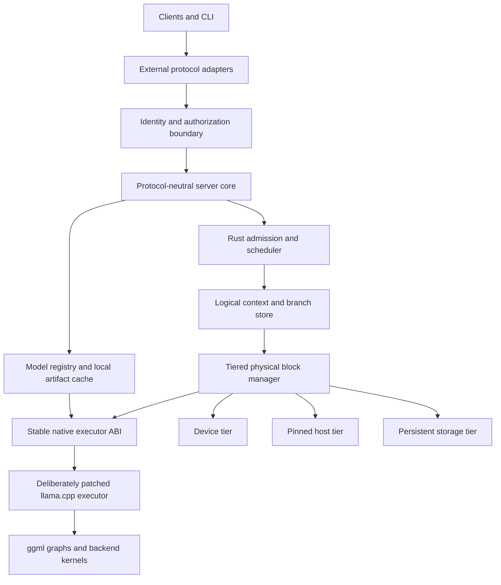

# Cusco: a Rust tiered-context server around the llama.cpp execution engine

## Document purpose and status

This is the standalone project proposal for **Cusco**, a new persistent, tiered, branch-aware model-state server. It defines the problem, architecture, ownership rules, native execution boundary, project layout, implementation phases, and acceptance gates needed to begin implementation without relying on another proposal or repository for context.

Cusco is written in Rust and uses a deliberately but conservatively extended llama.cpp as its model execution engine. It is not a Rust rewrite of llama.cpp, a wrapper around llama-server, or an incremental feature plan for an existing server. The intended split is:

> Rust owns logical contexts, scheduling, tiering, and transactional cache state. A deliberately patched llama.cpp owns model-specific graph construction, tensor semantics, and optimized inference kernels, with no more upstream modification than that contract requires.

The first project decision is therefore an architectural boundary, not a cache policy: slots are disposable execution workers, while logical contexts and their evaluated state are durable objects owned outside the executor.

The proposal is ready to drive a focused executor proof and project bootstrap. Later server and mapped-execution phases remain contingent on the correctness gates defined below.

## Decisive technical hypothesis

The project exists to answer one load-bearing question:

> Can a complete, model-specific executable checkpoint be captured, displaced from an execution slot, moved through the selected memory tiers, rebound transactionally, and continued with the same logits and token IDs as uninterrupted evaluation?

Every broader product commitment in this proposal is conditional on a positive answer. Phase 1 must test this hypothesis on a hybrid/recurrent Gemma model, including concurrent slot replacement and host-tier movement. Model management, protocol compatibility, scheduling breadth, and mapped execution must not turn an executor-boundary failure into a server project that happens to contain a non-working cache.

For Phase 1, model acquisition may be a thin implementation of the eventual registry contract: resolve one pinned `hf://` artifact or register one explicit local GGUF path, verify its identity, and publish a `ModelRecord`. The complete fetch/list/update/remove experience must not delay the checkpoint gate.

## Motivation and prior evidence

A prior branch-cache prototype demonstrated that restoring previously evaluated branches can avoid most prompt evaluation and reduce resumption latency by an order of magnitude. It also exposed a decisive correctness requirement: restoring ordinary KV state without every architecture-required SWA or recurrent component can produce invalid continuation state. A conservative fallback can preserve correctness by reevaluating the prompt, but then the cache benefit disappears.

Those experiments are evidence for this design, not a codebase dependency. This project starts from the requirements they revealed:

- execution slots must not own durable logical contexts;
- prompt state cannot be modeled only as sequence-associated KV ranges;
- each memory implementation has architecture-specific state and dependency rules;
- prompt-cache policy must be separable from slot scheduling;
- logical prompt identity and executable physical state need distinct representations;
- restoration must be a transactional operation rather than an opportunistic pre-decode mutation.

Conventional continuous batching can tolerate slot-owned sequence state and destructive cache mutation. Those assumptions are a poor fit for a persistent branch cache in which:

- logical contexts outlive execution slots;
- many contexts share evaluated prefixes;
- physical blocks move independently among device, host, and storage tiers;
- spare VRAM holds inactive but likely-to-be-revisited branches;
- a slot temporarily binds a context for execution rather than owning it;
- switching branches must either publish a complete, coherent state or leave the prior state intact;
- model architectures may require global KV, SWA, and recurrent state to be restored together.

A new outer server would allow those requirements to become the primary ownership model rather than a secondary mechanism fitted around existing slot semantics.

## Goals

The proposed system should:

1. Represent a logical context independently of any server slot or physical tensor address.
2. Represent evaluated state as dependency-valid composite blocks or checkpoints.
3. Share immutable evaluated prefixes across contexts.
4. Retain multiple inactive contexts in spare VRAM when capacity permits.
5. Demote inactive physical blocks to pinned host memory and eventually persistent storage.
6. Promote only the blocks required for the next execution binding.
7. Switch logical contexts atomically from the scheduler's perspective.
8. Preserve exact model behavior across park, demote, promote, and restore operations.
9. Support ordinary KV, SWA, and recurrent architectures without pretending they have identical dependency rules.
10. Reuse llama.cpp's model loading, graph construction, backend support, and optimized kernels.
11. Expose enough telemetry to explain cache hits, avoided work, transitions, residency, and eviction decisions.
12. Provide a migration path from a copy-based staging implementation to device-side block-mapped execution.
13. Present inference, context management, model management, and operations through one protocol-neutral application interface with versioned external adapters.
14. Make Hugging Face Hub identifiers and reproducibly resolved Hub snapshots the primary model-acquisition path.
15. Keep authentication and usage accounting at stable request boundaries even while the initial local deployment permits anonymous administration.
16. Provide a versioned extension point for later semantic context-compaction strategies and enough lifecycle information to schedule compaction before it delays the next turn.

## Non-goals

The first implementation should not:

- rewrite llama.cpp's model implementations or GPU kernels in Rust;
- reproduce the entire llama-server feature surface before validating the cache boundary;
- treat token-identical substrings as interchangeable evaluated state;
- infer model-specific recurrent layouts in Rust;
- require direct Rust ownership of ggml or C++ objects;
- promise zero-copy branch switching before the execution kernels support physical indirection;
- optimize arbitrary suffix reuse before exact-prefix restoration is correct;
- support every model architecture, multimodal feature, speculative decoder, grammar, adapter configuration, and API variant in its initial milestone.
- implement semantic context compaction or execute third-party strategy code in the initial cache-validation milestones.

## Standalone project boundary

This proposal defines a separate product and source tree. It may reuse and adapt proven executor experiments, tests, and telemetry conventions, but it does not inherit the lifecycle, public API, build layout, or compatibility obligations of an existing branch-cache server.

The project has four independently testable layers:

1. **Coordinator:** Rust-owned logical context identity, branch structure, policy, scheduling, persistence, and transition orchestration.
2. **Native executor:** a pinned llama.cpp fork plus a C-compatible shim implementing model-specific state operations and decode.
3. **Physical tier manager:** Rust-managed reservations and residency state backed by executor-owned representations, transfer operations, and fences.
4. **Independent validation:** black-box and executor-level correctness and performance workloads that do not depend on either server's internal metrics to determine semantic success.

The only mandatory upstream dependency is a pinned llama.cpp revision. The project owns its executor patches, ABI conformance tests, and update procedure. It must be possible to build, run, test, and benchmark the project without checking out the earlier prototype repository.

## Design principles

The implementation should preserve these principles even when individual structures change:

- **Logical identity is not physical location.** Contexts refer to immutable evaluated identities; physical representations may move or disappear.
- **Textual equality is not state equivalence.** Evaluated reuse requires dependency lineage, model configuration, and representation epochs to match.
- **Composite state commits together.** Global KV, SWA, recurrent state, metadata, and completion state form one executable contract.
- **Preparation may be expensive; publication must be atomic.** A worker observes a complete old binding or a complete new binding.
- **Capacity promises outrank cache warmth.** Opportunistic blocks never consume the active-growth guarantee.
- **Asynchronous work extends ownership.** Submitted backend work retains storage through an explicit completion fence.
- **Correctness precedes speed claims.** A restoration is a hit only after it commits and produces behavior equivalent to valid evaluation.
- **Staged execution is a product phase, not throwaway scaffolding.** It establishes the ownership and transaction model before mapped kernels optimize it.
- **The ABI is small-surface, high-semantic-density.** Few entry points may carry rich descriptors and strict lifecycle obligations; “small” must never be mistaken for trivial.

## Terminology

The proposal uses the following terms consistently:

- **Logical context:** a durable token history plus references to the evaluated state that is valid for some prefix of that history.
- **Logical block:** a canonical token interval used for identity, sharing, dependency accounting, and mapping; it contains no device address.
- **Evaluated component:** architecture-specific state for a logical interval or boundary, such as global KV, SWA state, or a recurrent checkpoint.
- **Composite block or checkpoint:** the coherent set of every evaluated component required to continue from one represented boundary.
- **Physical representation:** bytes and layout metadata realizing an evaluated component in device, host, or persistent storage.
- **Execution slot:** a disposable native worker capable of running a batch; it is not the durable owner of a context.
- **Binding:** the complete executor-visible association between a slot, represented position, and validated physical state.
- **Transition:** the prepare/commit/abort lifecycle used to replace one binding with another.
- **Lineage:** the dependency identity proving that evaluated state was derived from the required preceding history and compatible execution configuration.
- **Epoch:** an invalidation identity for model, adapter, representation format, or executor state.
- **Semantic context compaction:** constructing a new, shorter logical token history that preserves selected information from an older history; this creates new lineage and is distinct from compressing physical cache bytes.
- **Context strategy:** a registered policy implementation that proposes when and how to trim, summarize, or otherwise compact a logical context.

“Block” describes canonical logical identity and accounting. It does not require every model component to be physically stored as independently executable fixed-size pages. Recurrent state may be represented as a boundary checkpoint while still participating in the same composite mapping and transaction.

## Core architectural decision

The cache should wrap and control the inference engine rather than remain an optional side structure subordinated to server slots.



The Rust process owns durable context identities and cache policy. llama.cpp remains authoritative for the model-specific meaning of executable state.

## Responsibility split

### Rust server and coordinator

Rust should own:

- HTTP and protocol handling;
- request admission, cancellation, deadlines, and fairness;
- session, agent, conversation, and branch identities;
- token-sequence identities and persistent branch DAGs;
- logical evaluated-prefix mappings;
- prefix lookup and dependency validation;
- device, host, and storage residency policy;
- physical capacity accounting;
- eviction scoring;
- promotion and demotion planning;
- transition reservations;
- slot assignment;
- commit and abort state machines;
- background transfer orchestration;
- metrics and tracing;
- persistence and recovery of logical metadata.
- canonical inference and model-management operations independent of any external protocol;
- model registry, Hugging Face acquisition policy, local artifact-cache metadata, and administrative lifecycle operations;
- authentication and authorization interfaces, even when the initial implementation supplies only an anonymous administrator;
- implementation-independent usage accounting for prompt, generated, cached, and evaluated work;

Rust may eventually own sampling and token streaming, but that is optional. Keeping sampling in llama.cpp initially reduces compatibility work.

### llama.cpp executor

The native executor should continue to own:

- model loading and architecture metadata;
- tokenizer and vocabulary semantics;
- chat-template support, at least initially;
- model tensor definitions;
- graph construction;
- backend buffer allocation;
- CPU, CUDA, and other backend kernels;
- architecture-specific forward passes;
- architecture-specific memory dependencies;
- recurrent checkpoint capture and binding;
- execution of token batches against a supplied valid memory binding;
- sampling until or unless it is deliberately moved outward.

### Native ABI shim

A small-surface, high-semantic-density C-compatible ABI should separate Rust from llama.cpp's internal C++ types. Its surface should remain intentionally compact, but its semantics are necessarily rich: capabilities, canonical geometry, dependency descriptors, arenas, checkpoints, transfers, fences, epochs, and bindings all cross this boundary through stable handles and versioned data-oriented descriptors.

Rust must not manipulate ggml tensors or memory implementations directly. The shim must expose concepts that the current high-level API does not represent sufficiently:

- model memory capabilities and canonical block geometry;
- component dependency and compatibility descriptors;
- physical representation and arena handles;
- logical-mapping validation results;
- physical preparation plans and completion fences;
- prepared executor bindings;
- recurrent checkpoint import and export;
- decode submission and completion;
- invalidation when model, adapter, representation, or execution epochs change.

The ABI should distinguish three operations that may collapse differently in staged and mapped implementations:

1. **Logical mapping validation:** determine whether component identities, lineage, boundaries, and epochs describe a coherent target state. This operation must not allocate or mutate a slot.
2. **Physical representation preparation:** resolve or create the required device representations, schedule transfers or staging copies, and return fences plus ownership-bearing preparation handles.
3. **Executor binding construction:** combine validated logical state and completed physical representations into a candidate binding that the executor can publish atomically.

In staged execution, physical preparation may assemble a conventional contiguous arena and binding construction may be lightweight. In mapped execution, preparation may mostly reserve existing pages while binding construction publishes a block table. The semantic phases remain distinct even when one implementation fuses their internal work.

## External API adapter architecture

External compatibility should be a shim layer over a protocol-neutral application API, not a set of alternate request paths wired directly into scheduling or the executor. To avoid confusion with the native C ABI shim, this proposal calls these modules **protocol adapters**.

The first-class external protocol should be an explicitly versioned local-inference profile of the OpenAI-compatible `/v1` API, described by a generated and checked OpenAPI document. The initial profile should start from the subset that Ollama has demonstrated across common OpenAI clients—model discovery, chat and text completion, streaming, reproducible sampling controls, structured output, tools where supported, embeddings when the server gains that capability, and the stateless Responses shape—then narrow or extend it deliberately according to this project's implementation. Ollama's current compatibility matrix is a useful evidence base, not a normative dependency or a promise to reproduce every field: <https://docs.ollama.com/api/openai-compatibility>. “Compatible” does not mean copying unrelated hosted-service features such as billing, organization administration, fine-tuning, or cloud-resource APIs.

The internal boundary should normalize each adapter into the same operations and event stream:

```rust
trait InferenceService {
    async fn complete(
        &self,
        request: CanonicalGenerationRequest,
        caller: RequestContext,
    ) -> Result<GenerationEventStream, ServiceError>;
}

trait ModelService {
    async fn fetch(&self, request: FetchModel, caller: RequestContext) -> Result<ModelRecord, ServiceError>;
    async fn list(&self, caller: RequestContext) -> Result<Vec<ModelRecord>, ServiceError>;
    async fn remove(&self, request: RemoveModel, caller: RequestContext) -> Result<(), ServiceError>;
}
```

Context lifecycle extensions should use the same application boundary. `CanonicalGenerationRequest` should reserve optional fields for a registered context-strategy identifier and versioned strategy parameters. A separate context-lifecycle service should accept advisory client-presence signals and expose strategy discovery without making any external protocol adapter responsible for compaction policy:

```rust
trait ContextLifecycleService {
    async fn list_strategies(
        &self,
        caller: RequestContext,
    ) -> Result<Vec<ContextStrategyDescriptor>, ServiceError>;

    async fn signal_activity(
        &self,
        signal: ContextActivitySignal,
        caller: RequestContext,
    ) -> Result<(), ServiceError>;
}
```

Protocol adapters may map native fields or extension objects onto these canonical operations. A selected strategy is part of request and context policy, not model identity, and authorization policy must govern strategy enumeration, selection, registration, and execution.

The OpenAI-compatible adapter will itself require documented local extensions for capabilities that the hosted protocol does not model, including durable logical contexts, branch selection, cache policy, extended usage, and possibly context-strategy selection. Those extensions should occupy an explicit versioned namespace or native companion endpoint, remain visible in the generated OpenAPI document, and degrade predictably for unextended OpenAI clients. They must not be smuggled into unrelated standard fields.

Canonical request types must preserve information needed by the implemented OpenAI profile and by plausible future protocol families without embedding any protocol's JSON schema into `server-core`. The adapter owns field names, defaults, error envelopes, streaming framing, and protocol-specific model-name syntax. The core owns validation, scheduling, context semantics, execution, and usage facts.

Protocol research should account for three families even though only one adapter is initially committed:

1. **OpenAI-compatible `/v1`:** first-class in the minimal server and the reference compatibility contract. Ollama's implemented OpenAI subset is a pragmatic starting profile because it identifies fields and endpoint shapes already useful to local-inference clients.
2. **Ollama native API:** a source of requirements for a quality local-inference boundary, particularly administrative model pull, list, show, and remove operations that OpenAI and Anthropic inference APIs do not model. Cusco's native administrative API should express those capabilities whether or not an Ollama wire adapter is ever shipped.
3. **Anthropic Messages API:** a source of requirements for canonical messages, content blocks, tool use, stop reasons, usage, and streaming semantics. An Anthropic adapter is optional, but the core should not make it needlessly expensive or lossy.

Studying a protocol is not a commitment to implement its adapter. The purpose is to distinguish broadly useful application semantics from wire-specific conventions early enough that a later adapter, if justified, remains a thin and high-quality shim rather than a second execution path.

Efficiency requires more than translating JSON. Adapters should share zero-copy or bounded-copy request bodies where practical, use one backpressure-aware internal event stream, avoid retokenizing merely to populate compatibility fields, and derive all usage views from one execution record. Chat templates and tool schemas may require protocol-specific normalization before tokenization, but tokenization and model execution must happen only once.

### Authentication and authorization seam

The first local build should run without configured credentials. It should nevertheless route every CLI and HTTP operation through an authentication and authorization interface. The default provider returns a well-known anonymous principal with administrator privileges; it is a provider implementation, not a scattering of `if auth_enabled` bypasses.

With the anonymous provider active, network listeners should default to loopback or a local socket. Binding an unauthenticated administrator to a non-local interface must require an explicit unsafe-development option and a prominent startup warning.

`RequestContext` should carry a principal, credential identity when present, request identity, and authorization scope. Inference, context mutation, model fetching, cache deletion, and server administration should invoke explicit policy checks. Replacing the anonymous provider with API keys, local socket identity, or another mechanism must not change handler signatures or core service contracts.

### Usage accounting without billing

Billing is out of scope, but accurate accounting is not. The server should emit a canonical usage record containing at least input tokens, generated tokens, prompt tokens actually evaluated, prompt work satisfied from cache, model identity and revision, logical context identity when applicable, latency, and terminal status. Protocol adapters may expose only the fields their protocol supports, while telemetry and administrative APIs retain the richer record.

Accounting must be generated by `server-core` from committed execution facts rather than reconstructed independently by adapters. This keeps OpenAI, Ollama, CLI, and any future Anthropic views consistent and preserves the distinction between logical input tokens and physical prompt work.

## Model registry and Hugging Face lifecycle

Hugging Face Hub should be the primary model acquisition mechanism. The canonical external identifier is an `hf://` URI, including optional repository type, revision, and file path, for example:

```text
hf://models/organization/model
hf://models/organization/model@revision
hf://models/organization/model@revision/path/to/model.gguf
```

The `model` field accepted by inference APIs and the CLI should resolve:

- an installed model's `hf://` identifier;
- an explicit local alias assigned at fetch or registration time; or
- an installed local-file model record whose source was registered from an absolute or explicitly resolved path.

Hugging Face is the preferred acquisition path, but it is not the only loading path. A local GGUF must be usable without copying it into the Hub cache or pretending that it has an `hf://` identity. Local-file registration is an administrator operation that canonicalizes the path, verifies that the file is regular and readable, computes or records its content digest, probes executor metadata, and atomically publishes a `ModelRecord`. Inference still addresses that installed record by alias or immutable model ID; arbitrary request-supplied filesystem paths must not bypass registration, authorization, provenance, or compatibility checks.

If no alias is supplied for a Hub model, the normalized `hf://` URI is the model's public name. A local-file registration should require an alias or assign a stable content-derived model ID rather than exposing host paths as public protocol identifiers. `ModelRecord` should distinguish `HubSnapshot` and `LocalFile` source provenance; a local record retains its canonical path, size, digest, registration time, and last verification time, while a Hub record retains repository and revision provenance.

Inference is lookup-only with respect to model installation: it must never initiate, enqueue, or wait for a network fetch, and it must not implicitly register a local path. An unavailable reference returns a stable “model not installed” error with the canonical identifier. Model acquisition and local registration are separate administrator-only operations on the native model-management API, with their own authorization, progress where applicable, cancellation, capacity checks, and failure lifecycle.

The Rust model service should use the Hugging Face Hub client rather than scrape web pages or shell out to a CLI. The current `hf-hub` client supports repository metadata, revision-aware snapshot downloads, conditional requests, atomic cache writes, and cache inspection. If a required Hub feature is temporarily absent from the Rust client, it should be implemented behind the model-source trait or delegated to a small isolated helper, not leaked into inference handlers.

Private or gated repositories require a Hugging Face access token. The model service should receive that token through a secret-provider reference or process configuration, pass it only to the Hub client, and never persist the token in `ModelRecord`, logs, provenance, aliases, or API responses.

Each successful installation should publish an immutable `ModelRecord` only after all selected artifacts are complete and verified. The record should retain:

- the requested and normalized `hf://` URI;
- repository type, namespace, name, and requested revision;
- resolved immutable commit hash;
- selected model files and their sizes, Hub ETags or content hashes where available;
- local cache paths;
- model format and executor-discovered metadata;
- optional alias;
- fetch time and last verification time;
- compatibility inputs that contribute to the model and executor epochs.

A repository may contain several quantizations, sharded variants, or unrelated artifacts. Fetch requests should therefore accept explicit include patterns or a concrete file URI. If automatic selection cannot identify one unambiguous supported artifact set, installation should stop with a structured choice list rather than downloading or loading an arbitrary model.

### Standard Gemma validation assets

The standard executor integration suite should use a small, publicly reproducible Gemma 4 model rather than an unrecorded developer-local weight file. The required baseline asset is:

```text
hf://models/unsloth/gemma-4-E2B-it-GGUF@0314792d7f1f7e229411f620751375812bb9faf2/gemma-4-E2B-it-Q3_K_M.gguf
size:   2,536,786,016 bytes
sha256: 086e2f5ba85057f8f19712e3160a644728f74f323c9feeac4cd73fab11b43085
```

This is the canonical core checkpoint-equivalence model until an intentional, reviewed fixture update changes the locked identity. The integration runner may accept a registered local path to these exact bytes for offline and developer use, but it must verify the digest and report the canonical identity in its result artifact. Model-free lifecycle tests remain separate and fast; the externally provisioned model test is a required executor integration gate, not a reason to commit multi-gigabyte weights to the repository.

An optional experimental lane may exercise Gemma 4 multi-token prediction with the QAT mobile model and its paired MTP draft:

```text
target:
  hf://models/unsloth/gemma-4-E2B-it-qat-mobile-GGUF@46af839dc23aceb4b965ab640dae7fc1bea39bba/gemma-4-E2B-it-qat-UD-Q2_K_XL.gguf
  sha256: 0a5bbc20f91f92da96ab4870fa71b356c45b8500a7b8b9c3e0eb48359b72da28
draft:
  hf://models/unsloth/gemma-4-E2B-it-qat-mobile-GGUF@46af839dc23aceb4b965ab640dae7fc1bea39bba/MTP/mtp-gemma-4-E2B-it-Q4_0.gguf
  sha256: 586f2460b909008640981ec34060aa864e03c144fbabfb3173c4335087e4aae0
```

That lane is valuable because speculative execution stresses checkpoint identity, cancellation, and rollback, but it is not the initial proof and must never substitute for the non-speculative baseline gate. It should run only after the pinned executor reports support for both artifacts and after plain Gemma restoration passes. Multimodal projection files are outside this text-only checkpoint gate.

Symbolic branches and tags are convenient acquisition requests, but a loaded model epoch must bind to the resolved commit and exact artifact set. Updating `main` therefore installs a new record and invalidates compatible execution state through an epoch change; it must never mutate the identity beneath a running model.

The administrator-only native Cusco API and its CLI client should support:

- fetch or refresh a Hub repository revision;
- register an explicit local model file without copying it;
- list installed models, revisions, source types, aliases, sizes, and load state;
- inspect provenance and executor metadata;
- check whether a symbolic Hub revision resolves to a newer commit;
- verify Hub-cached artifacts and detect a changed or missing local file;
- assign or change an alias without changing immutable model identity;
- remove a model record or clear eligible Hub cache content;
- report why a record or artifact cannot be removed because it is loaded, pinned, or referenced.

Downloads, updates, and deletions require per-model coordination, temporary-file cleanup, atomic publication, capacity checks, and cancellation. Cache management must distinguish the Hugging Face artifact cache from the evaluated model-state cache described elsewhere in this proposal.

Cusco's native model-management API is intentionally an extension beyond OpenAI- and Anthropic-compatible inference surfaces. A future Ollama adapter can map its pull and model-management semantics onto the same `ModelService`; protocol adapters must not become independent model stores.

## Command-line interface

The CLI should be a first-class client of the same application services, not a test-only wrapper around internal objects. Its command organization should take practical inspiration from Ollama while retaining the project's explicit model, context, and cache semantics:

```text
cusco serve
cusco run <model-reference>
cusco chat <model-reference>
cusco complete <model-reference>
cusco model fetch <hf-uri> [--alias NAME]
cusco model register <local-path> --alias NAME
cusco model list
cusco model inspect <model>
cusco model check-update <model>
cusco model update <model>
cusco model verify <model>
cusco model remove <model>
cusco cache status
cusco context list
cusco context inspect <context-id>
```

Before the HTTP server exists, commands may invoke the application services in-process. Once the daemon exists, the same CLI should default to the native administrative API, with an explicit local/in-process mode for proofs and recovery. Output should support stable machine-readable JSON in addition to human-readable tables. Destructive operations require confirmation unless a non-interactive flag is supplied.

The CLI provides the earliest usable path for loading a Hub model, running inference, exercising capture and restore, inspecting usage, and managing local artifacts. HTTP adapters should be built over those already-tested service contracts rather than becoming the first integration point.

## Logical contexts

A logical context is a durable description of a token history and the portion of that history for which valid evaluated model state exists. It is not an execution slot and does not contain raw device addresses.

Conceptually:

```rust
struct LogicalContext {
    id: LogicalContextId,
    tokens: PersistentTokenSequence,
    evaluated: EvaluatedPrefix,
    represented_end: Position,
    model_epoch: ModelEpoch,
    adapters: AdapterSetId,
}
```

Token storage and evaluated-state storage should remain distinct. A target context may contain tokens for which no evaluated representation exists yet.

For example, after branching in the middle of a context:

```text
source tokens:  [shared prefix][old tail]
source state:   [shared prefix][old tail]

target tokens:  [shared prefix][new tail]
target state:   [shared prefix][missing ]
```

The old tail remains valid for its original branch. It must not be attached to the new branch merely because some later tokens happen to match.

## Persistent sequence representation

Logical token sequences should be lightweight persistent structures, such as a radix tree, persistent rope, or balanced tree with subtree hashes. Constructing a branch should structurally share its unchanged prefix rather than copy an entire vector of tokens or block descriptors.

A logical sequence node might contain:

```rust
struct SequenceNode {
    parent: Option<SequenceNodeId>,
    token_block: TokenBlockId,
    token_count: u32,
    subtree_hash: DependencyHash,
}
```

The exact representation is an implementation choice. Required properties are:

- cheap append;
- cheap branch creation;
- longest-prefix lookup;
- structural sharing;
- stable logical identities;
- collision-safe token confirmation after hash lookup;
- efficient reclamation when no logical context references a branch.

## Semantic context compaction

Long-running conversations will eventually approach the model's usable context limit. Waiting for the next request to arrive and then discovering that its prompt no longer fits puts trimming, summarization, retokenization, and prompt evaluation directly on the user's critical path. Once the server can predict that the next plausible turn will cross a configured headroom threshold, it should be able to prepare a compacted successor immediately after the current reply reaches its terminal event.

This is speculative background work, not a mutation of the context that produced the reply. The coordinator should:

1. preserve the original logical context and its evaluated mapping;
2. ask the selected strategy to propose a shorter logical history;
3. validate and tokenize the proposal under the same model, adapter, and template configuration;
4. construct and evaluate a new logical branch with new dependency lineage;
5. publish that branch as a prepared successor only after its complete state commits;
6. select the original or compacted successor when the next request arrives according to explicit context policy.

If compaction fails, is cancelled, or loses a race with the next request, the original context remains valid. A strategy output is never allowed to masquerade as state derived from the old tokens: semantic compaction changes token history and therefore requires fresh evaluated-state identities. Whether a summary preserves enough meaning is a strategy-level quality property; cache correctness still requires exact execution from whichever new history was actually published.

### Pluggable strategy boundary

The long-term system should support a registry of versioned context strategies selectable by stable identifier in an API request or stored context policy. Strategies might include deterministic trimming, summary generation, retrieval-backed reconstruction, application-specific memory extraction, or combinations of those operations. Registry descriptors should declare accepted inputs, configuration schema, output contract, determinism, resource requirements, implementation kind, and compatibility version.

The extension boundary should be reserved early in `api-types` and `server-core`, but execution belongs to a later milestone. Trusted Rust strategies may implement an in-process trait. Python and other user-authored strategies should normally run behind a versioned out-of-process protocol rather than loading an interpreter or arbitrary code into the scheduling process. The protocol should exchange bounded, structured context and return a proposed replacement history plus provenance; it must not expose native tensor handles, physical block locations, authentication secrets, or mutable cache internals.

All strategy implementations must pass the same validation and publication path. They may propose logical content and policy hints, but only the coordinator can create lineage, reserve resources, evaluate state, and atomically publish a successor. Per-principal allowlists, deadlines, memory and output limits, cancellation, and auditable strategy provenance are required before third-party execution is enabled.

The protocol-neutral contract should reserve types equivalent to:

```rust
struct ContextCompactionPolicy {
    strategy: StrategyId,
    strategy_config: JsonValue,
    trigger: CompactionTrigger,
    next_turn_headroom: TokenCount,
    response_headroom: TokenCount,
}

struct ContextActivityHint {
    context: LogicalContextId,
    connection: ConnectionState,
    last_user_activity: Option<Timestamp>,
    expects_next_turn: Option<bool>,
    expires_at: Timestamp,
}

struct CompactionProposal {
    replacement_messages: Vec<CanonicalMessage>,
    provenance: StrategyProvenance,
    semantic_constraints: Vec<Constraint>,
}
```

The exact wire schema can evolve, but `StrategyId`, opaque validated strategy configuration, trigger policy, and successor selection must be carried by the canonical API rather than hidden in an OpenAI- or Ollama-specific field. Protocol adapters may map their own extension fields onto these types. The native administrative API should expose context policy and activity updates explicitly. In the initial implementation these fields may be accepted, validated, persisted, and reported as unsupported for execution; reserving them early prevents later API and context-record migrations.

Strategy execution should use a request/response protocol with version negotiation, bounded payloads, cancellation, deadlines, and structured error categories. A strategy receives a logical conversation view and declared limits, not an executor binding. It returns a proposal, not permission to mutate a context. A Rust trait and an out-of-process worker protocol should implement the same semantic contract so that built-in Rust, user-authored Rust, Python, and future language implementations differ only in deployment and trust policy.

### Explicit predictive compaction intent

The server should not guess that another turn is imminent from recent traffic, HTTP keepalive, typing cadence, or historical revisit probability. It already knows the deterministic capacity facts—the model limit, current token count, reserved response and next-turn headroom, chat-template overhead, canonical cache-block geometry, and evaluated boundary—but only the client knows whether a user is still engaged and expects to continue.

A later, dedicated native API should therefore let an authorized client explicitly declare that a connected logical context is expected to need another turn and that predictive compaction should begin. The exact wire schema is intentionally deferred. Once the server accepts that declaration, it should start the eligible compaction path as capacity permits rather than waiting for the next inference request or second-guessing the client's intent. This is a specific scheduling operation, not an inference field, an HTTP-connection heuristic, or a weak signal to feed into a predictor.

The declaration must be scoped to the principal, logical context, source head, policy version, and client connection or another explicit bounded lifetime. It is never a lease on device memory and cannot weaken admission, authorization, or correctness rules. If the anticipated request never arrives, the prepared compacted successor remains semantically valid but loses speculative priority and is demoted or evicted under ordinary cache policy. The original logical context remains intact throughout.

### Cache-aware compaction boundaries

The planner should account for known cache geometry when choosing the compacted target length. If the likely next prompt would otherwise force an immediate trim, producing a short terminal cache block that will be invalidated on the next append wastes evaluation and residency. Subject to the strategy's semantic constraints and required headroom, the planner should prefer a target whose evaluated prefix ends on a reusable canonical boundary and leaves room for the expected next user turn and reply.

This is an optimization, not permission to delete meaningful content merely to fill blocks. The trace should report requested headroom, chosen boundary, any unavoidable partial tail, work performed speculatively, work later reused, and work abandoned because the original branch continued instead.

Speculative compaction must have its own admission class. It may consume only capacity left after active bindings, active-growth guarantees, and transition reservations; it must be preemptible before interactive work waits. At most one proposal for the same context, policy version, and source head should execute at once. A new turn, policy update, model epoch change, or context deletion cancels or obsoletes earlier work without invalidating the source branch. Prepared successors may be retained briefly under normal cache policy, but speculation cannot create an unbounded second copy of every conversation.

## Token identity is not evaluated-state identity

A token block can be identified from its literal tokens. An evaluated block must also encode the history and model configuration on which its state depends.

```text
token block identity = hash(tokens)

evaluated block identity = hash(
    model epoch,
    adapter epoch,
    parent dependency identity,
    token block identity,
    evaluation parameters,
    component dependency summary
)
```

This distinction is essential. For a globally causal transformer:

```text
KV(suffix | history A) != KV(suffix | history B)
```

in general, even when the suffix tokens are identical.

Exact matching prefixes remain the primary reusable unit. Finite-window components may permit additional reuse, but only when their complete dependency identities match.

## Composite evaluated state

A block or checkpoint should identify one coherent evaluated interval across every model-state component required by the architecture.

Conceptually:

```rust
struct EvaluatedBlock {
    logical_id: EvaluatedBlockId,
    lineage: DependencyHash,
    begin: Position,
    end: Position,
    capabilities: ComponentMask,
    global_kv: Option<PhysicalRepresentationId>,
    swa: Option<PhysicalRepresentationId>,
    recurrent: Option<RecurrentCheckpointId>,
    dependencies: DependencySummary,
    completion: CompletionFence,
}
```

The logical block does not contain raw addresses. Each component points to a physical representation that may have device, host, or storage copies.

Every component in a composite block must refer to the same logical lineage and represented boundary. A block is executable only when all architecture-required components are present, complete, and dependency-valid.

## Canonical block geometry

A logical block should use one canonical token interval across all participating components. With a 32-token logical block:

```text
logical block 417 = token positions [13344, 13376)

base KV layer 0:       [13344, 13376)
base KV layer 1:       [13344, 13376)
...
SWA representation:   dependency-valid representation for this interval
recurrent component:  checkpoint required to continue at boundary 13376
```

The physical layout may differ by component, but the logical lineage and boundary must agree. Allowing each component to choose unrelated block boundaries would make atomic composition, reference accounting, and dependency validation significantly more difficult.

## Model capability descriptors

The executor should describe the state components and dependency rules required by the loaded model. Rust should not infer these rules from model names.

A capability descriptor should answer questions such as:

- Does the model use global KV?
- Does it use sliding-window KV?
- Does it use recurrent state?
- At what boundaries can recurrent checkpoints be captured?
- What preceding range does each component require?
- Can a component be reconstructed from another representation?
- Can physical blocks be rebound directly, or must they be staged?
- What alignment and arena constraints apply?
- Which state becomes invalid after adapter or parameter changes?

This permits the Rust layer to plan transitions while leaving model semantics in the executor.

## Recurrent state

Recurrent state is not an arbitrary token range. A checkpoint summarizes the dependency history required to continue from a particular boundary. It must include both tensor data and the metadata needed to interpret that data.

For a hybrid model, an executable checkpoint may contain:

```text
checkpoint at position N
├── global KV representations
├── SWA dependency window
├── recurrent tensors
├── recurrent cell/tail metadata
├── model and adapter epoch
├── dependency lineage
└── completion fence
```

The executor must provide architecture-specific operations to:

1. capture a complete recurrent checkpoint at a valid boundary;
2. report its physical size and alignment;
3. copy it to host or device storage;
4. validate that it matches a target logical lineage;
5. bind it to an execution slot;
6. reject incomplete or incompatible checkpoints before active state is mutated.

The Rust coordinator owns the checkpoint's identity, references, residency, and transition lifecycle. It must not reverse-engineer the recurrent tensor layout.

## Physical representations and tiers

Logical blocks reference movable physical representations. A representation may exist in more than one tier at once.

```rust
struct PhysicalRepresentation {
    id: PhysicalRepresentationId,
    component: MemoryComponent,
    device: Option<DeviceLocation>,
    host: Option<HostLocation>,
    storage: Option<StorageLocation>,
    bytes: u64,
    active_refs: u32,
    logical_refs: u32,
    reservation_refs: u32,
    transfer_refs: u32,
    last_access: Instant,
}
```

The reference classes must remain distinct:

- `logical_refs` keep a representation useful to retained contexts;
- `active_refs` pin it for an executing binding;
- `reservation_refs` protect it during a prepared transition;
- `transfer_refs` protect its buffers until asynchronous work has completed.

A host-visible CUDA submission is not necessarily complete when the submitting function returns. Physical storage must remain alive until its backend completion fence releases the transfer reference.

## Residency states

Useful policy states include:

```text
device resident and active
device resident and warm
host backed and device resident
host backed and demoting
host resident and promotable
device only
storage backed
discardable
```

These states have different reclaimability. A device-only block is not immediately reclaimable if preserving the logical branch would first require a host copy. A block whose exact host representation already exists can surrender its device pages much more quickly.

## Capacity policy

The allocator should distinguish committed execution capacity from opportunistic warm-cache capacity.

Let:

- $C$ be total device block capacity;
- $A$ be blocks pinned by active bindings;
- $G$ be blocks reserved for active growth;
- $T$ be blocks reserved by in-flight transitions;
- $W$ be inactive warm blocks.

The safety invariant is approximately:

$$
A + G + T \leq C
$$

Warm blocks may consume the remainder:

$$
W \leq C - (A + G + T)
$$

but must be reclaimable before an active request reaches its reserved limit.

This supports the premium deployment mode: if a model and its maximum active context require only part of device memory, spare VRAM can hold additional branch blocks. Those blocks accelerate revisits without endangering the capacity guaranteed to the active workload.

## Active bindings

Execution slots should be disposable workers. A slot holds a temporary binding to a logical context:

```rust
struct ActiveBinding {
    slot: ExecutorSlotId,
    context: LogicalContextId,
    mapping: LogicalMappingId,
    represented_end: Position,
    pins: Vec<PhysicalRepresentationId>,
}
```

The stable API affinity identifier, logical context identity, executor slot, and physical memory binding are separate concepts. A request may preserve logical affinity while executing on a different slot after a transition.

## Prepared transitions

A branch switch should be a prepared mapping transition rather than a sequence of destructive memory mutations.

```rust
struct PreparedTransition {
    source: Option<ActiveBindingId>,
    target: LogicalMappingId,
    common_prefix_blocks: u32,
    activate: Vec<PhysicalRepresentationId>,
    deactivate: Vec<PhysicalRepresentationId>,
    reservations: Vec<ReservationId>,
    transfers: Vec<TransferId>,
    represented_end: Position,
    class: TransitionClass,
}
```

Preparation may perform expensive work. Publication should be small and deterministic.

### Prepare

1. Resolve the target logical mapping.
2. Validate model, adapter, and representation epochs.
3. Validate all component dependencies.
4. Determine already-resident shared blocks.
5. Determine missing device representations.
6. Reserve destination capacity.
7. Protect source rollback representations when required.
8. Schedule required transfers.
9. Wait for or attach completion fences.
10. Ask the executor to validate the complete candidate binding.

### Commit

1. Publish the target mapping to the slot.
2. Publish the new represented boundary.
3. Transfer active pins to the target representations.
4. Release obsolete source pins and transition reservations.
5. Begin or continue decoding.

### Abort

1. Cancel work that can still be cancelled.
2. Retain transfer references until submitted backend work completes.
3. Release reservations.
4. Preserve the old executable binding if one existed.
5. Return a recoverable admission or execution error.

No logical hit should be reported until commit succeeds.

## Transition classes

The coordinator should classify transitions explicitly.

### Reference-only

Every target representation is already device-resident.

```text
reserve target references
validate composite mapping
publish target binding
release old suffix references
```

No tensor copy should occur.

### Non-destructive promotion

The target is host-backed and sufficient spare VRAM exists.

```text
reserve device blocks
promote target representations
wait for completion
validate
publish
release old suffix pins
```

The source remains executable throughout preparation.

### Quiesced, rollback-backed swap

There is insufficient VRAM for source and target suffixes simultaneously, but the source has a complete rollback representation in host memory.

```text
pause slot
pin source rollback representation
release selected source device pages
promote target into reclaimed pages
validate
publish target binding
release rollback reservation
```

This remains transactional in logical state, although abort may require restoring source pages from host.

### Recompute

The cache cannot produce a coherent target binding.

```text
reject cache hit
clear or retain slot according to policy
evaluate target normally
publish newly evaluated blocks as they complete
```

Recompute is a valid fallback, but it must be reported as a miss rather than a restoration hit.

## Device execution strategies

Two execution strategies provide an incremental implementation path.

## Strategy 1: staged execution arena

The first implementation should allow Rust to own logical mappings while llama.cpp continues to consume a conventional execution layout.

```text
logical mapping
    ↓
resolve resident representations
    ↓
promote missing host blocks
    ↓
copy changed or missing blocks into an execution arena
    ↓
bind arena and decode
```

This approach can provide:

- persistent logical branches;
- exact ownership and lifecycle rules;
- host-tier demotion and promotion;
- atomic transition preparation;
- shared-prefix accounting;
- recurrent checkpoint restoration;
- copying only missing state rather than recomputing an entire prompt.

It will not achieve the minimum possible device-resident switch latency because representations may be copied into llama.cpp's expected layout during activation. It is nevertheless the shortest path to validating correctness and the proposed ownership boundary.

## Strategy 2: mapped block-table execution

The advanced executor should allow model graphs and kernels to consume a block table directly.

```text
logical block 0 → physical device page 47
logical block 1 → physical device page 12
logical block 2 → physical device page 90
```

An already-resident branch switch could then approach a mapping publication rather than a tensor copy.

This requires deeper llama.cpp and backend work:

- attention kernels must support physical indirection;
- graph inputs must include stable block mappings;
- KV addressing must not assume the current contiguous or cell-oriented layout;
- participating layers must share canonical logical boundaries;
- graph reuse must tolerate changing block tables;
- CUDA graph capture may require stable table addresses;
- SWA and recurrent components need compatible mapped or checkpoint representations;
- allocator lifetimes and completion fences must be explicit.

Mapped execution is an executor capability, not something an external Rust layer can impose on unmodified kernels.

## Proposed native interface semantics

The precise ABI should be finalized only after the executor proof, but its concepts and phase boundaries should be explicit from the start. The following sketch illustrates responsibilities rather than freezing function signatures:

```c
executor_capabilities executor_get_capabilities(executor_handle);

executor_validation_result executor_validate_mapping(
    executor_handle,
    const executor_logical_mapping *);

executor_prepare_result executor_prepare_representations(
    executor_handle,
    const executor_validation_handle,
    const executor_reserved_locations *);

executor_binding_result executor_construct_binding(
    executor_handle,
    executor_slot_handle,
    const executor_validation_handle,
    const executor_preparation_handle);

executor_status executor_commit_binding(
    executor_handle,
    executor_binding_handle);

void executor_abort_binding(
    executor_handle,
    executor_binding_handle);

executor_checkpoint_result executor_capture_checkpoint(
    executor_handle,
    executor_slot_handle,
    executor_position);

executor_future executor_decode(
    executor_handle,
    executor_slot_handle,
    const executor_token_batch *);
```

The lifecycle is:

```text
logical mapping
    ↓ validate without mutation
validated mapping handle
    ↓ reserve, transfer, stage, and fence
prepared physical representations
    ↓ construct candidate executor binding
prepared binding
    ├─ commit → atomically publish to slot
    └─ abort  → preserve old binding and unwind ownership safely
```

The Rust coordinator owns logical mappings and policy decisions. The native executor is authoritative for architecture-specific validation and construction. Physical preparation is a joint contract: Rust supplies reservations and desired locations; native code performs layout-sensitive copies, imports, and backend synchronization.

Required design rules include:

- opaque native handles with an explicit owning side;
- no exceptions, C++ standard-library objects, or raw ggml pointers crossing the ABI;
- explicit status, error category, and diagnostic-detail types;
- versioned, size-tagged structures that permit compatible extension;
- caller-provided or queryable variable-length buffer sizes;
- explicit asynchronous completion and cancellation handles;
- preparation and binding handles that retain reservations and transfer references until terminal cleanup;
- an abort operation valid from every pre-commit state;
- idempotent cleanup where practical and documented single-consume operations otherwise;
- thread-safety and callback/reentrancy rules for every function;
- an executor epoch that invalidates stale representations after reload;
- conformance tests that run against both staged and mapped implementations;
- no logical cache-hit accounting until binding commit succeeds.

## Scheduling

The scheduler should consider both compute availability and cache-transition cost.

A candidate slot score may include:

- length of dependency-valid resident prefix;
- bytes requiring host-to-device promotion;
- bytes requiring device-to-host rollback preparation;
- whether the source binding must be quiesced;
- active growth reservations;
- request priority and waiting time;
- expected decode duration;
- NUMA or device affinity in multi-GPU deployments.


Semantic compaction adds a second, lower-priority scheduling path. A terminal response may update deterministic eligibility facts, but it must not by itself predict another turn or launch speculative strategy work. An accepted predictive-compaction declaration enqueues the eligibility check. Eligibility combines the context's configured trigger, next-turn fit, exact source-head identity, strategy availability, declaration lifetime, and speculative resource budget. The scheduler should begin eligible work as capacity permits; it may delay or preempt it for interactive traffic or guarded capacity, but it should not override the declaration merely because an internal predictor disagrees. If the next request arrives before publication, it continues from the original context unless that request explicitly accepts waiting for the in-flight successor.

The dedicated declaration endpoint requires authorization for the referenced context, rate limiting, and a live connection or another explicit expiry condition. Disconnect, expiry, source-head change, or policy change cancels pending work or removes speculative priority from completed work. None of these events proves that the conversation has ended or permits deletion of the source context.

The scheduler should not choose a slot solely by least-recent use when another slot can bind the target with substantially less state movement.

## Eviction and demotion

Physical blocks are the eviction unit, but logical dependency structure determines their value.

An eviction score should account for:

- number of retained logical contexts that depend on the representation;
- whether an unexpired client declaration gives the representation near-term purpose;
- cost to reconstruct or promote it;
- whether an exact host or storage copy exists;
- distance from active branch tips;
- shared-prefix fan-out;
- age and access frequency;
- whether evicting it makes later dependent blocks unusable;
- transfer and reservation pins.

Shared prefix blocks may be unusually valuable because one physical representation accelerates many branches. Large private tails without an active declaration, recent reuse, or dependent branch fan-out are natural candidates for early demotion; the manager need not invent a probability that a client will return.

## Concurrency and failure handling

The cache manager is a concurrent resource allocator and must model state transitions explicitly.

Important rules include:

1. A logical mapping is immutable once published.
2. A prepared transition cannot publish partial component state.
3. Physical storage cannot be reclaimed while active, reserved, or transfer references exist.
4. Cancellation releases logical reservations but not storage still referenced by submitted backend work.
5. A failed promotion does not mutate the source active binding.
6. A model or adapter epoch change invalidates incompatible evaluated mappings.
7. Executor crashes or device loss invalidate physical representations without corrupting durable logical context metadata.
8. A restored boundary is not published until every required memory component agrees on that boundary.
9. Cache accounting uses committed state; tentative work is reported separately.

Rust's type system can help distinguish states such as `PreparedBinding`, `ActiveBinding`, and `CompletedTransfer`, but backend fences must still be treated as real runtime ownership constraints.

## Persistence

Logical metadata and physical payload persistence should be separate.

The logical store should retain:

- token-sequence DAGs;
- evaluated-block identities;
- dependency lineages;
- model and adapter epochs;
- representation checksums;
- tier locations;
- branch metadata and policy hints.

The storage tier may retain:

- serialized physical block components;
- recurrent checkpoints;
- checksums and format versions;
- compression metadata;
- model compatibility identifiers.

Recovery must treat physical payloads as untrusted until their checksums, epochs, sizes, and component descriptors validate. Missing payloads should reduce evaluated coverage rather than corrupt the logical token sequence.

## Observability

The server should expose native metrics for:

- logical prefix lookup hits and misses;
- prepared, committed, aborted, and recomputed transitions;
- hits by transition class;
- valid represented tokens or units avoided;
- device-to-device, host-to-device, device-to-host, and storage transfer bytes;
- transfer latency and queue time;
- device, host, and storage residency;
- logical and physical reference counts;
- warm-cache capacity versus guarded execution capacity;
- block promotions, demotions, and evictions;
- dependency-validation failures by component;
- recurrent checkpoint captures and restores;
- slot binding latency;
- output-equivalence failures in validation mode;
- cache benefit by explicit predictive-declaration class, observed revisit class, and cache hit rate.

Compaction observability should additionally include:

- eligibility checks, starts, completions, cancellations, obsolete results, failures, and timeouts by strategy;
- source and replacement token counts, requested and achieved headroom, and canonical-boundary alignment;
- queue delay, strategy time, tokenization time, replacement evaluation time, and publish latency;
- speculative CPU, accelerator, and memory use;
- prepared successors selected, reused work, abandoned work, and avoided synchronous compaction latency;
- client-hint age and scheduling effect, without recording message content or high-cardinality principal and context identifiers in metrics.

Traces may carry authorized context and proposal identifiers plus strategy provenance, but logs and metrics must not emit conversation text or third-party configuration secrets. Strategy quality evaluation is distinct from executor correctness and should use workload-specific semantic measures alongside the exact cache-state gates.

A request trace should explain why a candidate was selected or rejected, which blocks moved, which dependencies were validated, and when the mapping was committed.

## Correctness requirements

Performance measurements are valid only after semantic equivalence is established.

For deterministic validation, restoration should be compared at the strongest practical level:

1. next-token logits when available;
2. exact sampled token IDs under fixed sampling configuration;
3. stop reason and generated content;
4. represented boundary and prompt work accounting;
5. component-level checkpoint checksums in diagnostic builds.

The essential invariant is:

> Continuing from a restored composite checkpoint produces the same model result as uninterrupted evaluation from the identical logical prefix under the same model and execution configuration.

A fast restoration with different logits or token IDs is a correctness failure, not a successful cache hit.

## Initial product scope

The first usable server should remain deliberately narrow:

- one loaded local model per process, acquired primarily from Hugging Face Hub;
- CLI model fetch, inspection, verification, removal, completion, and chat;
- text completion and basic chat through a documented OpenAI-compatible `/v1` profile initially informed by Ollama's exercised compatibility subset;
- explicit versioned native extensions or companion endpoints for logical contexts, branch and cache policy, extended usage, and model administration;
- a generated OpenAPI description for the complete implemented HTTP surface;
- protocol-neutral request, streaming, error, and usage types informed by Ollama and Anthropic semantics without promising either adapter;
- deterministic sampling mode;
- continuous batching;
- explicit logical context IDs;
- exact-prefix branch creation and resume;
- device and pinned-host tiers;
- ordinary KV, SWA, and recurrent checkpoint support for the selected validation model;
- cancellation;
- streaming responses;
- model, inference, cache, and usage metrics and traces;
- authentication and authorization interfaces backed initially by an anonymous administrator.

Broader llama-server compatibility and additional protocol adapters should follow only after the executor/cache contract is proven. Potential later features include the Ollama native API, an Anthropic adapter if demand justifies it, adapters, grammars, speculative decoding, embeddings, reranking, multimodal inputs, multi-model routing, storage-tier persistence, and multi-GPU placement.

## Project source layout

The repository should make the ownership boundary visible rather than hiding it in one server crate:

```text
/
├── Cargo.toml                 Rust workspace
├── Dockerfile                 multi-stage CPU and CUDA development/build image
├── compose.yaml               primary build, test, proof, and local-run interface
├── .dockerignore              explicit build-context boundary
├── crates/
│   ├── api-types/             canonical requests, events, errors, usage records
│   ├── auth/                  principal providers and authorization policy seam
│   ├── context-store/         persistent tokens, branches, evaluated mappings
│   ├── cache-coordinator/     transitions, reservations, policy, residency
│   ├── model-registry/        hf:// resolution, records, aliases, artifact lifecycle
│   ├── scheduler/             admission, slot choice, cancellation, deadlines
│   ├── executor-sys/          generated/raw C ABI declarations only
│   ├── executor/              safe Rust handles and lifecycle wrappers
│   ├── server-core/           protocol-neutral application services
│   ├── server-api/            HTTP routing, streaming, and native admin API
│   ├── api-openai/            first-class OpenAI-compatible /v1 adapter
│   ├── api-ollama/            optional Ollama native adapter
│   ├── api-anthropic/         optional Anthropic adapter
│   ├── telemetry/             metrics, traces, usage, decision explanations
│   ├── context-strategy/      policy, registry, built-ins, and worker protocol
│   └── cli/                   proof, inference, model, cache, and server commands
├── native/
│   ├── include/               public versioned C ABI
│   ├── shim/                  C++ implementation over patched llama.cpp
│   └── conformance/           ABI lifecycle and failure-injection tests
├── executor/
│   ├── llama.lock.toml        pinned upstream source and verified identity
│   └── patches/
│       ├── series.toml        ordered patch and optional PR-source manifest
│       └── *.patch            project-owned minimal source patches
├── vendor/
│   └── llama.cpp/             pristine pinned source or source cache
├── tests/
│   ├── fixtures/              deterministic tokenized workloads and expectations
│   ├── executor/              logits, checkpoint, tier, and failure gates
│   ├── integration/           scheduler and concurrent context scenarios
│   └── compatibility/         protocol and model-management contracts
├── benches/                   isolated transition and end-to-end benchmarks
│   ├── strategy/              protocol, sandbox, cancellation, and quality fixtures
└── tools/                     reproducible executor, model, and report utilities
```

Crate boundaries are dependency rules, not merely organization. `context-store` must not depend on HTTP or native tensor layouts. `executor-sys` contains no policy. `executor` turns raw handles into safe Rust state transitions but does not decide eviction. Protocol adapters depend on `api-types` and `server-core`, never directly on the scheduler, model cache, or FFI. `server-api` hosts adapters but does not define their application semantics. The CLI uses the same core service traits in-process or through the native administrative client. Native conformance tests must be runnable without starting the HTTP server.

## Container-first build and test interface

Docker images and Docker Compose are the primary supported interfaces for building, testing, benchmarking, and running Cusco during development. Contributors and automation should not install compiler toolchains, CUDA development packages, patched llama.cpp artifacts, or project dependencies directly on the development host. A host build may exist as an explicitly unsupported expert escape hatch, but documentation, CI, acceptance commands, and generated provenance must use the container path.

The repository should provide a multi-stage `Dockerfile` and a checked-in `compose.yaml` with named services or profiles for at least:

- CPU compilation and model-free tests;
- CUDA compilation and GPU tests;
- the Phase 1 executor proof;
- conformance and integration tests;
- benchmarks and a local Cusco server;
- reproducibility checks for the pinned source and patch series.

The same build stages should be used locally and in CI. Compiler, Rust, CUDA, CMake, and Python/tooling versions must be pinned by image digest or another immutable lock, and the resulting provenance must record the base-image identity, executor source identity, patch manifest, build arguments, GPU architecture targets, and runtime image identity. BuildKit caches and mounted dependency caches may accelerate builds, but a clean build must not depend on untracked host state. Model weights, Hugging Face caches, benchmark outputs, and compiler caches should enter through explicit mounts and must not be copied into image layers.

The default early GPU test configuration must pass through **host NVIDIA GPU ID 1, not GPU ID 0**. Compose should select the host device explicitly—for example through an NVIDIA device reservation with `device_ids: ["${CUSCO_GPU_DEVICE_ID:-1}"]`—rather than relying only on enumeration inside the container. The selected device may appear as CUDA device `0` within a container that exposes only that GPU; provenance and test output must still record that host GPU ID 1 was requested and the physical GPU UUID actually used.

This default is intentionally temporary development policy, not a permanent product assumption. `CUSCO_GPU_DEVICE_ID` should permit an explicit override from the beginning, and later scheduler and deployment work should remove the single-device default in favor of declared device sets and placement policy. Early tests must nevertheless choose GPU 1 out of the box so an unconfigured run does not contend with work expected on host GPU 0.

Canonical developer commands should be short Compose operations, with exact service names fixed during bootstrap, along the lines of:

```text
docker compose build
docker compose run --rm test-cpu
docker compose run --rm test-gpu
docker compose run --rm executor-proof
docker compose up cusco
```

Project scripts may wrap these commands for ergonomics, but must not create a second host-native build path with different dependency resolution, build flags, tests, or runtime behavior.

## llama.cpp source, patch, and build management

Upstream integration must be automated, reproducible, and intentionally biased toward carrying as little patch surface as possible. The source manager should treat upstream source, project-owned additions, external PRs, and the final build as distinct inputs.

`executor/llama.lock.toml` should pin:

```toml
[upstream]
repository = "https://github.com/ggml-org/llama.cpp.git"
revision = "<immutable-commit-sha>"
source_tree_sha256 = "<normalized-source-identity>"

[build]
profile = "cuda-release"
cmake_preset = "executor-cuda"

[patches]
manifest = "patches/series.toml"
```

`series.toml` should define a deterministic order and record each patch's origin and digest. Entries may refer to a project-owned patch file or an upstream pull request by repository and PR number, but PR references are an acquisition convenience rather than a reproducible identity. A resolve command must fetch the PR, select and record immutable commit IDs, materialize the patch, compute its digest, and update the lock data. Normal and offline builds consume only locked artifacts; they must not depend on the current contents of a mutable PR or branch.

The build workflow should:

1. acquire or verify the exact upstream commit in a content-addressed source cache;
2. create a disposable build source tree, leaving the pristine source untouched;
3. apply the ordered, digest-checked patch series with no fuzz, skipped hunks, or implicit conflict resolution;
4. add project-owned shim and extension files;
5. configure and build through declared CMake presets or equivalent locked options;
6. emit provenance containing the upstream commit, resolved PR commits, patch digests, toolchain, backend flags, generated ABI version, and final source-tree identity;
7. run native ABI conformance and a minimal executor smoke test.

The project should provide commands equivalent to:

```text
cusco-dev executor fetch
cusco-dev executor resolve-pr <number>
cusco-dev executor patch add <file>
cusco-dev executor build [--offline]
cusco-dev executor verify
cusco-dev executor update --to <tag-or-commit>
```

These are container-internal tooling operations. Developers should invoke them through the appropriate Compose service or a thin Compose wrapper; their presence must not imply that a host-installed Rust/CMake/CUDA toolchain is a supported build interface.

An update command should stage a candidate lockfile, apply the existing series against the new upstream revision, report exact conflicts, rebuild, and run conformance and semantic gates before replacing the accepted lock. It must not silently refresh PR heads or rewrite patches.

Cusco should patch llama.cpp wherever the executor contract genuinely requires it, but not merely for integration convenience. The executor is therefore **deliberately but conservatively patched**: necessary native capability takes priority over an artificially small diff, while avoidable upstream modification remains a defect to prevent or remove.

The decision order is:

1. Use the stable public llama.cpp API when it expresses the required semantics correctly and without avoidable copying.
2. Otherwise, prefer project-owned files and a narrow shim when they can provide the capability without duplicating model semantics or depending precariously on internal layouts.
3. Patch llama.cpp when architecture-specific state, graph construction, kernel addressing, synchronization, or lifecycle semantics cannot safely be exposed at the existing boundary.
4. Keep scheduling, eviction policy, HTTP protocols, model acquisition, and durable logical ownership in Cusco even when moving them into the fork would be expedient.

Every upstream modification must explain why it belongs at the model-execution boundary, remain as localized as correctness permits, carry ABI conformance and semantic coverage, and be checked for removal when upstream capabilities evolve. Independently upstreamable changes should remain separate. The source manager should continuously measure the maintained diff against the pinned upstream tree.

“Minimal patching” must not become “use an inadequate API.” Exact recurrent checkpoints and mapped execution will probably require native changes. Conversely, “deliberately patched” is not permission to turn the executor fork into Cusco's policy layer. The desired result is the **minimum necessary upstream patch surface after correctness**, not a patch-count promise made before the executor requirements are known.

## Bootstrap deliverables

The first implementation increment should leave a buildable, reviewable project rather than a collection of disconnected experiments:

1. a pinned llama.cpp dependency with a locked, automated patch, PR-resolution, build, provenance, verification, and update mechanism;
2. a versioned C header and native shim library;
3. `executor-sys` bindings generated or verified reproducibly;
4. safe Rust wrappers for executor, slot, checkpoint, preparation, binding, transfer, and fence handles;
5. protocol-neutral service, identity, authorization, error, event-stream, and usage-accounting types;
6. a model registry that accepts verified local GGUF registrations and resolves `hf://` URIs to immutable cached revisions, exposing fetch, register, list, inspect, verify, update-check, and removal operations;
7. a CLI proof and operations driver that can acquire or register a model, run inference, and execute deterministic capture, displacement, restoration, and comparison;
8. model capability and composite-state descriptors for the standard Gemma validation asset;
9. failure injection for allocation, transfer, validation, construction, and commit boundaries;
10. machine-readable result artifacts containing model provenance, logits comparison, token comparison, transitions, bytes moved, usage, and timing;
11. a multi-stage, digest-pinned Docker build and Docker Compose interface used as the primary development, CI, test, proof, benchmark, and local-run path, with CPU and CUDA services;
12. an early GPU test service that selects host NVIDIA GPU ID 1 by default, records the requested host ID and observed physical GPU UUID, and permits an explicit device override;
13. continuous containerized checks for Rust, C ABI compatibility, native compilation, patch reproducibility, and model-free lifecycle tests.

The validation model itself may remain an external test asset. Its immutable Hugging Face identity, selected files, checksums, acquisition command, and required runtime parameters must be explicit so the decisive integration experiment is reproducible without committing model weights.

## Implementation plan

### Phase 1: executor proof

Build and run a small C ABI and Rust command-line driver through the checked-in Docker Compose executor-proof service, with no production HTTP server.

1. Resolve and fetch the locked standard Gemma artifact through a thin immutable `hf://` resolver, or register a local file whose digest matches that artifact.
2. Evaluate a deterministic exact prefix.
3. Capture every required component of a composite checkpoint.
4. Continue once and record next-token logits and token IDs.
5. Replace the execution slot with an unrelated context.
6. Restore the captured checkpoint.
7. Continue and require identical logits and tokens.
8. Repeat across four concurrent logical contexts.
9. Repeat after device-to-host-to-device movement.
10. Verify cancellation and failed promotion leave the prior binding valid.

This phase answers the hardest technical question before the project inherits a full server's compatibility surface.

### Phase 2: Rust logical context store

Implement:

- persistent token sequences;
- branch identities;
- evaluated-prefix mappings;
- model and adapter epochs;
- longest dependency-valid prefix lookup;
- immutable mapping publication;
- logical reference accounting;
- monotonic logical-context revisions for ABA-safe prepared publication;
- hash-indexed lookup with allocation-free literal-token confirmation.

Initially, physical execution may still use a staged arena.

### Phase 3: tiered physical manager

Implement:

- guarded active capacity;
- opportunistic warm-device capacity;
- pinned-host representations;
- promotion and demotion;
- transfer and reservation references;
- prepared transition state machines;
- a single-writer logical coordinator that performs transfers outside its critical section and commits only against the prepared logical-context revision;
- typed transfer, reservation, binding, and transition ownership whose lifetimes, rather than metadata `Arc` clones, protect physical residency;
- eviction policy;
- metrics and traces.

### Phase 4: minimal server and scheduler

Implement:

- protocol-neutral inference and model-management services;
- the useful OpenAI-compatible `/v1` completion and chat surface plus its OpenAPI document;
- native model fetch, local registration, list, inspect, update-check, verify, alias, and removal APIs;
- opaque durable logical-context identifiers that cannot be reused across restart, restore, import, or multiple server processes;
- durable logical-context and revision recovery with atomic restoration of the next externally visible identifier state;
- request streaming through the shared event abstraction;
- context and branch APIs;
- the anonymous-administrator authentication provider and policy checks at every protected operation;
- canonical usage accounting;
- slot scheduling using transition cost;
- cancellation and deadlines;
- deterministic validation mode;
- independent benchmark-harness integration;
- canonical context-compaction policy and activity-hint types, persisted but not executed;
- native endpoints for policy inspection and expiring activity updates;
- strategy capability discovery that reports compaction execution as unavailable;

### Phase 5: mapped execution

After the staged design is correct and measurable:

- introduce physical device block tables;
- teach the executor and kernels to resolve mapped blocks;
- preserve graph reuse across mapping changes;
- reduce device-resident branch switches toward reference-only publication;
- measure the delta between staged and mapped execution.

### Phase 6: compatibility and production hardening

Expand support based on actual demand:

- additional architectures;
- an Ollama native protocol adapter only if demand justifies it; Ollama-derived model-management requirements remain part of the native API regardless;
- an Anthropic Messages adapter only if demand justifies it; Anthropic-derived canonical message and streaming requirements remain regardless;
- configured authentication providers, least-privilege roles, and deployment controls;
- adapters and model reloads;
- storage persistence;
- speculative decoding;
- multimodal inputs;
- multi-GPU scheduling;
- crash recovery;
- broader OpenAI-compatible behavior.

### Phase 7: semantic context compaction

Implement only after the executor/cache contract and minimal server pass their semantic and capacity gates:

- a versioned strategy registry and one deterministic built-in trimming strategy;
- the shared Rust trait and sandboxed out-of-process worker protocol, with Python as the first reference worker;
- explicit predictive-compaction declarations and preemptible speculative scheduling;
- compacted-successor creation through the ordinary tokenize, evaluate, validate, and atomic publication path;
- a dedicated authorized declaration API with bounded lifetime, disconnect handling, expiry, and rate limits;
- cache-block-aware target planning without weakening semantic constraints;
- cancellation, obsolescence, resource accounting, provenance, and operator controls;
- opt-in per-context policy; no automatic semantic rewriting by default.

## Phase deliverables and exit criteria

Each phase must end in a usable artifact and a decision, not merely merged infrastructure.

| Phase | Required deliverable | Exit criterion |
|---|---|---|
| 1. Executor proof | CLI driver, reproducibly patched native ABI, Hub-resolved model, complete Gemma checkpoint operation | displaced and tier-moved continuations match uninterrupted logits and tokens; failed preparations preserve the old binding |
| 2. Logical context store | persistent branch and evaluated-prefix library | structural sharing, lineage invalidation, and longest valid-prefix lookup pass deterministic and property-based checks |
| 3. Tiered physical manager | reservation, residency, transfer, and eviction subsystem | active-growth guarantees survive full warm capacity; cancellation and delayed fences produce no leaks or premature reuse |
| 4. Minimal server | runnable OpenAI-compatible streaming server, native model-management API, context APIs, CLI, and scheduler | four concurrent branch revisits match isolated controls; committed hits avoid measured prompt work; protocol, accounting, anonymous-auth, and immutable model-install contracts pass |
| 5. Mapped execution | block-table-capable executor path | semantic gates remain green and measured resident-switch cost improves enough to justify backend complexity |
| 6. Production hardening | supported compatibility and operations profile | declared protocol, model-source, architecture, recovery, security, and deployment matrices pass their release gates |
| 7. Semantic compaction | strategy registry, built-in strategy, worker protocol, speculative scheduler, and explicit client declaration API | original contexts survive every failure and race; accepted declarations start eligible work without predictive guessing; abandoned successors demote normally; committed successors execute correctly; interactive latency and guarded capacity are not regressed; strategy sandboxes and authorization pass their gates |

Phase 1 has an explicit go/no-go boundary. If complete recurrent capture and restoration cannot be expressed without exposing unstable model internals, the project pauses for an executor-boundary redesign before server work begins. Phase 5 is optional unless staged measurements show that physical assembly is a material bottleneck.

Phase 4 reserves and persists the extension contract but does not execute it. Phase 7 turns it on only after fault injection proves that strategy crashes, malformed output, cancellation, expired or disconnected declarations, late results, and next-turn races cannot mutate the source context or delay admitted interactive work. Third-party workers require explicit operator enablement; the first release should support allowlisted local executables rather than arbitrary uploaded code.

## Definition of a cache hit

A lookup candidate is not yet a hit. A request counts as a committed cache hit only when:

1. the logical mapping is dependency-valid;
2. all required physical components are prepared and complete;
3. the executor constructs and validates a coherent candidate binding;
4. commit publishes that binding atomically;
5. decode begins from the represented boundary without prompt recomputation attributable to missing restored state.

Semantic validation remains an independent release gate: if the same deterministic request diverges from its valid control, the transition is a correctness failure even if all five operational conditions appeared to succeed. Metrics should separately report candidates, validation rejections, preparation failures, aborts, recomputes, committed hits, and post-commit semantic failures discovered by validation workloads.

## Validation plan

Each phase should preserve a small set of end-to-end gates.

### Exact checkpoint gate

```text
evaluate prefix
capture checkpoint
generate continuation A
replace slot
restore checkpoint
generate continuation B
assert logits(A) == logits(B) within the defined numeric contract
assert tokens(A) == tokens(B)
```

### Concurrent branch gate

```text
warm four independent contexts concurrently
replace all four execution bindings
restore all four contexts concurrently
assert all continuations match isolated controls
assert every committed hit avoided prompt work
assert no slot observes partially restored state
```

### Tier movement gate

Run the same equivalence check for:

- device-resident reference-only activation;
- host-to-device promotion;
- quiesced rollback-backed swap;
- storage-to-host-to-device restoration, when a storage tier has been implemented;
- forced allocation failure and abort.

### Capacity gate

Fill warm VRAM to its policy limit, then grow an active context to its guarded reservation. The active request must not fail because opportunistic warm blocks consumed reserved capacity.

### Lifetime gate

Inject delayed asynchronous copies, cancellation, and rapid eviction. Buffers must remain valid until backend completion events release their transfer references.

### Performance gate

Only after semantic gates pass, measure:

- active binding latency;
- resumed request latency;
- prompt units avoided;
- bytes transferred;
- throughput under concurrency;
- benefit by explicit predictive-declaration class, observed revisit class, and cache hit rate;
- effect of spare device capacity;
- staged versus mapped execution cost.

## Upstream and prototype strategy

This project consumes a pinned llama.cpp fork as an executor dependency, but it is not organized as a feature branch of llama-server. Executor patches should move llama.cpp toward a lower-level, testable execution boundary and avoid embedding Rust-owned branch policy back into native slot code.

Prior branch-cache implementations remain useful as experimental evidence and comparison targets. They are not linked into the new server, imported as a policy library, or treated as normative behavior. Any reused native primitive must enter through the new ABI, satisfy its ownership rules, and pass its conformance tests.

The accepted upstream revision and every applied change must be described by the executor lock and patch manifest, not by an implicitly dirty submodule. Build provenance should make two binaries with different patch or PR inputs distinguishable even when they report the same product version.

Project-owned additions should be compiled beside upstream sources whenever possible. Necessary edits to existing llama.cpp files should remain narrow, independently testable, and removable when equivalent upstream capability lands. Optional upstream PRs must be resolved to immutable commits and vendored patches before they enter a reproducible build.

The benchmark and correctness harness should also remain independent of both implementations. During development it should be capable of comparing:

- upstream llama-server as a conventional baseline;
- any prior branch-cache prototype as historical comparison;
- the Rust coordinator with staged execution;
- the Rust coordinator with mapped execution when available.

Historical benchmark artifacts may motivate target workloads, but they do not constitute acceptance evidence for Cusco. Every correctness and performance claim must be reproduced from Cusco's source tree, pinned executor revision, declared model asset, and captured build configuration.

## Risks

### Reimplementing too much server behavior

llama-server includes batching, sampling, adapters, speculative decoding, multimodal behavior, embeddings, reranking, context shifting, grammar support, and numerous compatibility details. Attempting immediate feature parity would obscure the cache experiment.

Mitigation: begin with a narrow executor proof and a deliberately constrained server surface.

### An unstable internal executor boundary

llama.cpp evolves quickly, and a shim tied to internal C++ layouts could be expensive to maintain.

Mitigation: use a small versioned C ABI, opaque handles, capability queries, and conformance tests. Keep architecture-specific implementation behind the shim.

The patch manager, locked upstream source, diff-size reporting, and update gates described above are part of this mitigation. A green compile after an upstream update is insufficient; ABI conformance and checkpoint equivalence must also pass.

### Copy-based staging underperforms

A correct staged implementation may spend meaningful time assembling execution layouts.

Mitigation: treat staging as the correctness baseline and quantify its cost. Move to mapped execution only after measurements identify the remaining copy overhead.

### Recurrent checkpoints are large or awkward

Some architectures may require checkpoints whose size or cadence weakens cache economics.

Mitigation: expose checkpoint size and boundary capabilities, measure them per architecture, and allow policy to choose recomputation when transfer cost exceeds expected avoided work.

### Numeric reproducibility under concurrency

Backend batching and floating-point execution order can complicate byte-for-byte logit comparison.

Mitigation: define isolated deterministic controls first, compare logits under a documented tolerance where necessary, and distinguish cache-induced divergence from ordinary batching variation.

### Unsafe asynchronous lifetimes across FFI

Rust ownership alone cannot guarantee that CUDA or another backend has finished using a buffer.

Mitigation: represent backend completion as explicit native fence handles and retain transfer references until fence completion.

### Logical metadata outlives compatible physical state

Model reloads, adapters, quantization changes, or executor upgrades can invalidate stored representations.

Mitigation: include model, adapter, representation-format, and executor epochs in evaluated identities and validate them before preparation.

### Untrusted model acquisition and cache pressure

An administrative model-fetch API introduces network, disk-capacity, provenance, and artifact-validation risks even before multi-user authentication is enabled.

Mitigation: accept only supported URI schemes and repository types, resolve symbolic revisions to immutable commits, download into bounded temporary space, publish atomically, record provenance, verify artifacts, and prohibit deletion of loaded or referenced revisions. The initial anonymous administrator is suitable only for an explicitly local deployment.

### Speculative compaction consumes interactive capacity

Background summary generation and replacement evaluation could compete with the next user turn or duplicate large contexts that are never selected.

Mitigation: use a preemptible admission class below interactive traffic, strict per-context deduplication, global and per-principal budgets, short successor retention, and accounting for abandoned work. Preserve guarded active-growth capacity and cancel stale work before reclaiming resources from admitted requests.

### Strategy plugins expand the trust boundary

In-process plugins or unrestricted Python execution could read secrets, exhaust resources, block cancellation, or compromise the server.

Mitigation: keep third-party strategies out of process; pass bounded structured data over a versioned protocol; use allowlists, least privilege, filesystem and network restrictions, deadlines, memory and output caps, provenance, and audit records. Treat strategy output as untrusted input that must pass canonical validation and fresh evaluation.

## Open questions

1. What is the smallest executor ABI that can capture and restore complete Gemma recurrent state without exposing model internals?
2. Should tokenization and chat templates remain in the native executor or move to Rust after the first milestone?
3. Should sampling remain native to preserve compatibility, or move outward to simplify streamed scheduling?
4. What canonical block size balances prefix sharing, metadata cost, transfer fragmentation, and kernel efficiency?
5. Can staged execution bind existing device representations without a full copy for ordinary KV?
6. What changes are required for block-table addressing in each relevant attention backend?
7. How should recurrent checkpoint cadence interact with logical block boundaries?
8. Which state components can be reconstructed cheaply enough that storing them is not worthwhile?
9. How should multi-GPU tensor placement be represented in a physical block descriptor?
10. What persistent checkpoint format can survive executor upgrades without freezing llama.cpp internals prematurely?
11. Which endpoints, fields, and behavioral details from Ollama's exercised OpenAI-compatible subset should define the initial compatibility profile, and which project-specific context, cache, usage, and administration capabilities belong in versioned extensions or native companion endpoints?
12. Which built-in compaction strategies and semantic-quality suites are sufficient before enabling external workers?
13. Which worker isolation mechanisms are required on each supported deployment platform, especially for user-authored Python and Rust strategies?

## Recommendation

Proceed with a minimal Rust-controlled executor proof rather than immediately building a complete replacement server.

The proof should establish one capability decisively:

> A logical Gemma context can be captured as a complete composite checkpoint, displaced from an execution slot, moved through the selected memory tiers, restored transactionally, and continued with the same logits and token IDs as uninterrupted evaluation.

If that succeeds, the Rust logical context store and tier manager have a solid foundation. If it fails, the failure will be localized to the executor and model-state boundary rather than entangled with HTTP compatibility, scheduling policy, and production server behavior.

The long-term target is therefore not a Rust clone of llama.cpp. It is a Rust context operating system around a narrower llama.cpp execution engine: logical branches and resource policy outside, architecture-specific tensors and optimized inference inside.